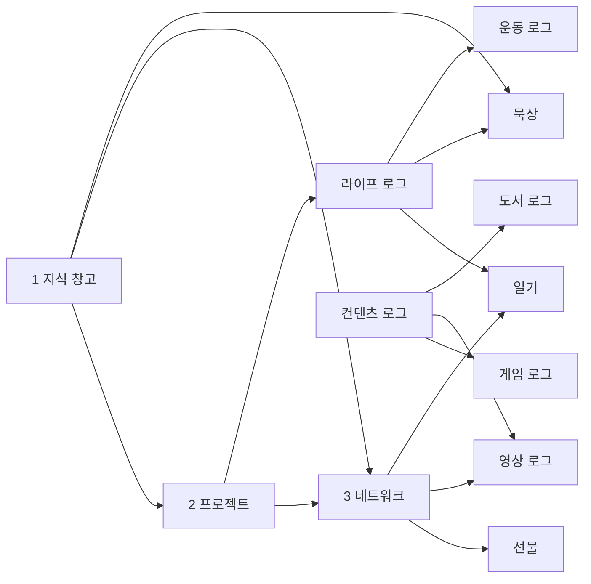

# 00. AS-IS Schema Audit

> Purpose: rebuild the product model from the original exported data, not from the previous speculative plan.

## Inputs Inspected

| Source | Observed Contents | Design Weight |
|---|---:|---|
| `migrations/Master DB-from notion.zip` | 1011 Markdown documents, 361 CSV files, 1381 total entries | Primary |
| `migrations/Pneos' Master Dashboard-from notion.zip` | 10 Markdown documents, 11 CSV files, 21 total entries | Secondary dashboard/context export |
| Current Drizzle schema | Auth, source records, tags, entity links, domain tables, UI state | Preserve as infrastructure where useful |
| Current app shell/components | GNB/LNB, page layout, cards, filters, command palette, context bundle, source panel | Preserve and redesign around v2 data |

## AS-IS Database Inventory

The exported system was built around a small number of high-signal databases with heavy cross-relations.

| AS-IS DB | Rows | Key Fields | Meaning |
|---|---:|---|---|
| `1 지식 창고` | 129 | 이름, 프로젝트, 관련인물, 묵상 로그, 상태, 생성 일시, 유형, 출처, 카테고리, 한 줄 요약 | Long-form knowledge, sermons, faith notes, writings, references |
| `2 프로젝트` | 1 | 이름, 지식 창고, 라이프 오퍼레이션, 관련 인물, 뇌 에너지 소모, 대분류, 산출물 링크, 상태, 에피소드 DB, 작업기간, 중요도 | Project hub with linked artifacts and effort metadata |
| `3 네트워크` | 6 | 이름, 그룹, 생일, 마지막 연락일, 사건, 상태, 선물, 영상 로그, 일기, 주소, 즐겨찾기, 핵심 가치 | Relationship database, not just contact cards |
| `라이프 로그` | 107 | 이름, 날짜, 묵상, 오늘 묵상, 오늘 운동, 오늘 일기, 운동 로그, 일기 | Date container joining daily records |
| `일기` | 54 | 제목, 감정, 관련인물, 날짜, 라이프 로그, 사건, 태그 | Journal entries with emotion, event, people, tags |
| `묵상` | 43 | 본문말씀, 날짜, 라이프 로그, 배경지식 | Meditation entries with scripture and background |
| `운동 로그` | 3 | 이름, 날짜, 라이프 로그, 운동 종류 | Workout entries linked to daily log |
| `컨텐츠 로그` | 327 | 이름, 날짜, 유형, 평가, 플랫폼, 장르, 한줄평, 감독, 게임 로그, 도서 로그, 영상 로그, 제작사 | Unified media/content index |
| `게임 로그` | 172 | 이름, 개발사, 날짜, 리뷰, 상태, 장르, 컨텐츠 로그, 평점, 플랫폼, 플레이 타임 | Game-specific media log |
| `영상 로그` | 145 | 이름, 네트워크, 감독/크리에이터, 날짜, 다시 볼 가치, 리뷰, 시청상태, 유형, 장르, 제작사, 컨텐츠 로그, 평점, 플랫폼 | Screen/video-specific media log |
| `도서 로그` | 1 | 이름, 날짜, 리뷰, 분류, 상태, 장르, 저자, 출판사, 컨텐츠 로그, 평점 | Book-specific media log |
| `선물` | 1 | 품목명, 날짜, 만족도, 비용, 사람, 사이즈/옵션, 선물 사유, 이미지 | Gift memory attached to people |
| `커리어&히스토리` | 1 | 이름, 근무기간, 조직/소속, 카테고리 | Career timeline |
| `에피소드 DB` | 1 | 이름, 작품 | Episode/project child item |
| `국군수도병원 DEMIS`, `외출자 특이사항` | 4 / 9 | Work-specific fields | Archive by default, not core operating data |

## Original Relationship Shape

AS-IS was relation-first. The most important behavior was not any single table, but how records referenced one another.

## Current System Strengths To Preserve

| Current Asset | Why It Survives v2 |
|---|---|
| `source_documents`, `source_document_properties`, `source_document_relations` | Perfect fit for preserving every original field and relation without polluting canonical tables |
| `entity_links` | Needed for cross-domain relations that do not deserve a bespoke join table |
| Specialized relation tables | Useful for high-frequency joins: media-person, zettel-person, daily-entry-person, project-person, project-zettel |
| `tags` and `taggings` | Better than Notion multi-select when paired with saved views |
| `saved_views` | The correct replacement for one-off archive pages like diary, meditation, sermons, media status |
| `attachments` with R2 | Needed for gift images, document assets, original/optimized image split |
| Context Bundle / Source Trace | Strong differentiator: every entity can explain what it is connected to and why |
| GNB/LNB shell and bento/dashboard primitives | Good structural foundation, but must be refit to v2 domains |
| Gemini curation queue | Useful for low-confidence classification only after deterministic AS-IS mapping |

## Problems With The Previous Plan

| Problem | Effect |
|---|---|
| It started from idealized domains instead of the AS-IS schema | Real records landed in awkward places such as media history inside PRM or raw zettels |
| It treated zettels as the universal fallback | Long-form sermons, diaries, media logs, and relationship notes lost their native context |
| It had pages before it had a data reading model | There were input forms without good archive and retrieval views |
| It over-separated domains | AS-IS value came from cross-relations; v1 pages often hid those links |
| It did not define source-to-canonical confidence states | Migration QA became manual and hard to trust |

## Design Implications

1. The v2 schema must keep a source layer and a canonical layer.
2. The canonical layer must mirror AS-IS record types closely enough that original usage survives.
3. UI must be collection/view-driven: one data type can have multiple saved views.
4. Long documents must remain first-class, not card-only summaries.
5. Daily records must be navigable by date and by kind/tag/person.
6. Media must be unified in one collection but type-specific in detail/edit UI.
7. Relationship pages must surface linked journals, gifts, media, projects, and documents.
8. Work-specific junk is not deleted blindly; it is archived under source records and hidden from operating views.
