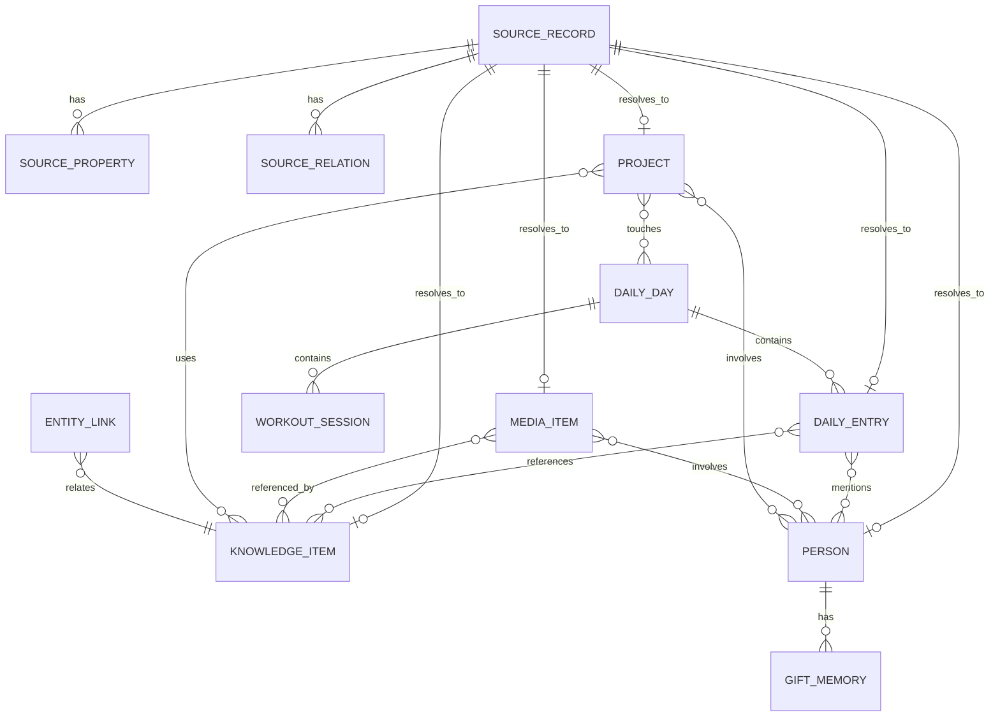

# 01. TO-BE Schema Blueprint

> Status: v2 canonical schema proposal.
> Basis: AS-IS export first, current implementation strengths second.

## Architecture Decision

Do not clone Notion 1:1 and do not discard the current implementation. v2 uses a three-layer model:

| Layer | Responsibility | Examples |
|---|---|---|
| Source Layer | Preserve imported/exported truth exactly | source record, raw fields, raw body, original relation names, file path, confidence |
| Canonical Layer | Store fields needed for product behavior | knowledge item, daily entry, media item, person, project |
| View Layer | Store user-facing sorting/filtering/workspace state | saved views, widget layouts, filters, command palette scopes |

This gives us the safety of a migration ledger and the usability of an opinionated app.

## Entity Map

## Source Layer

Current `source_documents` should conceptually become `source_records`. The table may keep the existing physical name during migration, but product language must not expose a platform name.

### `source_records`

| Field | Purpose |
|---|---|
| `id`, `user_id` | identity |
| `source_type` | `legacy_export`, `manual_import`, `api`, `backup_restore` |
| `source_bundle` | export bundle identifier, not shown in normal UI |
| `source_database` | original database name such as `일기`, `영상 로그`, `1 지식 창고` |
| `source_path` | original file path inside bundle |
| `source_id` | original stable id from filename/export |
| `title` | original record title |
| `document_role` | `knowledge`, `journal`, `meditation`, `media_game`, `media_screen`, `person`, `project`, `archive_work`, etc. |
| `canonical_entity_type`, `canonical_entity_id` | resolved target |
| `status` | `staged`, `mapped`, `active`, `archived`, `ignored`, `needs_review` |
| `raw_properties`, `raw_content`, `raw_content_hash` | complete source preservation |
| `quality_score`, `confidence`, `resolved_at` | migration trust |

### `source_properties`

Keep current `source_document_properties` with `property_key`, `property_name`, `property_type`, `value_text`, `value_json`, `normalized_value`.

### `source_relations`

Keep current `source_document_relations`, but relation names must be normalized:

| AS-IS Relation | Normalized Relation |
|---|---|
| `관련인물`, `관련 인물`, `3. 네트워크`, `사람` | `person` |
| `1. 지식 창고`, `묵상 로그` | `knowledge` |
| `2. 프로젝트` | `project` |
| `4. 라이프 오퍼레이션`, `라이프 로그` | `daily_day` |
| `게임 로그`, `영상 로그`, `도서 로그`, `컨텐츠 로그` | `media` |
| `운동 로그` | `workout` |

## Canonical Layer

### Knowledge

Rename the product concept from "zettel-only" to "Library". Existing `zettels` can remain physical storage short-term, but v2 should treat it as `knowledge_items`.

#### `knowledge_items`

| Field | AS-IS Source |
|---|---|
| `title` | 이름 |
| `body`, `body_text`, `summary` | Markdown body, 한 줄 요약 |
| `kind` | 유형: sermon, essay, prompt, fiction_idea, reference, note, question, bible_study |
| `category` | 카테고리 |
| `status` | 상태 |
| `source_label`, `source_url` | 출처 |
| `original_created_at` | 생성 일시 |
| `pinned`, `visibility`, `archived_at` | app behavior |

Specialized joins:

| Table | Purpose |
|---|---|
| `knowledge_people` | AS-IS 관련인물 |
| `knowledge_projects` | AS-IS 2. 프로젝트 |
| `knowledge_daily_entries` | AS-IS 묵상 로그 or diary references |
| `knowledge_media` | review/document references to media |

### Daily Life

AS-IS has date containers and individual records. v2 must keep both.

#### `daily_days`

Physical current table: `daily_logs`.

| Field | Purpose |
|---|---|
| `date` | daily address |
| `mood`, `energy_level`, `emotions` | current Life Ops signal |
| `journal_rollup`, `meditation_rollup`, `gratitude_rollup` | optional composed text for dashboard |
| `ai_summary` | generated daily digest |

#### `daily_entries`

Physical current table: `daily_log_entries`.

| Field | AS-IS Source |
|---|---|
| `daily_day_id`, `date` | 라이프 로그 relation, 날짜 |
| `kind` | `journal`, `meditation`, `sermon_note`, `prayer`, `gratitude`, `event`, `note` |
| `title` | 일기.제목 or generated from scripture/date |
| `body` | Markdown body |
| `emotion` | 감정 |
| `event_summary` | 사건 |
| `verse` | 본문말씀 |
| `background` | 배경지식 |
| `tags_snapshot` | original tag text |
| `source_record_id` | original source |

Relations:

| Relation | Purpose |
|---|---|
| `daily_entry_people` | 일기.관련인물 |
| `daily_entry_knowledge` | diary/meditation references to library |
| `daily_day_workouts` | daily container to workout sessions |

### Media

Keep a unified media table, but expose type-specific subforms.

#### `media_items`

Physical current table: `media_logs`, renamed conceptually.

| Field | AS-IS Source |
|---|---|
| `media_type` | content/game/screen/book |
| `title`, `original_title` | 이름 |
| `subtype`, `screen_kind` | 유형, 분류 |
| `creator` | 감독/크리에이터, 감독 |
| `studio` | 제작사, 개발사 |
| `author` | 저자 |
| `platform_or_publisher` | 플랫폼, 출판사 |
| `genre` | 장르 |
| `status` | 상태, 시청상태 |
| `rating` | 평점 |
| `evaluation`, `review` | 평가, 한줄평, 리뷰 |
| `play_time`, `pages` | 플레이 타임, page count if later added |
| `rewatch_value` | 다시 볼 가치 |
| `logged_at`, `started_at`, `completed_at` | 날짜 interpretation |

Relations:

| Relation | Purpose |
|---|---|
| `media_people` | 영상 로그 -> 3. 네트워크 |
| `media_parent_child` via `entity_links` | 컨텐츠 로그 -> 게임/영상/도서 로그 |
| `media_knowledge` | reviews and essays linked from library |

### People

AS-IS people are not just contacts. They are relationship memory hubs.

#### `people`

Keep existing enriched current table.

| Field | AS-IS Source |
|---|---|
| `name`, `nickname`, `aliases` | 이름 and variants |
| `groups` | 그룹 |
| `birth_date`, computed birthday display | 생일, 생일까지 |
| `last_contacted_at` | 마지막 연락일 |
| `status`, `is_favorite` | 상태, 즐겨찾기 |
| `address` | 주소 |
| `core_value` | 핵심 가치 |
| `profile_body` | long Markdown profile |
| `intimacy`, `dunbar_layer`, `contact_cadence_days` | app-level relationship operations |

Relations:

| Relation | Source |
|---|---|
| `person_knowledge` | 1. 지식 창고 |
| `person_projects` | 2. 프로젝트 |
| `person_daily_entries` | 일기 |
| `person_media` | 영상 로그 |
| `gifts` | 선물 |

### Projects and Episodes

#### `projects`

Keep current project table and finish AS-IS fields.

| Field | AS-IS Source |
|---|---|
| `title` | 이름 |
| `category` | 대분류 |
| `status` | 상태 |
| `start_date`, `target_date`, `period_text` | 작업기간 |
| `importance` | 중요도 |
| `brain_energy` | 뇌 에너지 소모 |
| `artifact_url` | 산출물 링크 |
| `description`, `outcome`, `review` | app-level fields |

#### `episodes`

Add only if future imports contain more than one meaningful episode. For now, map `에피소드 DB` to `entity_links` or tasks.

### Workouts, Gifts, Career

| Entity | Decision |
|---|---|
| `workouts` | Keep current table, ensure `title`, `categories`, `date`, `source_record_id` are populated |
| `gifts` | Keep current table and add `reason`, `cost`, `options`, `image_url` to UI |
| `career_history` | Keep current table, map `근무기간`, `조직/소속`, `카테고리` |

## Universal View Layer

### `saved_views`

Saved views are the v2 answer to "I need to see diaries, sermons, meditations, media records, etc." without hardcoding every archive page.

Required default views:

| Domain | View |
|---|---|
| Library | All, Sermons, Bible Study, Essays, Prompts, Fiction Ideas, Needs Review |
| Daily | Calendar, Journal, Meditation, Sermon Notes, Emotion Timeline, People Mentions |
| Media | All, Games, Screens, Books, Completed, Backlog, High Rating, Rewatch |
| People | Core, Active, Dormant, Birthdays, Gift History, Appears In Journals |
| Projects | Active, High Energy, Important, Has Artifact, Archived |
| Sources | Needs Review, Archived Work, Low Confidence, Unmapped |

## Migration Mapping Rule

1. Load every AS-IS record into source layer first.
2. Map by source database and high-confidence fields.
3. Materialize canonical entity.
4. Materialize relations from source relations.
5. Keep source inspector attached to every canonical entity.
6. Hide archived work records from default views, but never erase source provenance until backup exists.

## Implementation Notes

| Existing Physical Table | v2 Product Concept | Action |
|---|---|---|
| `zettels` | `knowledge_items` | Keep temporarily, rename in UI/docs first, DB rename later if worth it |
| `daily_logs` | `daily_days` | Keep physical name, update type aliases/UI language |
| `daily_log_entries` | `daily_entries` | Expand kind values and archive views |
| `media_logs` | `media_items` | Keep physical name, enrich UI and relation materialization |
| `source_documents` | `source_records` | Keep physical name, remove platform-specific language from UI |
| `entity_links` | universal links | Keep and formalize relation taxonomy |

## Non-Negotiable Data Guarantees

1. No AS-IS field is discarded; unmodeled fields stay in source properties.
2. Every migrated canonical entity must point back to one or more source records.
3. Every relation materialized into a join table must keep source/confidence/raw value.
4. UI must allow the user to recover the original attributes without seeing legacy platform branding.
5. Archive work data is hidden, not mixed into personal operating views.
