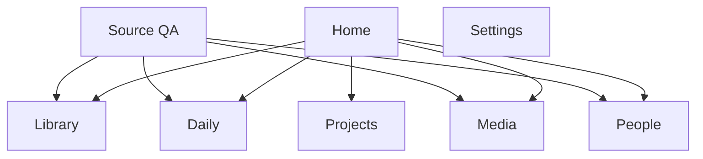

# 02. TO-BE UI/UX Specification

> Basis: v2 schema only. This document intentionally ignores the old page plan unless a current component is explicitly preserved.

## Product Shape

v2 should feel like an archive-native operating system:

- Records are not scattered cards; they live in collections with strong detail pages.
- Every collection has saved views, filters, and sort presets.
- Every detail page has three layers: canonical fields, readable body/timeline, source inspector.
- Context is a first-class rail, not an afterthought.

## Preserved UI Strengths

| Current UI Asset | v2 Use |
|---|---|
| GNB/LNB shell | Keep as the main navigation frame |
| `PageLayout`, `PageHeader`, `PageBody` | Keep as layout primitives |
| `FilterBar`, `ViewSwitcher`, `Tag` | Promote to core collection controls |
| `ContextBundlePanel` | Use on every detail page as the right-side context rail |
| `SourceDocumentPanel` | Rename/position as Source Inspector; no platform branding |
| `GlassCard`, Bento grid | Keep for dashboard and summary surfaces, not for dense archive lists |
| Command palette | Upgrade to global jump/search/create |
| R2 image pipeline | Use for gift/media/attachment display, original/optimized split |

## Navigation Model

### GNB

| Item | Purpose |
|---|---|
| Home | Today, recent changes, unresolved decisions |
| Library | Knowledge, sermons, essays, notes, prompts |
| Daily | Calendar, journals, meditations, workouts |
| Media | Unified media history |
| People | Relationship memory |
| Projects | Active and archived projects |
| Sources | Migration/source QA, hidden from casual use later |
| Settings | Account, data, R2, AI, backups |

### LNB

LNB is collection-specific. It should not repeat every route; it should expose saved views.

Example for Daily:

- Calendar
- Journal
- Meditation
- Sermon Notes
- Emotion Timeline
- People Mentions
- Workouts
- Needs Review

## Collection Page Pattern

Every major domain uses the same structural pattern:

1. Header with entity count, active view, create/import action.
2. View tabs or saved view selector.
3. Search and filters.
4. Main result surface: table/list/grid/timeline depending on view.
5. Optional right summary rail for facets and context.

### Required Collection Modes

| Mode | Best For |
|---|---|
| Table | AS-IS field-heavy records, QA, media metadata |
| List | diaries, meditations, sermons, long-form documents |
| Card grid | media gallery, people, project overview |
| Timeline | daily entries, interactions, career, media watch history |
| Calendar | daily days and date-addressed records |
| Graph | people/context/knowledge relations |

## Detail Page Pattern

Every detail page should have:

| Zone | Content |
|---|---|
| Header | title, type, status, primary actions |
| Metadata strip | canonical fields that matter for sorting/editing |
| Body | Markdown or structured content |
| Relations | linked people, projects, media, daily entries, knowledge |
| Activity/source rail | context bundle, source inspector, QA confidence |
| Edit mode | inline canonical form, never raw source editing by default |

## Domain UX

### Home

Home is not the old generic dashboard. It is an operational overview assembled from v2 views:

- Today: daily day status, open daily entries, workouts, recent captures.
- Continue Reading/Writing: recent knowledge items and unfinished drafts.
- Relationship Nudges: people needing contact, birthdays, gifts.
- Media Shelf: currently consuming, recently completed, high rating.
- Project Focus: high importance and high brain energy work.
- Data QA: only if unresolved source records exist.

### Library

Library replaces "Vault as zettel dump".

Default views:

| View | Filter |
|---|---|
| All Documents | all active knowledge items |
| Sermons | `kind = sermon` or tag/view rule |
| Bible Study | scripture-heavy documents |
| Essays | reflective long-form |
| Prompts | prompt guides and AI instructions |
| Fiction Ideas | story/worldbuilding notes |
| Needs Review | low-confidence mapped records |

Library list rows must show title, kind, category, summary, linked people/projects, original created date, updated date.

Detail page must prioritize reading. Metadata is secondary and collapsible on mobile.

### Daily

Daily is both date-based and record-based.

Primary surfaces:

| Surface | Purpose |
|---|---|
| Calendar | navigate by date |
| Daily Day | one date with rollups, entries, workout, mood/energy |
| Entry Archive | list/filter all journal/meditation/prayer/sermon-note entries |
| Emotion Timeline | sort/filter by emotion and event |
| People Mentions | entries grouped by linked person |

Important rule: diary, meditation, and sermon-note are saved views over `daily_entries`, not isolated hardcoded pages.

Daily Entry detail/edit fields:

- kind
- title
- date
- body
- emotion
- event summary
- verse
- background
- tags
- linked people
- linked knowledge
- source inspector

### Media

Media is a unified collection with type-specific detail panels.

Default views:

| View | Filter |
|---|---|
| All Media | active media items |
| Games | `media_type = game` |
| Screens | `media_type = screen` |
| Books | `media_type = book` |
| Completed | status completed |
| Backlog | status backlog |
| Rewatch | rewatch value true |
| High Rating | rating >= threshold |

Media list rows/cards must show title, type, creator/studio/author, platform/publisher, status, rating, date, linked people.

Detail panel rules:

- Game: platform, developer, play time, status, rating.
- Screen: director/creator, studio, platform, rewatch, watch status.
- Book: author, publisher, genre, status, rating.
- Unified: review, evaluation, related content logs, linked people, source inspector.

### People

People is a relationship memory system.

Default views:

| View | Filter |
|---|---|
| Core | Dunbar 5/15 and favorite |
| Active | status active |
| Dormant | stale contact |
| Birthdays | upcoming birthday |
| Gift History | people with gifts |
| Appears In Journals | people linked to daily entries |
| Media Together | people linked to media |

Person detail must show:

- profile summary and core value
- groups, birthday, address, contact cadence
- timeline: interactions, gifts, journals, media, projects, knowledge links
- gift board
- linked documents
- source inspector

### Projects

Projects should be a small but rich command surface.

Default views:

| View | Filter |
|---|---|
| Active | active status |
| High Importance | importance high |
| High Energy | brain energy high |
| Has Artifact | artifact URL exists |
| Archived | archived/done |

Project detail:

- status, category, importance, brain energy, period, artifact URL
- linked knowledge
- linked people
- linked daily days/entries
- linked episodes/tasks
- context rail

### Sources

Sources is a QA workspace, not a normal user destination.

Views:

- Needs Review
- Low Confidence
- Unmapped
- Archived Work
- Mapped Today

Actions:

- inspect raw fields
- compare canonical target
- remap entity type
- hide/archive
- approve mapping
- run AI suggestion on selected records

## Component System Changes

### New/Upgraded Components

| Component | Role |
|---|---|
| `CollectionShell` | shared header/view/filter/result layout |
| `SavedViewTabs` | query-backed saved views |
| `RecordTable` | dense AS-IS fields, column visibility |
| `RecordListItem` | long-form documents and daily entries |
| `RecordDetailShell` | canonical detail + context/source rail |
| `SourceInspector` | current source panel renamed and made platform-neutral |
| `CanonicalFieldGrid` | editable metadata grid |
| `RelationChips` | person/project/media/knowledge links |
| `ConfidenceBadge` | source QA confidence |
| `TypeSpecificMediaFields` | game/screen/book adaptive fields |
| `DailyEntryEditor` | journal/meditation/sermon-note editor |

### Visual Direction

The previous dark glass direction can stay, but archive readability needs stronger contrast and calmer density.

Rules:

- Long-form reading uses a high-legibility document pane, not tiny cards.
- Metadata uses compact chips and tables.
- Dense tables must have sticky headers and column visibility.
- Mobile detail pages stack as header, body, relations, source inspector.
- Source QA can be utilitarian; primary user surfaces should feel polished.

## CRUD and Editing Rules

| Action | UX Rule |
|---|---|
| Create | create canonical record first; optional source record only for imports |
| Edit canonical fields | inline form in detail page |
| Edit body | Markdown editor with preview |
| Edit relations | relation chips with search attach |
| Edit source fields | hidden in Source QA only |
| Delete | soft delete canonical record; source record remains unless backup/cleanup flow approves removal |

## Search

Search must support:

- command palette jump by title
- FTS over body/title
- filters by entity type, kind, date, status, people, tags
- saved view scoped search
- source QA search over original property names and raw body

## CAD: Schema-to-UX Traceability

| Schema Decision | UI Consequence |
|---|---|
| `daily_days` + `daily_entries` split | Calendar and entry archive coexist |
| Unified `media_items` | One Media page with type-specific detail forms |
| Rich `people` profile | Person detail becomes a memory hub, not contact card |
| `source_records` preserved | Every detail page gets Source Inspector, QA gets review board |
| `entity_links` universal | Context rail works across domains |
| `saved_views` mandatory | Diary/meditation/sermon/media views are configurable collection views |
| Tags are normalized | Tag filters work across Library, Daily, Media, People |

## Acceptance Criteria

1. A migrated diary can be found by date, tag, emotion, person, and full-text search.
2. A sermon can be read as a full document and filtered as a Library saved view.
3. A media record keeps game/screen/book-specific fields and linked people.
4. A person page shows linked journals, gifts, media, projects, and knowledge.
5. A source QA page can explain why each original record went to its canonical target.
6. No normal user-facing page says or implies a specific legacy platform.
