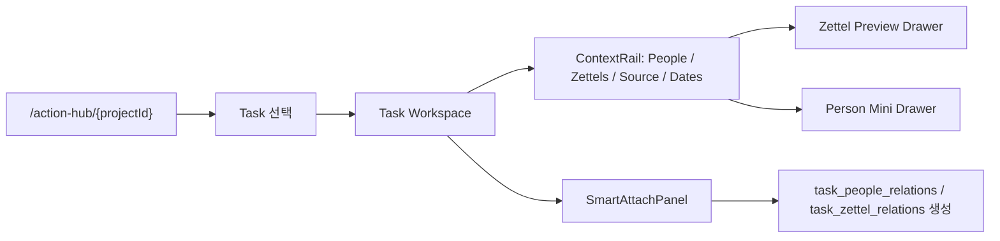
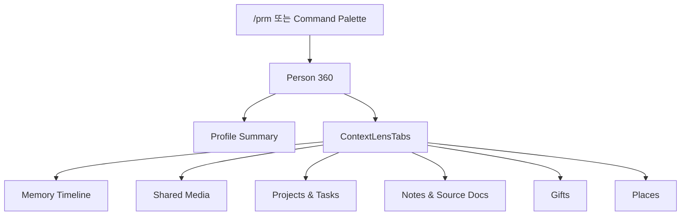

# Contextual Connectivity Planning Document

> **목적**: AS-IS Notion export, 현재 DB 스키마, 현재 구현된 화면 구조를 통합 진단한 뒤, Project Light House의 핵심 가치인 **데이터 간의 끊김 없는 맥락적 연결성**을 실제 구현 기준으로 고정한다.  
> **읽은 범위**: `Docs/00~10`, `packages/db/schema/*`, `apps/web/src`의 shell/shared/domain 컴포넌트, `migrations/*.sql`, `migrations/*from notion.zip`의 CSV/Markdown 구조.  
> **작업 원칙**: 이 문서는 기획/설계 기준서다. migration 정제 로직, `migration_review_items`, ai-curation 스크립트를 직접 변경하지 않는다.

---

## 1. 통합 진단 및 분석

### 1.1. 현재 문서 구조 파악 결과

기존 Docs는 다음 축으로 잘 나뉘어 있다.

| 문서 | 현재 역할 | 연결성 관점의 한계 |
|---|---|---|
| `00_MASTER_PLAN.md` | 5대 도메인, 글로벌 상호작용 철학 | 도메인 간 관계를 “보조 기능”으로 언급하나, 관계 자체를 1급 화면/컴포넌트로 정의하지 않음 |
| `01_INFORMATION_ARCHITECTURE.md` | GNB/LNB, 3-Pane Workspace, 라우트 맵 | 라우트가 도메인별 분리 중심이라 한 엔티티에서 다른 엔티티로 문맥 이동하는 규칙이 부족 |
| `02_DESIGN_SYSTEM.md` | 토큰, 글래스, 모션, 컴포넌트 사용 규칙 | 시각 언어는 충분하나 Context Graph / Evidence / Relation 상태의 시각 규칙은 없음 |
| `03_DATABASE_SCHEMA.md` | 정규화 스키마, bridge table, source document layer | 관계 데이터는 존재하지만 UI가 소비할 통합 read model이 정의되지 않음 |
| `05_PAGE_SPECIFICATIONS.md` | 페이지별 화면 구성 | 페이지가 “목록/상세/드로어” 단위로 고정되어 다차원 관계 탐색 흐름이 약함 |
| `06_INTERACTION_PATTERNS.md` | Mention, Command Palette, Quick Capture, Drawer | 관계 생성/탐색의 입력 패턴은 있으나 관계 해석, 증거, 신뢰도, 역방향 탐색 규칙이 없음 |
| `08_COMPONENT_SPECIFICATIONS.md` | 컴포넌트 트리와 props | 공통 컴포넌트는 많지만 “연결망 전용 primitive”가 빠져 있음 |
| `09_DATA_RECLASSIFICATION_PLAN.md` | canonical entity 우선, tag는 lens라는 원칙 | 좋은 원칙이나 화면에서 canonical/source/inferred 관계를 어떻게 보여줄지 부족 |
| `10_MIGRATION_HEALTH_REPORT.md` | migration 상태 진단 | 데이터 정합성 관점 중심이며 사용자 경험 기준의 연결성 acceptance criteria는 약함 |

결론: 문서 체계는 도메인별 제품 빌드에는 충분하지만, AS-IS가 가진 Notion식 관계망을 “사용자가 탐색 가능한 제품 경험”으로 바꾸기에는 **Context Graph 계층**이 하나 더 필요하다.

### 1.2. AS-IS 데이터 구조에서 확인된 관계 신호

Notion export는 단순 CSV 목록이 아니라 관계형 데이터베이스에 가깝다. 특히 `_all.csv`에는 원본 relation property가 많이 살아 있다.

| AS-IS 소스 | 샘플 규모 | 관계 신호 | TO-BE 의미 |
|---|---:|---|---|
| `2 프로젝트` | 1+ row | `1. 지식 창고`, `4. 라이프 오퍼레이션`, `관련 인물`, `산출물 링크`, `에피소드 DB` | 프로젝트는 tasks/projects만이 아니라 지식 문서, 인물, 라이프 로그, 산출물을 묶는 작업 허브 |
| `1 지식 창고` | 109 rows | `2. 프로젝트`, `관련인물`, `묵상 로그`, `출처`, `카테고리`, `한 줄 요약` | zettel은 독립 메모가 아니라 프로젝트/인물/묵상과 연결된 지식 노드 |
| `3 네트워크` | 6 rows | `1. 지식 창고`, `2. 프로젝트`, `4. 라이프 오퍼레이션`, `선물`, `영상 로그`, `일기`, `주소`, `핵심 가치` | 사람은 PRM 프로필이 아니라 memories/media/gifts/logs/projects의 중심 노드 |
| `영상 로그` | 145 rows | `컨텐츠 로그=144`, `3. 네트워크=143` | 미디어는 사람과 강하게 연결됨. “누구와 봤는지/누가 추천했는지”가 핵심 속성 |
| `컨텐츠 로그` | 327 rows | `게임 로그=170`, `영상 로그=144` | media 통합 레이어의 canonical parent 역할 |
| `게임 로그` | 25 rows | `컨텐츠 로그=25` | type-specific detail을 media_logs에 흡수하되 원본 관계 보존 필요 |
| `라이프 로그` | 107 rows | `오늘 일기`, `오늘 묵상`, `오늘 운동`, `일기`, `운동 로그` | daily log는 하루의 anchor이며 task/person/zettel/media/workout 이벤트를 합류시키는 날짜 노드 |
| `일기` | 54 rows | `관련인물`, `태그`, `라이프 로그` | diary는 daily_log의 본문 필드이면서 person memory timeline의 증거 |
| `운동 로그` | 3+ rows | `라이프 로그` | workout은 daily log에 붙는 이벤트 노드 |
| `묵상` | 43 rows | `본문말씀`, `라이프 로그`, `배경지식` | meditation은 daily log와 zettel/source 문서 사이의 지식/신앙 연결점 |
| `선물` | sparse | `사람`, `날짜`, `만족도`, `비용`, `선물 사유` | gift는 person timeline과 날짜 timeline의 이벤트 노드 |

핵심 진단: AS-IS의 관계는 “컬럼”으로 저장되어 있지만, 사용자의 실제 기억 모델은 **사람 중심**, **프로젝트 중심**, **날짜 중심**, **문서 중심**으로 자유롭게 재조합된다. TO-BE 화면은 이 네 가지 중심축을 같은 데이터 그래프에서 읽어야 한다.

### 1.3. 현재 DB 스키마의 연결성 자산

현재 스키마는 이미 연결성 구현의 기반을 상당히 갖고 있다.

| 계층 | 테이블 | 역할 |
|---|---|---|
| Canonical Entities | `projects`, `tasks`, `zettels`, `media_logs`, `people`, `daily_logs`, `workouts`, `gifts`, `interactions`, `places`, `assets` | 사용자가 직접 다루는 실제 엔티티 |
| Explicit Bridge | `task_people_relations`, `task_zettel_relations`, `zettel_links`, `zettel_people_relations`, `zettel_media_relations`, `media_people_relations`, `daily_log_people_relations`, `network_edges` | 명시적 관계 |
| Source Preservation | `source_documents`, `source_document_properties`, `source_document_relations` | Notion 원본 문서/속성/관계 보존 및 canonical 매핑 증거 |
| Lens & View | `tags`, `taggings`, `saved_views`, `widget_layouts` | 조회 관점, 필터, 사용자별 화면 구성 |
| Search & Inference | FTS tables, `quick_captures`, mention/tagging helpers | 텍스트 기반 탐색과 관계 후보 생성 |
| QA | `migration_review_items` | 불확실한 관계/중복/분류를 검토하는 큐 |

따라서 대대적 개선의 우선순위는 “스키마를 새로 갈아엎기”가 아니라, 기존 관계 자산을 통합해서 UI가 읽을 수 있는 **Context Bundle Read Model**을 정의하는 것이다.

### 1.4. 현재 화면/프로젝트 구조의 데이터 연결성 한계

현재 구현은 기능별 CRUD/목록/드로어를 빠르게 사용할 수 있는 상태까지 와 있다. 하지만 AS-IS가 요구하는 다차원 맥락 연결에는 다음 병목이 있다.

1. **도메인 우선 화면 구조**
   - `/action-hub`, `/vault`, `/prm`, `/life-ops`가 각각 잘 작동하지만, 한 엔티티에서 관련 엔티티를 “이탈 없이” 탐색하는 표준 패턴이 부족하다.
   - 예: task drawer는 `linkedPeople`, `linkedZettels`를 텍스트로 보여주지만, 그 사람/문서를 즉시 preview, attach, compare, detach하는 경험은 없다.

2. **드로어는 있으나 Context Stack이 약함**
   - `SideDrawerHost`는 `?detail=type:id,type:id` 2중 드로어를 지원한다.
   - 그러나 Drawer body가 entity별 요약/폼 중심이며, 관계를 `tabs`, `rail`, `timeline`, `evidence`로 표준화하지 않았다.

3. **Source Document가 보존되지만 수동 증거 패널에 머묾**
   - `SourceDocumentPanel`은 source database, raw property, preview를 보여준다.
   - 하지만 source relation이 어떤 canonical edge로 변환됐는지, 어떤 관계가 미해결인지, 사용자가 수동 확정할 수 있는지까지 연결되지 않는다.

4. **PRM은 사람의 360도 맥락을 충분히 표현하지 못함**
   - `PersonDrawer`는 gifts/interactions/tasks/zettels timeline 일부를 보여준다.
   - AS-IS 네트워크 데이터가 가진 `영상 로그`, `일기`, `선물`, `지식 창고`, `프로젝트`, `주소`, `핵심 가치`는 사람 한 화면에서 lens별로 탐색되어야 한다.

5. **Daily Log가 날짜 허브 역할을 완전히 수행하지 못함**
   - `daily_logs`, `daily_log_people_relations`, workouts, health metrics, timeline query는 존재한다.
   - 그러나 날짜 하나에서 “그날 만난 사람, 본 콘텐츠, 간 장소, 진행한 프로젝트, 쓴 문서”를 연결하고 역방향으로 들어가는 규칙이 부족하다.

6. **Graph View가 별도 목적지로 분리됨**
   - `/vault/zettels/graph`, `/prm/graph`는 그래프 전용 페이지다.
   - 실제 사용자는 프로젝트 작업 중, 사람 상세 중, 일기 회고 중에도 작은 관계 그래프를 확인해야 한다.

7. **관계의 신뢰도/출처/생성 방식을 구분하지 않음**
   - AS-IS relation, editor mention, hashtag, AI inference, semantic search 결과는 신뢰도가 다르다.
   - UI는 이를 같은 “관련 항목”으로 뭉개면 안 된다. explicit/source/inferred/semantic을 구분해야 migration 검수와 사용자 신뢰가 생긴다.

---

## 2. 아키텍처 개선 전략

### 2.1. 제품 원칙: Domain-First에서 Entity-Context-First로 확장

기존 GNB/LNB 도메인은 유지한다. 단, 사용자가 엔티티 상세에 들어간 순간부터 화면의 중심 원칙은 다음으로 바뀐다.

> **현재 보고 있는 엔티티를 중심으로, 관련 사람/문서/프로젝트/날짜/미디어/장소를 같은 화면에서 탐색하고 연결한다.**

이를 위해 모든 주요 엔티티는 아래 세 가지 UI 권리를 가진다.

| 권리 | 설명 | 예시 |
|---|---|---|
| Preview | 현재 화면을 떠나지 않고 관련 엔티티의 핵심 정보를 본다 | 프로젝트 작업 중 관련 zettel preview |
| Pivot | 관련 엔티티를 새 중심으로 삼아 같은 context UI를 유지한다 | 사람 → 함께 본 영화 → 같이 본 사람 |
| Attach/Detach | 관계를 생성/해제하고 출처를 남긴다 | task에 person 연결, zettel에 media 연결 |

### 2.2. Context Graph Read Model

서버는 각 도메인 store가 따로 쓰는 snapshot 외에, 모든 상세/드로어가 공유하는 `ContextBundle`을 제공해야 한다.

```ts
export type EntityType =
  | "project"
  | "task"
  | "zettel"
  | "media"
  | "person"
  | "daily_log"
  | "workout"
  | "gift"
  | "interaction"
  | "place"
  | "asset"
  | "source_document"
  | "tag";

export type RelationKind =
  | "explicit"       // bridge table, direct FK
  | "source"         // source_document_relations
  | "mention"        // @, [[, # editor extraction
  | "inferred"       // migration/AI rule proposal
  | "semantic";      // vector/FTS similarity

export type ContextNode = {
  type: EntityType;
  id: string;
  title: string;
  subtitle?: string;
  href: string;
  preview?: string;
  icon?: string;
  tone?: "gold" | "info" | "success" | "warning" | "danger" | "muted";
  sourceDocumentId?: string;
};

export type ContextEdge = {
  id: string;
  from: { type: EntityType; id: string };
  to: { type: EntityType; id: string };
  label: string;
  kind: RelationKind;
  confidence: number; // 1.0 explicit, 0.7 source unresolved, etc.
  evidence: Array<{
    source: "table" | "source_document" | "editor" | "ai" | "search";
    table?: string;
    sourceDocumentId?: string;
    propertyName?: string;
    snippet?: string;
  }>;
  createdAt?: string;
};

export type ContextBundle = {
  focus: ContextNode;
  nodes: ContextNode[];
  edges: ContextEdge[];
  grouped: {
    people: ContextNode[];
    projects: ContextNode[];
    zettels: ContextNode[];
    media: ContextNode[];
    dates: ContextNode[];
    places: ContextNode[];
    source: ContextNode[];
    unresolved: ContextNode[];
  };
  timeline: Array<{
    date: string;
    nodes: ContextNode[];
    edges: ContextEdge[];
  }>;
  quality: {
    unresolvedCount: number;
    lowConfidenceCount: number;
    duplicateSuspects: number;
  };
};
```

### 2.3. Relation Resolution 우선순위

동일한 관계 후보가 여러 경로에서 들어올 때 다음 우선순위를 적용한다.

| 우선순위 | 출처 | 예시 | UI 표시 |
|---:|---|---|---|
| 1 | Explicit DB Bridge/FK | `media_people_relations`, `task_zettel_relations` | solid edge, `확정` |
| 2 | Source Relation Resolved | Notion `영상 로그 -> 3. 네트워크`가 person으로 resolved | solid edge + source badge |
| 3 | Editor Mention | `@김재민`, `[[불안 메모]]` | mention badge |
| 4 | Source Relation Unresolved | target title/source id는 있으나 canonical entity 미확정 | dashed edge, `검토 필요` |
| 5 | Semantic/FTS Candidate | 제목/본문 유사도 | dotted edge, `추천` |

중복 처리 규칙:
- 같은 `from.type/id + to.type/id + semantic label`은 하나의 edge로 병합한다.
- evidence는 배열로 누적한다.
- confidence는 max 값을 쓰되, UI에는 evidence count를 함께 표시한다.

### 2.4. 데이터-UI 컴포넌트 매핑 전략

| 신규/강화 컴포넌트 | 위치 | 연결 데이터 | 목적 |
|---|---|---|---|
| `<EntityContextShell>` | `components/shared/context/` | `ContextBundle.focus` | 모든 상세 화면의 공통 3영역 골격 |
| `<ContextRail>` | `components/shared/context/` | `ContextBundle.grouped` | 현재 엔티티와 연결된 사람/문서/미디어/날짜/장소를 압축 표시 |
| `<ConnectedEntityStrip>` | `components/shared/context/` | `ContextNode[]` | 카드 상단/섹션 상단의 빠른 관련 항목 띠 |
| `<ContextMapMini>` | `components/shared/context/` | `nodes`, `edges` | 상세 화면 내부에서 작은 관계망 표시 |
| `<ContextTimeline>` | `components/shared/context/` | `timeline` | 날짜순 memories/events 통합 |
| `<RelationEvidenceCard>` | `components/shared/context/` | `ContextEdge.evidence` | 관계가 왜 생겼는지 출처/속성/스니펫 제시 |
| `<SourceTracePanel>` | `components/shared/context/` | `source_documents`, `source_document_properties`, `source_document_relations` | 원본 Notion 문서와 canonical 변환 상태 확인 |
| `<SmartAttachPanel>` | `components/shared/context/` | reference search + bridge mutation | 관련 엔티티 attach/detach |
| `<ContextLensTabs>` | `components/shared/context/` | `people/projects/zettels/media/dates/places/source` | 사람 360, 프로젝트 워크벤치 등에서 lens 전환 |
| `<UnresolvedRelationQueue>` | `components/shared/context/` | `migration_review_items`, unresolved source relations | 사용자 검수/확정 UI. 정제 스크립트는 건드리지 않고 UI에서 소비 |

### 2.5. Context API 표준

새로운 화면/드로어는 도메인별 snapshot만 직접 읽지 않고, 필요 시 Context API를 추가로 읽는다.

| API | Method | 목적 |
|---|---|---|
| `/api/context/[entityType]/[entityId]` | `GET` | `ContextBundle` 반환 |
| `/api/context/edges` | `POST` | explicit relation 생성 |
| `/api/context/edges/[edgeId]` | `DELETE` | relation 해제. source relation은 삭제하지 않고 canonical bridge만 해제 |
| `/api/context/resolve-source-relation` | `POST` | unresolved source relation을 canonical entity로 확정 |
| `/api/context/search` | `GET` | attach panel용 cross-domain reference search |

필수 쿼리 파라미터:

```txt
depth=1|2
lenses=people,zettels,media,dates,places,source
include=inferred,semantic,unresolved
limit=12
```

기본값:
- 상세/드로어: `depth=1`, `include=source,mention`
- 그래프 페이지: `depth=2`, `include=source,mention,inferred`
- Command Palette: `depth=1`, `include=semantic`

---

## 3. 실무 기준 기획서

### 3.1. 주요 화면 흐름안

#### Flow A. 프로젝트 중심: Project Workbench

목표: 프로젝트/태스크를 수행하면서 관련 문서, 사람, 날짜 기록, 산출물을 페이지 이탈 없이 확인한다.



화면 기준:
- `/action-hub/{projectId}`는 Kanban/List/Calendar를 유지한다.
- task 클릭 시 `/action-hub/{projectId}/tasks/{taskId}` 또는 `?detail=task:{id}`로 진입한다.
- Task Workspace 우측은 기존 meta panel 대신 `ContextRail`을 기본 탑재한다.
- `ContextRail`의 `Zettels` 탭에서 메모를 클릭하면 `?detail=task:{id},zettel:{id}`로 stacked drawer를 연다.
- `People` 탭에서 person을 클릭하면 person mini drawer를 연다.
- `SmartAttachPanel`은 `@person`, `[[zettel]]`, `#tag`를 검색하고 explicit bridge를 생성한다.

Acceptance Criteria:
- 태스크 상세에서 linked person/zettel을 텍스트가 아닌 클릭 가능한 `ContextNodeCard`로 볼 수 있다.
- 관련 zettel을 열어도 task workspace는 유지된다.
- source document relation으로만 들어온 후보는 `검토 필요` badge로 표시된다.

#### Flow B. 인물 중심: Person 360

목표: 특정 사람을 볼 때 프로필이 아니라 그 사람과 연결된 추억, 문서, 프로젝트, 미디어, 선물, 장소를 한 화면에서 탐색한다.



화면 기준:
- `/prm?detail=person:{id}`는 빠른 drawer.
- `/prm/{personId}`는 full Person 360 page.
- Drawer와 full page는 같은 `ContextBundle`을 사용하되 표시 밀도만 다르다.
- 첫 화면은 `Profile Summary + Relationship Health + Recent Context`로 구성한다.
- 세부 lens:
  - `Timeline`: interactions, gifts, daily_log_people_relations, related diary/meditation source docs
  - `Media`: `media_people_relations` + AS-IS source relation `영상 로그`
  - `Projects`: `task_people_relations` + source relation `2. 프로젝트`
  - `Notes`: `zettel_people_relations` + source relation `1. 지식 창고`
  - `Places`: `interactions.placeId`, `place_visits.companionIds`, source/inferred place relations
  - `Gifts`: `gifts`

Acceptance Criteria:
- 사람 상세에서 “같이 본 콘텐츠”, “관련 일기”, “관련 메모”, “선물”, “프로젝트”를 lens별 count와 최신 항목으로 볼 수 있다.
- 각 항목은 클릭 시 같은 drawer stack에서 열린다.
- source-only 관계는 SourceTracePanel에서 어떤 Notion property에서 왔는지 확인 가능하다.

#### Flow C. 날짜 중심: Daily Context Journal

목표: 하루를 단순한 일기/습관 체크가 아니라 그날의 모든 도메인 이벤트가 모이는 anchor로 사용한다.

화면 기준:
- `/life-ops/{date}` 상단은 `DailyTopStrip` 유지.
- 본문은 `Daily Journal`, `Habits`, `ContextTimeline`, `Connected People`, `Source Trace`로 구성한다.
- `ContextTimeline`은 다음을 합류한다:
  - completed/updated tasks
  - interactions
  - gifts
  - workouts
  - zettels created/updated
  - daily_log_people_relations
  - source_documents canonical `daily_log`

Acceptance Criteria:
- 특정 날짜에서 그날 관련 인물과 메모를 클릭해 drawer로 확인할 수 있다.
- 일기/묵상 원문 source document와 canonical daily_log 필드의 대응을 볼 수 있다.
- 날짜 기반 relations가 없는 source 문서는 unresolved로 표시된다.

#### Flow D. 문서/지식 중심: Vault Context Split

목표: zettel을 읽거나 쓸 때 관련 사람, 프로젝트, 미디어, 원문 문서, backlinks를 동시에 탐색한다.

화면 기준:
- `/vault/zettels`는 기존 3단 split을 유지하되 우측 aside를 `ContextRail`로 교체/확장한다.
- editor 내부 mention과 `zettel_links`를 즉시 `ContextMapMini`에 반영한다.
- `SourceTracePanel`은 source document의 raw properties와 source relations를 보여준다.

Acceptance Criteria:
- zettel 상세에서 관련 person/media/project를 바로 attach/detach 가능하다.
- outgoing/backlinks는 단순 제목 리스트가 아니라 edge evidence를 포함한다.

### 3.2. 핵심 UI/UX 컴포넌트 명세

#### 3.2.1. `<EntityContextShell>`

- **Path**: `apps/web/src/components/shared/context/entity-context-shell.tsx`
- **Purpose**: 상세 화면/드로어 공통 레이아웃. focus entity, main content, context rail, optional mini map을 조합.
- **Props**:

```ts
export interface EntityContextShellProps {
  bundle: ContextBundle;
  density?: "drawer" | "page" | "compact";
  mainSlot: React.ReactNode;
  actionsSlot?: React.ReactNode;
  railDefaultLens?: ContextLensKey;
  onOpenNode?: (node: ContextNode) => void;
  onAttach?: (target: ContextNode, relationLabel: string) => Promise<void>;
  onDetach?: (edge: ContextEdge) => Promise<void>;
}
```

- **Design**:
  - `density="page"`: 2-column, main `minmax(0,1fr)`, rail `360px`.
  - `density="drawer"`: vertical stack, `ContextLensTabs` collapsed.
  - surface: `.glass`, radius `var(--radius-lg)`.
- **A11y**:
  - focus entity title is `h1` or `h2` depending on nesting.
  - context node cards are buttons/links with `aria-label="{title} 열기"`.

#### 3.2.2. `<ContextRail>`

- **Path**: `apps/web/src/components/shared/context/context-rail.tsx`
- **Purpose**: 현재 엔티티와 연결된 항목을 lens별로 탐색.
- **Props**:

```ts
export type ContextLensKey =
  | "overview"
  | "people"
  | "projects"
  | "zettels"
  | "media"
  | "dates"
  | "places"
  | "source"
  | "unresolved";

export interface ContextRailProps {
  bundle: ContextBundle;
  activeLens: ContextLensKey;
  onLensChange: (lens: ContextLensKey) => void;
  onOpenNode: (node: ContextNode) => void;
  onInspectEdge: (edge: ContextEdge) => void;
}
```

- **Required States**:
  - Loading: `SkeletonBlock variant="row" count={6}`
  - Empty: lens별 카피. 예: `연결된 미디어가 없습니다`
  - Error: inline retry
  - Unresolved: `검토 필요` badge와 confidence 표시

#### 3.2.3. `<ContextNodeCard>`

- **Path**: `apps/web/src/components/shared/context/context-node-card.tsx`
- **Purpose**: 모든 관련 엔티티의 통일 카드.
- **Display Fields**:
  - icon/type badge
  - title
  - subtitle/preview 1~2줄
  - relation badges: `확정`, `원본`, `멘션`, `추천`, `검토 필요`
- **Data Requirements**:
  - `ContextNode`
  - related `ContextEdge[]` limited to edges touching node
- **Interaction**:
  - primary click: open drawer stack
  - secondary menu: attach/detach, copy link, inspect evidence

#### 3.2.4. `<RelationEvidenceCard>`

- **Path**: `apps/web/src/components/shared/context/relation-evidence-card.tsx`
- **Purpose**: 관계의 출처와 신뢰도를 설명.
- **Props**:

```ts
export interface RelationEvidenceCardProps {
  edge: ContextEdge;
  onResolve?: (edge: ContextEdge) => Promise<void>;
  onDismissCandidate?: (edge: ContextEdge) => Promise<void>;
}
```

- **Rules**:
  - `kind="explicit"`: table name + createdAt.
  - `kind="source"`: source database, property name, target title/source id.
  - `kind="inferred"`: confidence, suggested action.
  - `kind="semantic"`: snippet and score.
- **Copy**:
  - `원본 관계에서 확인됨`
  - `멘션으로 연결됨`
  - `확정 전 후보`

#### 3.2.5. `<SourceTracePanel>`

- **Path**: `apps/web/src/components/shared/context/source-trace-panel.tsx`
- **Purpose**: `SourceDocumentPanel`의 확장판. 원본 보존 + relation resolution 상태를 동시에 보여준다.
- **Data**:
  - `source_documents`
  - `source_document_properties`
  - `source_document_relations`
  - optional `migration_review_items`
- **Sections**:
  1. Canonical mapping: `source_database -> canonical_entity_type/id`
  2. Raw properties: property table
  3. Source relations: resolved/unresolved list
  4. Review items: open/dismissed/applied
- **No Direct Script Mutation**:
  - UI에서 확정 action을 호출하더라도 migration 정제 스크립트를 수정하지 않는다.
  - 필요한 경우 API가 canonical bridge를 생성하고 review item status만 변경한다.

#### 3.2.6. `<SmartAttachPanel>`

- **Path**: `apps/web/src/components/shared/context/smart-attach-panel.tsx`
- **Purpose**: 현재 엔티티에 다른 엔티티를 빠르게 연결.
- **Search Sources**:
  - FTS: zettels/tasks/people/media
  - tags
  - recent context
  - source unresolved target titles
- **Supported Relations**:

| Focus | Attach Targets | Write Target |
|---|---|---|
| task | person, zettel, tag | `task_people_relations`, `task_zettel_relations`, `taggings` |
| zettel | zettel, person, media, tag | `zettel_links`, `zettel_people_relations`, `zettel_media_relations`, `taggings` |
| person | media, zettel, project/task, place, gift, interaction | bridge table or entity creation |
| daily_log | person, workout, source document, tag | `daily_log_people_relations`, `workouts`, `source_documents`, `taggings` |
| media | person, zettel, tag | `media_people_relations`, `zettel_media_relations`, `taggings` |

#### 3.2.7. `<ContextTimeline>`

- **Path**: `apps/web/src/components/shared/context/context-timeline.tsx`
- **Purpose**: 사람/날짜/프로젝트 중심의 cross-domain timeline.
- **Timeline Item Types**:
  - `task.updated`
  - `interaction.occurred`
  - `gift.occurred`
  - `daily_log.date`
  - `workout.date`
  - `zettel.created`
  - `media.completed`
  - `source_document.imported`
- **Interaction**:
  - item click opens node drawer
  - edge evidence icon opens `RelationEvidenceCard`

### 3.3. 화면별 적용 명세

#### `/action-hub/{projectId}/tasks/{taskId}` — Task Workspace 2.0

| Region | Component | Data |
|---|---|---|
| Header | `ProjectHeader`, task status chips | `tasks`, `projects` |
| Main | `ZenEditor`, checklist, task fields | `tasks`, `checklists` |
| Right Rail | `ContextRail` | task ContextBundle |
| Bottom/Aside | `ContextTimeline` | task related events |
| Drawer Stack | `SideDrawerHost` + `EntityContextShell density="drawer"` | selected related node |

Must-have:
- `linkedPeople`/`linkedZettels`는 text join이 아니라 `ContextNodeCard`.
- 관련 source document가 있으면 task meta에 `SourceTracePanel`.
- 태스크 본문 저장 시 mention sync 결과를 rail에 refresh.

#### `/prm/{personId}` and `?detail=person:{id}` — Person 360

| Lens | Primary Data | Empty State |
|---|---|---|
| Overview | `people`, health/contact metrics, source doc | `아직 이 사람의 맥락이 충분하지 않습니다` |
| Timeline | `interactions`, `gifts`, `daily_log_people_relations`, linked tasks/zettels | `기록된 추억이 없습니다` |
| Media | `media_people_relations`, source relation `영상 로그` | `같이 본 콘텐츠가 없습니다` |
| Projects | `task_people_relations`, source relation `2. 프로젝트` | `함께 진행한 프로젝트가 없습니다` |
| Notes | `zettel_people_relations`, source relation `1. 지식 창고` | `연결된 메모가 없습니다` |
| Places | `interactions.placeId`, `place_visits.companionIds`, inferred source | `함께 간 장소가 없습니다` |
| Gifts | `gifts` | `선물 기록이 없습니다` |
| Source | `source_documents` | `원본 문서가 없습니다` |

Must-have:
- person drawer는 full page와 같은 bundle을 사용한다.
- AS-IS `3 네트워크`의 각 relation property는 SourceTrace에서 확인 가능해야 한다.
- media lens에서 `누가 추천했는지`, `같이 봤는지` relation context를 구분한다.

#### `/life-ops/{date}` — Daily Context Journal

| Region | Component | Data |
|---|---|---|
| Top | `DailyTopStrip` | `daily_logs` |
| Journal | `JournalingTabs` | `daily_logs.journal/meditation/gratitude` |
| Habits | `HabitTrackerGrid` | `habits`, `habit_logs` |
| Context | `ContextTimeline` | date-bound tasks/interactions/gifts/workouts/zettels |
| People | `ConnectedEntityStrip` | `daily_log_people_relations` |
| Source | `SourceTracePanel` | source docs canonical daily_log |

Must-have:
- AS-IS `일기`, `묵상`, `운동 로그`가 같은 날짜로 연결되면 한 화면에 합류한다.
- 날짜 없는 일기/묵상은 unresolved relation으로 남긴다.

#### `/vault/zettels` — Zettel Context Split

| Region | Component | Data |
|---|---|---|
| Left | Zettel list + FilterBar | `zettels`, `tags` |
| Center | ZenEditor | selected zettel |
| Right | `ContextRail` | zettel ContextBundle |
| Graph | `ContextMapMini` | `zettel_links`, person/media/project edges |

Must-have:
- backlink/outgoing links는 edge evidence를 가진다.
- source document preview는 raw content와 property mapping을 함께 표시한다.

### 3.4. 데이터 연동 요건

#### 3.4.1. ContextBundle 생성 로직

Focus별 최소 edge 수집 규칙:

| Focus Type | Direct Edges | Source Edges | Timeline Edges |
|---|---|---|---|
| project | tasks by `project_id`, source `2 프로젝트` relations | `source_document_relations` where canonical project | task updates, related daily logs |
| task | `task_people_relations`, `task_zettel_relations`, `taggings` | source docs mapped task/project | checklist completion, status changes |
| zettel | `zettel_links`, `zettel_people_relations`, `zettel_media_relations`, `taggings` | source docs mapped zettel | created/updated |
| person | gifts, interactions, network_edges, task/zettel/media/daily relations | AS-IS network relation columns | gifts/interactions/daily logs |
| media | `media_people_relations`, `zettel_media_relations` | content/video/game/book source relations | started/completed date |
| daily_log | daily people, workouts, health metrics, source docs | diary/meditation/workout source relations | same-day all domain events |
| place | place visits, interactions.placeId | inferred diary/place source relations | visit dates |

#### 3.4.2. Bridge Write Rules

| User Action | Write | Audit |
|---|---|---|
| Attach person to task | insert `task_people_relations` | `audit_logs` action `create_relation` |
| Attach zettel to task | insert `task_zettel_relations` | same |
| Attach media to person | insert `media_people_relations` with context when schema supports it, otherwise source relation evidence | same |
| Attach person to daily log | insert `daily_log_people_relations` | same |
| Resolve source relation | update `source_document_relations.resolved_entity_type/id`, create canonical bridge if applicable | mark review item applied if linked |
| Dismiss inferred candidate | no bridge write, create/update review item or local dismissal state | audit optional |

주의: 현재 `media_people_relations`에는 `context`는 있으나 `media_logs` relation UI에서 충분히 쓰이지 않는다. `watched_together`, `recommended_by`, `mentioned_by` 같은 context value 표준화가 필요하다.

### 3.5. AS-IS 마이그레이션 연동 방안

이 섹션은 정제 스크립트 수정 지시가 아니라, UI/데이터 계약 기준이다.

| AS-IS Field | Canonical Target | Relation Target | UI Requirement |
|---|---|---|---|
| `3 네트워크.1 지식 창고` | `people` + `zettels` | `zettel_people_relations` and/or `source_document_relations` | Person 360 > Notes lens에 표시 |
| `3 네트워크.2 프로젝트` | `people` + `projects/tasks` | `task_people_relations` or source relation until task resolved | Person 360 > Projects lens에 표시 |
| `3 네트워크.영상 로그` | `people` + `media_logs` | `media_people_relations` | Person 360 > Media lens에 표시 |
| `3 네트워크.일기` | `people` + `daily_logs/source_documents` | `daily_log_people_relations` or source relation | Person 360 > Timeline에 표시 |
| `3 네트워크.선물` | `people` + `gifts` | direct FK `gifts.person_id` | Gifts lens에 표시 |
| `영상 로그.3 네트워크` | `media_logs` + `people` | `media_people_relations` | Media drawer > People strip |
| `영상 로그.컨텐츠 로그` | `media_logs` + source content parent | `source_document_relations` | SourceTrace에서 parent relation 표시 |
| `게임/도서/영상 로그.컨텐츠 로그` | `media_logs` | source relation/evidence | duplicate canonical media 방지 |
| `라이프 로그.일기/묵상/운동 로그` | `daily_logs`, `workouts`, source docs | source relation + direct child data | Daily Context Journal에 합류 |
| `일기.관련인물` | `daily_logs/source diary` + `people` | `daily_log_people_relations` | Person timeline + Daily people strip |
| `일기.태그` | `tags`, `taggings` | tag lens | ContextRail tag chips |
| `1 지식 창고.관련인물` | `zettels` + `people` | `zettel_people_relations` | Zettel ContextRail People lens |
| `1 지식 창고.2 프로젝트` | `zettels` + `tasks/projects` | `task_zettel_relations` or source relation | Project Workbench Docs lens |
| `묵상.배경지식` | `daily_logs` + `zettels/source_documents` | source relation or `zettel_links` | Daily Source/Notes lens |

Migration UI rules:
- 모든 imported row는 canonical 매핑 여부와 무관하게 `source_documents`에서 조회 가능해야 한다.
- canonical entity로 확정된 row는 `SourceTracePanel`에서 원본 속성과 함께 보여야 한다.
- unresolved target title이 있을 경우 사용자는 `SmartAttachPanel`에서 canonical entity를 검색/생성해 확정할 수 있어야 한다.
- 중복 가능성이 있는 media/person/zettel은 화면에서 merge하지 말고 `검토 필요` 상태로 분리 표시한다.

### 3.6. 개발 실행 순서

1. **Context Types & Server Read Model**
   - `apps/web/src/lib/server/context.ts` 신설.
   - `ContextNode`, `ContextEdge`, `ContextBundle` 타입 정의.
   - focus별 query helper 작성.

2. **Shared Context Components**
   - `components/shared/context/*` 추가.
   - 먼저 `ContextNodeCard`, `ContextRail`, `RelationEvidenceCard`, `SourceTracePanel`부터 구현.

3. **Drawer Standardization**
   - `TaskDrawer`, `PersonDrawer`, `ZettelDrawer`, `MediaDrawer`, `PlaceDrawer`가 `EntityContextShell`을 사용하도록 통일.
   - 기존 drawer URL 규약은 유지.

4. **Person 360 Page**
   - `/prm/{personId}` full page를 ContextBundle 기반으로 재구성.
   - 가장 높은 가치: AS-IS 네트워크의 다차원 관계를 한 화면에서 회수.

5. **Task Workspace ContextRail**
   - `/action-hub/{projectId}/tasks/{taskId}` 우측 rail에 bundle 연결.

6. **Daily Context Journal**
   - `/life-ops/{date}`에 `ContextTimeline`과 `SourceTracePanel` 연결.

7. **Migration QA Surface**
   - Settings Data 또는 ContextRail unresolved lens에서 source relation resolution UI 제공.

---

## 4. 검증

### 4.1. Assumptions

| 전제 | 설명 |
|---|---|
| 단일 사용자 우선 | 현재 스키마는 `user_id`를 갖지만 제품 경험은 단일 사용자 personal OS를 우선한다 |
| Source preservation is mandatory | canonical entity로 흡수되어도 원본 Notion row/document는 `source_documents`에서 추적 가능해야 한다 |
| Tags are lenses | 태그는 엔티티 목적지가 아니라 조회/탐색 lens다 |
| Explicit beats inferred | AI/semantic 추천은 사용자 확정 전까지 canonical relation처럼 보이면 안 된다 |
| Drawer stack stays shallow | 현 `SideDrawerHost`의 2중 stack은 유지하고, 더 깊은 탐색은 pivot navigation으로 전환한다 |
| 스키마 대변경은 후순위 | 현재 bridge/source schema로 먼저 UI read model을 구현한다 |

### 4.2. Edge Cases

| Edge Case | 위험 | 처리 원칙 |
|---|---|---|
| Notion relation target title은 있지만 target source id가 없음 | 잘못된 canonical 연결 | unresolved edge로 표시하고 수동 확정 필요 |
| 같은 미디어가 `컨텐츠 로그`, `영상 로그`, `도서 로그`에 중복 존재 | 중복 카드/타임라인 오염 | source evidence를 병합하고 canonical media는 1개만 노출 |
| 사람 이름이 동명이인 | 잘못된 Person 360 연결 | source id, group, birthday, relation evidence를 함께 확인 |
| 날짜 포맷이 한국어/ISO/비어 있음 혼재 | Daily timeline 누락 | 파싱 실패 시 source-only unresolved로 보존 |
| 일기/묵상 본문이 daily_logs 필드와 source doc 양쪽에 존재 | 중복 표시 | canonical field를 본문으로, source doc은 trace/evidence로 표시 |
| 장소/음식 데이터가 명시 테이블 없이 일기 본문에만 존재 | 사용자가 기대하는 “같이 간 장소/먹은 음식” 누락 | place candidate를 inferred/source edge로 표시하고 수동 place 생성 유도 |
| relation confidence가 낮은 AI 후보 | 사용자 신뢰 저하 | `추천`/`검토 필요` badge와 evidence card 없이는 주요 lens에 섞지 않음 |
| bridge table은 삭제됐지만 source relation은 남음 | “왜 다시 보이지?” 혼란 | canonical bridge와 source evidence를 구분하고, dismissed state 필요 |
| `migration_review_items` open 상태가 많음 | 주요 화면이 QA 항목으로 오염 | 기본 lens에서는 숨기고 unresolved lens/count로만 표시 |
| 모바일 drawer stack | 화면 폭 부족 | drawer density에서 rail은 accordion/lens tabs로 접기 |

### 4.3. Acceptance Checklist

기능 구현 PR은 다음을 통과해야 한다.

- [ ] 현재 엔티티에서 관련 people/zettels/media/projects/dates/source를 한 화면 내에서 확인할 수 있다.
- [ ] 관계는 `explicit/source/mention/inferred/semantic` 중 하나로 분류되어 UI badge가 붙는다.
- [ ] 모든 관계 카드에서 evidence를 열어 출처 table/property/snippet을 볼 수 있다.
- [ ] source-only 관계는 canonical relation처럼 과장 표시하지 않는다.
- [ ] Person 360에서 AS-IS `3 네트워크`의 지식/프로젝트/영상/일기/선물 관계가 lens별로 표시된다.
- [ ] Project Workbench에서 관련 zettel/person을 페이지 이탈 없이 preview하고 attach할 수 있다.
- [ ] Daily Context Journal에서 하루에 묶인 사람/운동/일기/묵상/작업/메모가 timeline으로 합류한다.
- [ ] `SourceTracePanel`은 원본 Notion 속성, canonical mapping, unresolved relation을 함께 보여준다.
- [ ] 모바일 375px에서 context rail이 접혀도 주요 액션이 44px 이상 터치 타겟을 유지한다.
- [ ] migration 정제 스크립트나 ai-curation 스크립트를 UI 작업 중 변경하지 않는다.

### 4.4. Definition of Done

이 기획의 1차 완료 기준:

1. `ContextBundle` server read model이 task/person/zettel/daily_log/media에 대해 동작한다.
2. `ContextRail`, `ContextNodeCard`, `RelationEvidenceCard`, `SourceTracePanel`이 공통 컴포넌트로 구현된다.
3. Person 360과 Task Workspace가 ContextBundle을 사용한다.
4. AS-IS source relation에서 resolved/unresolved 상태가 UI에 드러난다.
5. `npm run typecheck`와 `npm run build`가 통과한다.

