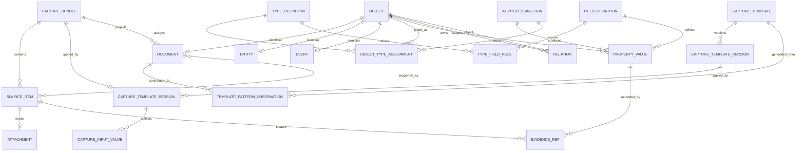

# 02. Conceptual Data Model

## 1. 설계 목표

V2 데이터 모델은 다음 조건을 동시에 만족해야 한다.

1. 처음 보는 자료도 스키마 오류 없이 저장한다.
2. 원본과 AI 파생 결과를 분리한다.
3. 한 입력에서 여러 문서·개체·사건을 만들 수 있다.
4. 한 문서가 여러 유형을 가질 수 있다.
5. 새 필드를 DB 마이그레이션 없이 추가한다.
6. 숫자, 날짜, 단위, 개체 참조를 실제 타입으로 검색·정렬한다.
7. 모든 값에서 원문 근거로 돌아갈 수 있다.
8. 반복 사용되는 필드는 인덱스와 투영으로 최적화할 수 있다.

## 2. 세 층의 데이터

### Source Layer — 사용자가 준 것

- 입력 텍스트
- 이미지 원본
- 오디오·영상
- 문서 파일
- 입력 순서
- 파일 메타데이터

이 층은 불변이다. OCR 교정이나 AI 제목 생성으로 수정하지 않는다.

### Knowledge Layer — 시스템이 이해한 것

- 읽을 수 있는 문서
- 개체
- 사건
- 관계
- 평가
- 동적 필드
- 유형 배정
- 근거와 출처

AI 재처리로 새 버전을 만들 수 있지만 사용자 잠금값은 보존한다.

### Retrieval Layer — 다시 보는 방식

- 전문 검색 인덱스
- 의미 검색 벡터
- 자동 목록
- 저장된 뷰
- 정렬·집계 투영
- 개체·인물·장소 타임라인

정본 데이터가 아니라 재생성 가능한 파생층이다.

## 3. 핵심 개체 관계



## 4. 공통 식별자 `objects`

문서, 개체, 사건을 모두 검색·연결·동적 필드의 대상으로 만들기 위해 공통 식별자 테이블을 둔다.

| 필드 | 타입 | 설명 |
| --- | --- | --- |
| `id` | ULID | 전역 객체 ID |
| `user_id` | text | 소유자 |
| `object_kind` | text | `document`, `entity`, `event` 등 안정된 상위 종류 |
| `lifecycle_status` | text | active, archived, merged, deleted |
| `canonical_object_id` | ULID? | 병합된 경우 정본 객체 |
| `created_at` | datetime | 생성 시각 |
| `updated_at` | datetime | 수정 시각 |
| `deleted_at` | datetime? | 소프트 삭제 |

`object_kind`는 제품의 기본 문법이므로 고정할 수 있다. `place_review`, `running_log` 같은 사용자 유형은 이 열에 넣지 않고 타입 레지스트리에서 관리한다.

## 5. 입력 원본

### `capture_bundles`

한 번의 입력 행동을 나타낸다.

| 필드 | 설명 |
| --- | --- |
| `id`, `user_id` | 식별 |
| `capture_channel` | web, mobile_share, clipboard, import, api |
| `user_note` | 입력창에 직접 작성한 텍스트의 원본 |
| `captured_at` | 입력 시각 |
| `client_timezone` | 상대 날짜 해석용 |
| `processing_status` | pending, analyzing, enriching, completed, needs_review, failed_retryable |
| `processing_priority` | interactive, background, migration |
| `content_hash` | 중복 입력 탐지 |
| `template_version_id` | 선택적 입력 템플릿 version |

### `source_items`

캡처 묶음 안의 불변 원본 조각이다.

| 필드 | 설명 |
| --- | --- |
| `capture_id` | 소속 캡처 |
| `item_kind` | text, image, audio, video, document |
| `display_order` | 사용자가 제공한 순서 |
| `raw_text` | 텍스트 원문 |
| `attachment_id` | 바이너리 첨부 참조 |
| `content_hash` | 첨부·텍스트 중복 탐지 |
| `source_metadata` | EXIF, 파일 생성 시각, 원본 URL 등 |
| `immutability_version` | 원본 저장 형식 버전 |

### `attachments`

기존 R2 첨부 기반을 확장한다.

- 원본 R2 key
- 미리보기 R2 key
- MIME type
- 파일 크기
- 이미지 폭·높이·방향
- 오디오·영상 길이
- SHA-256
- EXIF 보존본
- 업로드·미리보기·분석 상태

원본과 파생 미리보기는 다른 key를 사용한다.

## 6. 읽을 수 있는 문서 `documents`

문서는 사용자에게 글로 보이는 단위다. 단순 텍스트 캡처는 보통 하나의 문서가 된다. 긴 녹취나 서로 무관한 여러 스크랩은 한 캡처에서 여러 문서로 분리될 수 있다.

| 필드 | 설명 |
| --- | --- |
| `object_id` | `objects.id`와 1:1 |
| `capture_id` | 시작 캡처 |
| `title` | 사용자 제목 또는 AI 제안 제목 |
| `title_source` | user, ai_generated, imported |
| `body_markdown` | 사용자가 편집하는 정본 Markdown 본문 |
| `current_revision_id` | 현재 불변 revision |
| `current_version` | 낙관적 동시성 검사용 버전 |
| `analyzed_revision_id` | 현재 AI 구조화 결과가 기준으로 삼은 revision |
| `written_at` | 실제 집필 시각 |
| `document_status` | inbox, draft, revising, finished, archived |
| `summary` | AI 파생 요약 |
| `privacy_level` | normal, sensitive, restricted |
| `user_locked_fields` | 사용자 수정 보호 정보 |

시각 편집기의 `editor_state_json`, 렌더링 HTML, plain text는 `body_markdown`에서 재생성할 수 있는 캐시로 취급한다.

`privacy_level`은 저장 접근권한만 뜻하지 않는다. `Presentation Projector`가 Library card, 검색 snippet, 최근 기록, 알림, 관련 기록 추천, AI 처리 허용 범위를 계산할 때 사용하는 정본 정책 입력이다. `sensitive`는 본문 preview와 자동 재노출을 기본 차단하고, `restricted`는 snippet과 자동 재노출을 항상 금지한다.

### `document_revisions`

| 필드 | 설명 |
| --- | --- |
| `id`, `document_object_id` | revision 식별과 소속 문서 |
| `parent_revision_id` | 직전 revision |
| `body_markdown` | 해당 시점의 불변 본문 |
| `content_hash` | 중복 checkpoint 방지와 무결성 |
| `author_kind` | user, ai_accepted, import |
| `change_reason` | manual, idle_checkpoint, ai_before, ai_after, finish 등 |
| `created_at` | revision 생성 시각 |

AI 본문 제안은 기존 revision을 덮어쓰지 않는다. [10_AUTHORING_AND_DOCUMENT_LIFECYCLE.md](./10_AUTHORING_AND_DOCUMENT_LIFECYCLE.md)의 승인 흐름으로 새 revision을 만든다.

### `document_source_links`

문서가 어떤 원본 조각으로 구성되었는지 나타낸다.

- `document_object_id`
- `source_item_id`
- `role`: primary_text, evidence, quotation, illustration, identifier
- `source_order`
- `extraction_run_id`

## 7. 개체 `entities`

현실 또는 창작 세계에서 지속적인 정체성을 갖는 대상이다.

| 필드 | 설명 |
| --- | --- |
| `object_id` | 공통 객체 ID |
| `entity_kind` | person, place, work, organization, menu_item, concept, fictional_character 등 |
| `canonical_name` | 대표 이름 |
| `display_name` | 사용자 표시 이름 |
| `resolution_status` | unresolved, candidate, resolved, user_confirmed |
| `canonical_entity_id` | 중복 병합 시 정본 |

### `entity_aliases`

- 한국어 제목과 원제
- 별명과 본명
- 상호 변경 전 이름
- 오타·약칭
- AI가 발견한 표기 변형

각 별칭에는 출처, 언어, 유효 기간을 기록한다.

### `external_identities`

| 필드 | 설명 |
| --- | --- |
| `entity_object_id` | 내부 개체 |
| `provider` | google_maps, grounded_search, isbn 등 |
| `external_id` | 외부 식별자 |
| `canonical_url` | 근거 URL |
| `matched_at` | 식별 시각 |
| `match_confidence` | 매칭 신뢰도 |
| `is_user_confirmed` | 사용자 확인 여부 |

## 8. 사건 `events`

시간이 있는 일을 나타낸다.

| 필드 | 설명 |
| --- | --- |
| `object_id` | 공통 객체 ID |
| `event_kind` | visit, watch, play, read, workout, conversation, writing 등 가변 key |
| `occurred_at_start` | 시작 시각 |
| `occurred_at_end` | 종료 시각 |
| `date_precision` | exact, day, month, year, relative, unknown |
| `timezone` | 사건 시간대 |
| `location_entity_id` | 장소 개체 |
| `resolution_status` | inferred, extracted, user_confirmed |

인물 참여, 대상 작품, 관련 문서는 `relations`으로 연결한다.

## 9. 관계 `relations`

관계는 정해진 외래키 묶음 대신 predicate 레지스트리를 사용한다.

```text
Document --about--> Movie
Person --participated_in--> Conversation Event
User --visited--> Place Visit Event
Review --assesses--> Game
Essay --developed_from--> Meditation
Workout Event --occurred_at--> Han River
```

| 필드 | 설명 |
| --- | --- |
| `subject_object_id` | 출발 객체 |
| `predicate_key` | about, participated_in, assesses 등 |
| `object_object_id` | 도착 객체 |
| `valid_from`, `valid_to` | 시간 범위가 있는 관계 |
| `source_class` | user_explicit, external, ai_inferred |
| `confidence` | 신뢰도 |
| `status` | active, disputed, superseded |

관계 자체의 근거는 `evidence_refs`와 연결한다.

## 10. 타입 레지스트리

### `type_definitions`

| 필드 | 설명 |
| --- | --- |
| `key` | canonical type key |
| `label` | 사용자 표시명 |
| `applies_to_kind` | document, entity, event |
| `parent_type_id` | 부모 유형 |
| `status` | candidate, observed, active, archived |
| `origin` | system_seed, ai_proposed, user_created, imported |
| `definition` | 의미 설명 |
| `schema_version` | 현재 정의 버전 |
| `usage_count` | 사용 객체 수 |
| `user_pinned` | 정식 목록 고정 여부 |

### `object_type_assignments`

한 객체에 복수 유형을 부여한다.

| 필드 | 설명 |
| --- | --- |
| `object_id` | 대상 객체 |
| `type_definition_id` | 유형 |
| `role` | primary, secondary, inferred |
| `source_class` | user, ai, import |
| `confidence` | 신뢰도 |
| `processing_run_id` | 생성한 AI 실행 |
| `locked_by_user` | 사용자 보호 여부 |

### `type_presentation_profiles`

type의 의미 정의와 화면 표현은 별도로 versioning한다. icon이나 기본 view를 바꿔도 `type_definition`과 과거 assignment의 의미는 바뀌지 않는다.

| 필드 | 설명 |
| --- | --- |
| `type_definition_id` | 의미 type |
| `icon_key` | semantic Icon Catalog key |
| `accent_role` | neutral, primary, warm 가운데 제한된 역할 |
| `default_collection_preset_key` | 기본 collection 표현 |
| `default_record_preset_key` | 기본 record 표현 |
| `source` | system, ai_suggested, user |
| `version`, `status` | presentation 이력과 active 상태 |

AI는 허용된 `icon_key`와 preset key만 제안할 수 있다. presentation profile은 type 승격, object assignment, template activation을 일으키지 않는다.

## 11. 동적 필드

### `field_definitions`

필드는 이름이 아니라 의미와 데이터 타입으로 식별한다.

| 필드 | 설명 |
| --- | --- |
| `key` | canonical key, 예: `average_heart_rate` |
| `label` | 표시명 |
| `definition` | 의미 설명 |
| `data_type` | 허용 타입 |
| `canonical_unit` | 기준 단위 |
| `status` | candidate, observed, active, archived |
| `origin` | AI, 사용자, 시스템 |
| `semantic_fingerprint` | 중복 비교용 설명·임베딩 |
| `filterable` | 필터 노출 여부 |
| `sortable` | 정렬 가능 여부 |
| `facetable` | 집계 가능 여부 |
| `schema_version` | 정의 버전 |

### 허용 데이터 타입

- short_text
- long_text
- integer
- decimal
- boolean
- date
- datetime
- duration
- measurement
- enum_value
- object_reference
- url
- geo_point
- ordered_list
- structured_json — 다른 타입으로 표현할 수 없을 때만 사용

### `property_values`

실제 필드 값이다.

| 필드 | 설명 |
| --- | --- |
| `owner_object_id` | 문서·개체·사건 가운데 값 소유자 |
| `field_definition_id` | 필드 정의 |
| `value_kind` | 실제 값 타입 |
| `value_text` | 문자열 |
| `value_number` | 숫자 |
| `value_boolean` | boolean |
| `value_date` | 날짜 |
| `value_datetime` | 시각 |
| `value_duration_ms` | 기간 |
| `value_object_id` | 개체·사건 참조 |
| `value_json` | 목록 또는 구조형 fallback |
| `unit_key` | 단위 |
| `source_class` | user_locked, user_explicit, user_context, image_ocr, transcript_extract, exif, external_grounded, calculated, ai_inferred, imported |
| `claim_risk` | low, autobiographical, social_high_risk |
| `confidence` | 0~1 |
| `review_status` | accepted, proposed, disputed, rejected |
| `confirmed_by_user_at` | 고위험 제안을 사용자가 자기 기록으로 확인한 시각 |
| `locked_by_user` | 재처리 보호 |
| `supersedes_value_id` | 값 이력 |
| `processing_run_id` | 생성 실행 |

한 행에서는 값 열 하나만 사용한다. 서버 validator가 이를 강제한다.

`social_high_risk`는 모델 confidence와 무관하게 직접 evidence와 사용자 확인이 모두 없으면 `accepted`가 될 수 없다. 감정·의도·동기·성격·관계 상태·인과·약속·합의·결정이 여기에 포함된다. 사용자 확인을 받더라도 타인의 영구적 성격 field로 승격하지 않는다.

### `type_field_rules`

유형별 권장 필드 계약이다.

- 필수·선택·반복 가능 여부
- 허용 단위
- 외부 보강 가능 여부
- 표시 순서
- `display_zone`, `display_kind`, `group_key` 같은 제한된 표현 규칙
- 목록·필터 노출 우선순위
- 값 충돌 정책

후보 유형도 필드 규칙을 가질 수 있다.

## 12. 평가값

평점, 재방문 의사, 추천 상황처럼 사용자의 판단은 외부 사실과 의미가 다르다. 저장 구조는 `property_values`를 재사용하되 다음 규칙을 둔다.

- 평가 대상은 `assesses` 관계로 명시한다.
- `user_rating`과 `external_rating`은 별도 필드다.
- 척도와 최대값을 함께 저장한다.
- “4개 반”은 `4.5 / 5`로 정규화하되 원문 근거를 보존한다.
- 감정 추론은 사용자 명시 평가보다 낮은 우선순위를 가진다.

## 13. 근거 `evidence_refs`

모든 중요한 필드, 유형, 관계에 0개 이상의 근거를 연결한다.

| locator_kind | locator 예시 |
| --- | --- |
| text_span | `{start: 21, end: 32, quote: "별점은 4개 반"}` |
| image_region | `{x: 0.12, y: 0.18, width: 0.31, height: 0.09}` |
| transcript_time | `{start_ms: 861000, end_ms: 888000}` |
| form_field | `{template_version_id: "...", item_key: "user_rating"}` |
| external_url | `{url: "...", verified_at: "..."}` |
| exif | `{field: "DateTimeOriginal"}` |
| calculation | `{formula: "duration / distance", inputs: [...]}` |

`evidence_refs`는 대상 종류와 ID를 가진다.

- property value
- type assignment
- relation
- entity resolution
- document split decision

## 14. AI 처리 기록

### `ai_processing_runs`

| 필드 | 설명 |
| --- | --- |
| `capture_id` | 입력 |
| `stage` | analyze, enrich, merge, index, repair, template_pattern, template_generate |
| `model` | 실제 모델 ID |
| `prompt_version` | 프롬프트 버전 |
| `schema_version` | JSON 계약 버전 |
| `registry_snapshot` | 사용한 타입·필드 레지스트리 버전 |
| `input_hash` | 재현성 |
| `raw_output_ref` | 명시적 진단 모드에서만 사용하는 암호화·단기 TTL payload 참조 |
| `validation_result` | validator 결과 |
| `status` | queued, running, succeeded, partial, failed |
| `token_usage`, `latency_ms` | 운영 지표 |
| `supersedes_run_id` | 재처리 계보 |

V2는 기존 `ai_conversations.input/output`의 plaintext payload 저장 방식을 재사용하지 않는다. 기본 운영 기록에는 hash, 단계, 계약·레지스트리 version, token·latency, 검증 결과만 남긴다. 원시 payload가 필요한 진단 모드는 normal record의 명시적 opt-in과 짧은 TTL을 사용하며 [24_AI_RUNTIME_AND_OPERATIONS.md](./24_AI_RUNTIME_AND_OPERATIONS.md)를 따른다.

## 15. 검색 투영

정본 테이블과 별도로 재생성 가능한 투영을 둔다.

- `document_fts`: 제목, 본문, OCR, 요약
- `entity_fts`: 이름, 별칭, 외부 식별 정보
- `property_search`: 필터 가능한 동적 필드의 typed index
- `object_embeddings`: 문서·개체·사건 임베딩
- `timeline_projection`: 사건 날짜와 참여 개체
- `view_memberships`: 비용이 큰 저장 뷰의 캐시
- `record_presentations`: 레지스트리와 값을 프론트엔드 표시 계약으로 만든 선택적 캐시
- `collection_view_presets`, `record_view_presets`: 허용된 renderer·field·module 조합
- `context_module_registry`: code-owned module manifest와 presentation version

동적 필드도 `field_definition_id + typed value`로 인덱스할 수 있으므로 새 DB 열이 없어도 숫자·날짜 필터가 가능하다.

`record_presentations`는 정본이 아니다. [11_ADAPTIVE_RECORD_UI_AND_AI_FIELDS.md](./11_ADAPTIVE_RECORD_UI_AND_AI_FIELDS.md)의 `Presentation Projector`로 재생성할 수 있어야 한다.

## 16. 선택적 입력 템플릿

템플릿은 새로운 정본 schema가 아니라 동적 field·relation과 core field에 연결되는 versioned input configuration이다.

### `capture_templates`

- 사용자별 템플릿 정체성
- name, description, origin
- status: draft, generated_draft, suggested, trial, active, dismissed, archived
- current immutable version
- pinned, usage count

### `capture_template_versions`

- 검증된 `TemplateDefinition v1`
- 사용한 registry snapshot
- 이전 version과 사용자 승인 시각
- AI 생성 시 model·prompt version

### `capture_template_sessions`

- capture draft 또는 bundle과 template version 연결
- 적용·해제 시각
- item별 `unanswered`, `unknown`, `not_applicable`, `withheld` 상태

### `capture_input_values`

- 사용자가 폼에 직접 입력한 typed source value
- template item key와 binding snapshot
- client timestamp와 입력 순서
- Knowledge Layer로 projection하기 전 불변 Source Layer 데이터

### `template_pattern_observations`

- 정규화된 type·field·relation·heading·attachment pattern signature
- source document·revision IDs
- cluster와 similarity
- first/last observed date
- generated template 또는 기존 template revision proposal 연결
- dismissed pattern suppression

AI는 `capture_input_values`를 수정하지 않는다. property·relation·event로 투영한 값은 `source_class=user_explicit`와 `form_field` evidence를 가진다. 전체 정의는 [12_ADAPTIVE_CAPTURE_TEMPLATES.md](./12_ADAPTIVE_CAPTURE_TEMPLATES.md)를 따른다.

## 17. 불변 조건

1. 원본 `source_items`는 파생 처리로 수정하지 않는다.
2. 사용자 잠금값은 AI가 덮어쓰지 않는다.
3. 하나의 `property_value`는 하나의 실제 값 타입만 가진다.
4. 외부 사실은 URL 또는 외부 식별자 없이 `external`로 저장하지 않는다.
5. 계산값은 입력 필드와 계산식을 근거로 가진다.
6. 병합된 객체는 정본 ID로 추적 가능해야 한다.
7. 삭제는 기본적으로 소프트 삭제하며 원본 출처는 보존한다.
8. 알 수 없는 icon, preset, module은 generic fallback으로 열리며 정본 데이터 접근을 막지 않는다.
9. runtime AI가 생성한 React·JavaScript·SVG·CSS는 실행하지 않는다.
8. `unclassified` 문서도 읽기·검색·내보내기가 가능하다.
9. 파생 인덱스는 정본 데이터에서 재생성 가능해야 한다.
10. 사용자가 제공한 평가와 외부 평균 평가는 같은 필드에 저장하지 않는다.
11. 템플릿 공란은 저장 실패 조건이 아니며 `withheld`와 `not_applicable`은 AI가 보완하지 않는다.
12. 게시된 template version과 사용자 form input source는 수정하지 않는다.
