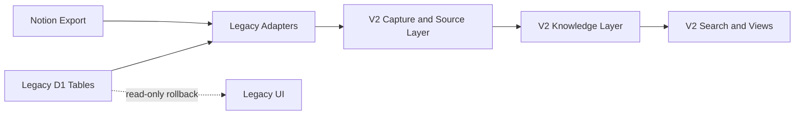

# 08. Migration and Backend Reuse

## 1. 원칙

“백엔드를 유지한다”는 것은 현재의 인프라와 안정된 서비스를 재사용한다는 의미다. 기존 도메인 테이블과 화면 구조를 새 제품의 정본으로 유지한다는 의미는 아니다.

V2는 기존 시스템 옆에 additive schema로 구축하고 검증 후 읽기·쓰기 경로를 전환한다.

## 2. 현재 자산 분류

### 재사용

| 자산 | 이유 | V2 조치 |
| --- | --- | --- |
| Cloudflare D1 연결 | 운영 DB 기반 | V2 테이블 추가 |
| Cloudflare R2 | 원본·미리보기 저장 구현 존재 | Capture Bundle 첨부로 확장 |
| 인증·세션 형식 | 제품 목표와 독립 | rotation·revocation·재인증을 보강한 V2 request context |
| signed upload 패턴 | 대용량 첨부 경로 | V2 reservation·verify·commit으로 새로 구현 |
| audit event 개념 | 이관·병합 추적 필요 | plaintext snapshot이 없는 V2 allowlist event log |
| backup/import UI 개념 | 안전한 전환에 필요 | 실제 validator가 있는 V2 job·snapshot table로 재작성 |
| saved views | 사용자 뷰 기반 | V2 Query Plan DSL로 확장 |
| 구조화 Gemini 호출 | JSON Schema 기반 존재 | 모델 라우팅·새 계약 적용 |

### 패턴 또는 연결만 재사용

| 자산 | 문제 | 조치 |
| --- | --- | --- |
| `attachments` | owner 다형성·upload 검증·근거 영역 부족 | legacy source로 유지하고 `v2_attachment_reservations`·source link 추가 |
| `quick_captures` | text 중심, domain routing 중심 | capture bundle과 processing queue로 대체 |
| `ai_conversations` | plaintext input/output와 단계·계약 부족 | V2 정본으로 재사용하지 않고 redacted processing run을 새로 구현 |
| FTS | zettel/task 등 도메인별 | document/entity/OCR/transcript 통합 |
| Vectorize | zettel 전용 | document/entity/event 임베딩으로 확장 |
| export | 4개 도메인 전용 | 정본 객체·레지스트리·원본 중심으로 재작성 |

### V2 정본으로 사용하지 않음

- `zettels`
- `media_logs`
- `places.notes`
- `daily_logs.journal/meditation`
- 기존 workout 전용 모델
- PRM 상호작용 전용 관계
- 7개 domain enum 기반 quick capture

이 테이블은 삭제하지 않고 legacy source로 읽는다.

## 3. 전환 구조



기존 테이블을 직접 고쳐 V2 모양으로 만들지 않는다.

## 4. 마이그레이션 단계

### M0. Snapshot and Inventory

- D1 backup snapshot 생성
- R2 object inventory
- 테이블별 실제 row count
- orphan attachment·relation count
- notion_source_id와 import_batch_id coverage
- 중복 후보 수
- 현재 schema와 migration journal hash

이 수치는 이관 직전에 다시 생성한다. 과거 문서의 개수를 사용하지 않는다.

### M1. Add V2 Schema

- 기존 테이블 유지
- V2 tables와 indexes 추가
- legacy source mapping 추가
- V2 export·backup 범위 확장

### M2. New Writes to V2

- 새 입력은 Capture Bundle로 저장
- legacy UI는 읽기 전용 또는 동시 운영
- AI 처리와 검색을 골든 코퍼스로 검증

새 입력 경로를 먼저 안정시킨 뒤 과거 데이터를 옮긴다.

### M3. Legacy Projection Dry-run

각 legacy row에 대해 다음만 계산하고 commit하지 않는다.

- source item 생성 계획
- document 생성 계획
- 예상 유형
- 개체·사건 후보
- 중복 후보
- 외부 조사 필요 여부
- 데이터 손실 경고

샘플과 총계 보고서를 검토한다.

### M4. Safe Projection

- source mapping 기록
- 원본 content와 legacy snapshot 저장
- V2 object 생성
- 기존 row는 수정하지 않음
- audit log 기록
- 배치별 checksum·counts 저장

### M5. Entity Reconciliation

- legacy mention과 외부 ID 집계
- 동일 개체 후보 클러스터링
- 확실한 것만 병합
- 미확정은 review queue
- grounded enrichment는 고유 개체 단위로 수행

### M6. Search Cutover

- V2 FTS·vector·property index 구축
- 리콜 시나리오 A/B 비교
- V2 결과가 기준을 통과하면 기본 검색 전환

### M7. UI Cutover

- V2 Capture/Library/Explore/Search 기본화
- legacy UI는 설정의 읽기 전용 보관소로 이동
- rollback 기간 유지

## 5. Legacy Adapter 매핑

### Zettel

```text
legacy zettel row
→ Capture(source=legacy_zettel)
→ text Source Item
→ Document
→ type assignments from type/category/content
→ links converted to Relations
```

기존 `type`과 `category`는 사용자 원문과 동일한 권위로 취급하지 않고 `imported` provenance로 둔다.

### Media Log

```text
media metadata
→ Work Entity properties

review/content
→ Review Document

started/completed dates
→ Consumption Events

rating/evaluation
→ User assessment properties
```

작품 메타데이터와 사용자의 글을 하나의 row로 유지하지 않는다.

### Place and Place Visit

```text
place row
→ Place Entity

place_visit row
→ Visit Event

review/notes
→ Review Document or imported property
```

`places.notes`에 여러 방문 경험이 섞여 있으면 자동 분할하지 않고 review 대상이 된다.

### Daily Log

```text
journal
→ Diary Document

meditation
→ Meditation Document

date
→ occurred/written date

emotions
→ imported properties
```

같은 날짜라도 일기와 묵상은 별도 문서로 투영할 수 있다.

### Workout

```text
workout row
→ Workout Event
→ optional Workout Log Document
→ typed measurement properties
```

자동화 placeholder와 실제 운동 기록은 dry-run에서 구분한다.

### PRM Interaction

```text
person
→ Person Entity

interaction
→ Conversation/Meeting Event

notes
→ related Document
```

기존 person table에 잘못 들어온 미디어 레코드는 자동 사람 개체로 투영하지 않는다.

## 6. Source Mapping

모든 V2 객체는 legacy 출처로 돌아갈 수 있어야 한다.

```text
legacy_source_type
legacy_table
legacy_id
notion_source_id
import_batch_id
legacy_snapshot_hash
v2_object_id
projection_version
projected_at
```

한 legacy row가 여러 V2 객체로 분리될 수 있으므로 1:N mapping을 허용한다.

## 7. 중복 정책

### 자동 병합 가능

- 동일 legacy source ID
- 동일한 신뢰 가능한 external ID
- 동일 파일 hash
- 동일 capture hash로 재시도된 입력

### 후보만 생성

- 제목과 본문 유사
- 같은 날짜·작품의 리뷰
- 같은 장소의 서로 다른 기록
- 같은 자동화 shell

서로 다른 방문·관람·집필 사건을 단순 중복으로 제거하지 않는다.

## 8. 무삭제 원칙

초기 이관에서는 다음을 하지 않는다.

- legacy hard delete
- 원문 요약으로 대체
- 여러 row의 무근거 병합
- AI 저신뢰 분할
- 외부 최신 정보로 과거 값 덮어쓰기

잘못된 domain row도 source로 보존하고 V2 투영만 올바르게 만든다.

## 9. 배치 감사

각 projection batch는 다음을 기록한다.

- 입력 row 수
- source item 수
- document/entity/event 생성 수
- 1:N 분할 수
- 자동 병합 수
- 미확정 개체 수
- 신규 유형·필드 후보 수
- 실패·재시도 수
- 원본 hash 검증 결과
- V2 search index 반영 수

구조 검증 통과와 내용 품질 승인을 분리한다.

## 10. Rollback

V2 이관은 additive이므로 rollback은 다음과 같다.

1. V2 write route 비활성화
2. legacy read UI 복구
3. 실패 batch의 V2 객체를 batch ID로 격리
4. legacy table과 R2 원본은 그대로 유지
5. 수정 후 새 projection version으로 재실행

V2 객체를 제거하더라도 원본 source mapping과 audit entry는 유지한다.

## 11. Backend Reuse 검증

구현 전에 다음 테스트를 통과해야 한다.

- D1 transaction 크기와 batch 한도
- R2 다중 파일 업로드·원본 다운로드
- 이미지 preview 생성 실패 시 원본 접근
- session 기반 user isolation
- backup에 V2 registry·evidence 포함
- export 후 새 DB에서 restore 가능
- Vectorize namespace와 object version 관리
- Gemini tool call·citation 수집 가능

## 12. Cutover 기준

기본 UI를 V2로 전환하기 전에:

- 골든 코퍼스 필수 기준 통과
- 새 입력 2주 이상 원본 손실 없음
- 검색 리콜 목표 달성
- export/restore 왕복 검증
- legacy sample projection의 hash·count 검증
- 치명적 개체 오병합 0건
- rollback drill 성공

기존 데이터 전체 이관 완료는 MVP 출시에 필수 조건이 아니다. 새 입력 경로와 대표 과거 자료를 먼저 안정화한다.
