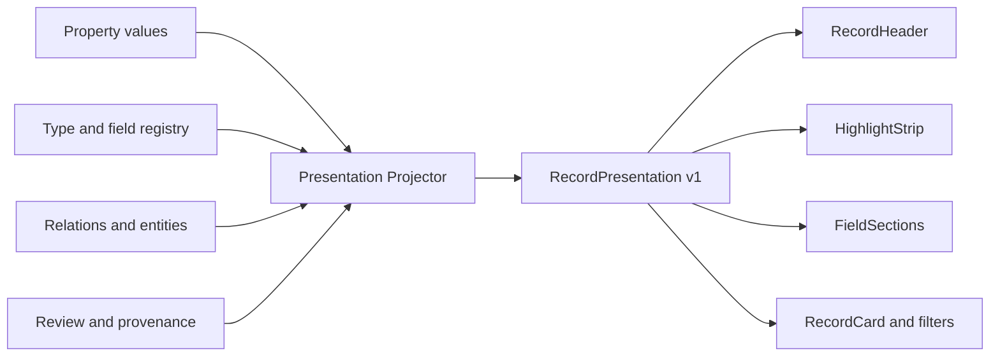

# 11. Adaptive Record UI and AI Field Presentation

## 1. 목적

V2 화면은 알려진 카테고리 수만큼 전용 페이지를 만드는 방식으로 확장하지 않는다. 장소 리뷰, 영화 감상, 에세이, 운동 기록, 처음 보는 기록 모두 같은 UI 문법 안에서 자연스럽게 보여야 한다.

핵심 결정은 다음과 같다.

> 객체 종류가 화면의 기본 골격을 정하고, 레지스트리의 표시 규칙이 필드 배치를 정하며, 검증된 값만 의미별 렌더러가 표현한다.

AI가 필드를 만들었다고 해서 모든 값을 `AI 결과` 상자에 모으지 않는다. 값은 사용자의 기록을 설명하는 정보로 제자리에 표시하고, 생성 경로·근거·신뢰 상태는 필요할 때 확인하게 한다.

## 2. 확정 UI 원칙

1. **본문 우선**: 문서 상세의 중심은 항상 사용자의 제목·본문·첨부다.
2. **범용 레코드 우선**: `PlaceDrawer`, `MediaDrawer`처럼 유형마다 컴포넌트를 늘리지 않는다.
3. **세 개의 안정된 골격**: document, entity, event의 상위 `object_kind`만 기본 화면 골격을 가진다.
4. **구조 정보 통합**: AI 필드는 별도 AI 탭이 아니라 Facts와 관계 영역에 들어간다.
5. **출처는 보이고 근거는 한 번 더 열기**: confidence 숫자는 반복하지 않지만 사용자 입력이 아닌 값의 의미적 출처는 지속적으로 표시하고, 상세 근거는 한 번 더 열어 확인한다.
6. **검토만 방해한다**: 충돌·낮은 신뢰·오식별처럼 행동이 필요한 값만 Review로 올린다.
7. **빈 필드 숨김**: 읽기 모드에서는 값이 없는 예상 필드를 보여주지 않는다.
8. **개인 경험 우선**: 작품·장소의 외부 메타데이터보다 사용자의 글, 평가, 방문·감상 사건을 먼저 보여준다.
9. **새 유형 안전성**: 새 유형에는 generic field layout을 사용하고 메뉴나 전용 화면을 자동 생성하지 않는다.
10. **서버가 표현을 투영**: 프론트엔드가 원시 EAV 행을 해석하거나 임의 배치하지 않는다.

## 3. 제품의 보이는 컴포넌트

### 전역 셸

```text
Primary destinations
보관함        모든 기록과 내 목록
탐색          개체·사건·관계 탐색
확인할 내용   사용자 판단이 필요한 고영향 항목

Global actions
새 기록       무엇이든 저장
검색           자연어와 정밀 검색

Utilities
처리 상태      분석·업로드·색인
설정           AI·데이터·내보내기
```

desktop sidebar, compact rail, mobile bottom navigation의 대응은 [15_INFORMATION_ARCHITECTURE_AND_RESPONSIVE_NAVIGATION.md](./15_INFORMATION_ARCHITECTURE_AND_RESPONSIVE_NAVIGATION.md)를 따른다.

| 컴포넌트 | 역할 |
| --- | --- |
| `AppShell` | 전역 내비게이션, 현재 위치, 모바일 shell |
| `GlobalCaptureButton` | 어느 화면에서나 Quick Capture 열기 |
| `OmniSearch` | 기록 열기, 검색, 저장 뷰 이동 |
| `BackgroundActivity` | 분석·업로드·색인 진행 상태를 방해 없이 표시 |
| `ToastAndRecovery` | 저장 성공, 오프라인, 재시도, 복구 안내 |

### Capture

| 컴포넌트 | 역할 |
| --- | --- |
| `CaptureComposer` | 텍스트와 여러 첨부를 받는 범용 입력 |
| `WritingAssistLauncher` | 본문보다 앞서지 않는 `도움받아 쓰기` 진입점 |
| `TemplateAssistPanel` | 사용자가 선택한 템플릿의 core cue 3~5개를 desktop rail·mobile sheet로 표시 |
| `RecallCueDeck` | 사용자가 펼치는 개인 경험 회상 단서 |
| `AttachmentTray` | 이미지·음성·파일 순서, 상태, 삭제 |
| `SensitivityControl` | normal, sensitive, restricted의 표시·재노출 수준 |
| `AiProcessingControl` | 저장 후 AI 정리 켜짐·꺼짐 |
| `CaptureOptions` | 원본 URL, 날짜 등 보조 옵션 |
| `CaptureReceipt` | 원본 commit ID, 저장 시각, 처리 상태 |
| `ProcessingSummary` | 분석 완료 후 핵심 결과와 상세 이동 |

카테고리 선택기와 강제 도메인 선택기는 제거한다. 템플릿은 사용자가 선택했을 때만 표시되며 데이터 타입을 강제하지 않는다. 구체적인 렌더링과 AI 공란 보완은 [12_ADAPTIVE_CAPTURE_TEMPLATES.md](./12_ADAPTIVE_CAPTURE_TEMPLATES.md)를 따른다.

### Library와 검색 결과

| 컴포넌트 | 역할 |
| --- | --- |
| `CollectionHeader` | 목록 이름, 결과 수, 저장 뷰 동작 |
| `QueryBar` | 자연어 또는 키워드 검색 |
| `FacetBar` | 레지스트리 기반 타입·날짜·평점·단위 필터 |
| `ActiveFilterChips` | 현재 적용 조건과 제거 |
| `ViewDisplayMenu` | layout, sort, group, visible field, density를 한 surface에서 조절 |
| `SaveViewAction` | 현재 query·filter·display state를 내 목록으로 저장하되 자동 pin하지 않음 |
| `RecordList` | 가상화 가능한 결과 목록 |
| `RecordCard` | 모든 객체에 쓰는 범용 카드 |
| `VisualMemoryGrid` | image-rich collection의 비율 보존 시각 탐색 |
| `RecordPeekPane` | desktop 목록을 떠나지 않는 keyboard·pointer preview |
| `InclusionReason` | 검색 결과에 포함된 이유 |

### 레코드 상세

| 컴포넌트 | 역할 |
| --- | --- |
| `RecordHeader` | 제목, 주 유형, 상태, 핵심 날짜, 대표 동작 |
| `ProcessingBanner` | 분석 중, 부분 완료, 실패, stale 상태 |
| `HighlightStrip` | 이 기록에서 가장 중요한 값 최대 6개 |
| `DocumentCanvas` | 문서 본문과 inline attachment |
| `EntityOverview` | 개체의 정체성과 사용자의 관계 요약 |
| `EventOverview` | 언제·어디서·누구와·무엇을 했는지 |
| `RelatedRecords` | 관련 문서·개체·사건 |
| `RecordInspector` | Facts, Connections, Sources, History |
| `EvidenceGutter` | field와 본문·이미지·녹취 근거 사이의 양방향 anchor |
| `MentionContextCard` | relation이 생긴 정확한 source 문맥과 origin |
| `RelatedViewModule` | 방문·글·사진·사람 같은 관련 collection projection |
| `RecordPeekPane` | wide pane·compact drawer로 변하는 가벼운 미리보기 |

### 탐색과 재발견

| 컴포넌트 | 역할 |
| --- | --- |
| `RediscoveryDeck` | 이유가 보이는 opt-in 재발견, 한 번에 record 하나 |
| `ExplainableSuggestionCard` | template·saved view·type·field 제안의 근거와 적용 범위 |

### Review

| 컴포넌트 | 역할 |
| --- | --- |
| `ReviewQueue` | 영향도 순으로 확인 항목 정렬 |
| `ReviewCard` | 문제, 제안값, 대안, 근거를 한 단위로 표시 |
| `EvidenceViewer` | 원문 span, 이미지 영역, 녹취 시점, URL 확인 |
| `CandidatePicker` | 동명 장소·작품·인물 선택 |
| `FieldMergeDialog` | 신규 필드를 기존 필드에 병합·별칭·분화 |
| `RevisionDiff` | AI 본문 제안과 문서 버전 비교 |

## 4. 레코드 화면 골격

### 문서 — desktop

```text
┌──────────────┬──────────────────────────────────┬──────────────────────┐
│ Navigation   │ Back  유형 · 상태        Edit   │ Facts                │
│              │ 제목                             │ ──────────────────── │
│              │ 작성일 · 사건일 · 저장 상태      │ 내 기록              │
│              │ [평점] [대상] [핵심 날짜]        │ 시간과 장소           │
│              │                                  │ 대상 정보             │
│              │ 본문                             │ 주제와 색인           │
│              │ 이미지·인용·표                   │                      │
│              │                                  │ Connections          │
│              │ 관련 기록                        │ Sources · History     │
└──────────────┴──────────────────────────────────┴──────────────────────┘
```

- 가운데 본문은 읽기 폭을 유지한다.
- 오른쪽 inspector는 접을 수 있고, 기본 폭은 320~380px다.
- body margin의 `EvidenceGutter`는 비사용자 핵심값의 source anchor만 조용히 표시한다.
- 편집 모드에서는 inspector가 자동으로 닫히고 사용자가 다시 열 수 있다.
- AI 채팅 영역은 고정 열로 두지 않는다.

### 모바일

- 본문이 전체 폭을 사용한다.
- `정보` 버튼이 `RecordInspector` bottom sheet를 연다.
- `HighlightStrip`은 2열 또는 가로 scroll로 줄인다.
- `EvidenceGutter`를 만들지 않고 Review·field 근거는 전체 화면 viewer로 연다.

### 개체와 사건

문서와 같은 `RecordHeader`와 `RecordInspector`를 재사용한다. 가운데 주 콘텐츠만 바뀐다.

- entity: 사용자의 평가·방문·감상 요약 → 타임라인 → 관련 글 → 외부 메타데이터
- event: 날짜·장소·참여자 → 사건 요약 → 첨부·원문 → 관련 전후 사건

장소, 영화, 책, 게임, 음식점, 인물마다 완전히 다른 page shell을 만들지 않는다. 지도, 표지, 운동 차트처럼 명백한 가치가 있는 모듈만 조건부 slot으로 추가한다.

## 5. Presentation Projection

동적 필드를 화면에 그리는 책임은 서버의 `Presentation Projector`가 가진다.



프론트엔드는 `field_definition_id + value_*` 원시 행을 직접 조합하지 않는다. 이렇게 해야 필드 병합, label 변경, 단위 변환, 사용자 표시 설정이 모든 화면에 일관되게 반영된다.

### 출력 계약

```ts
type RecordPresentation = {
  projectionVersion: 1;
  record: {
    id: string;
    objectKind: "document" | "entity" | "event";
    title: string;
    primaryType?: DisplayType;
    secondaryTypes: DisplayType[];
    lifecycleStatus: string;
  };
  viewPresetKey: string;
  header: PresentedField[];
  highlights: PresentedField[];
  sections: PresentedSection[];
  modules: PresentedModule[];
  connections: PresentedConnection[];
  review: { count: number; highestImpact?: "high" | "medium" | "low" };
  processing: { state: string; analyzedRevisionId?: string; stale: boolean };
};

type DisplayType = {
  typeDefinitionId: string;
  key: string;
  label: string;
  iconKey: string;       // semantic catalog key, library component name이 아님
  accentRole: "neutral" | "primary" | "warm";
  status: "candidate" | "observed" | "active" | "archived";
};

type PresentedModule = {
  moduleKey: string;
  presentationVersion: number;
  title?: string;
  data: unknown;
  sourceLabels: string[];
  previewPolicy: "full" | "redacted" | "locked";
};

type PresentedField = {
  propertyValueId: string;
  fieldKey: string;
  label: string;
  displayKind: DisplayKind;
  value: unknown;
  formattedValue: string;
  unit?: string;
  sourceClass: string;
  sourceLabel: "내가 입력" | "원문에서 추출" | "이미지에서 읽음" | "녹취에서 추출" | "외부 출처" | "계산" | "AI 해석";
  epistemicClass: "direct" | "external_fact" | "calculated" | "interpretation";
  claimRisk: "low" | "autobiographical" | "social_high_risk";
  confidence?: number;
  reviewStatus: "accepted" | "proposed" | "disputed";
  evidenceCount: number;
  lockedByUser: boolean;
  editable: boolean;
};
```

`confidence`는 전달하지만 일반 화면에서 숫자로 노출하지 않는다. `sourceLabel`은 사용자 입력이 아닌 값에서 숨기지 않는다. `claimRisk=social_high_risk`인 값은 직접 인용 또는 사용자 확인이 없으면 `accepted` presentation을 만들 수 없다.

`iconKey`, `viewPresetKey`, `moduleKey`는 서버 registry가 검증한다. unknown key나 module projection 실패는 해당 표현만 generic fallback으로 바꾸며 body와 일반 field를 막지 않는다. authored document는 module이 있어도 body가 첫 번째다.

## 6. 레지스트리의 표시 규칙

`type_field_rules`에 다음의 제한된 표현 메타데이터를 둔다.

```yaml
type: place_review
field: user_rating
display_zone: highlight
group_key: my_experience
display_kind: rating
display_order: 10
importance: primary
compact: true
filterable: true
```

### `display_zone`

| 값 | 의미 |
| --- | --- |
| `header` | 제목과 함께 보여야 하는 핵심 정체성 정보 |
| `highlight` | 최대 6개의 한눈에 보는 값 |
| `facts` | inspector의 일반 필드 |
| `contextual` | 특정 본문·타임라인 문맥에서만 표시 |
| `hidden` | 검색에는 쓰지만 기본 상세에는 숨김 |

### `display_kind`

- text
- long_text
- rating
- measurement
- duration
- date
- datetime
- boolean
- money
- entity_link
- location
- url
- chip_list
- ordered_list
- image_ref
- source_link
- structured_fallback

AI가 임의 React 컴포넌트 이름, CSS, HTML을 생성하게 하지 않는다. AI는 필드의 의미와 후보 역할을 제안할 수 있고, 서버가 허용된 `display_kind`와 `display_zone`으로 정규화한다.

type 수준의 icon·collection preset·record preset은 `type_presentation_profiles`에서 별도로 결정한다. 적용 우선순위와 module 제한은 [20_ICON_AND_VIEW_EXTENSION_CONTRACT.md](./20_ICON_AND_VIEW_EXTENSION_CONTRACT.md)를 따른다.

### 기본 group

| `group_key` | 표시명 | 내용 |
| --- | --- | --- |
| `my_experience` | 내 기록 | 평점, 감상, 추천, 재방문 의사 |
| `time_and_place` | 시간과 장소 | 집필·사건 날짜, 위치 |
| `activity_metrics` | 활동 수치 | 거리, 시간, 심박, 세트, 무게 |
| `conversation` | 대화와 사건 | 참여자, 논점, 결정, 후속 행동 |
| `subject_information` | 대상 정보 | 작품·장소·책의 외부 사실 |
| `themes_and_index` | 주제와 색인 | 주제, 개념, 정서, 키워드 |
| `other` | 기타 정보 | 아직 group이 정규화되지 않은 필드 |

빈 group은 표시하지 않는다. group은 새 유형마다 새 컴포넌트를 만드는 대신 필드를 의미 있는 덩어리로 읽게 한다.

## 7. 어떤 값을 얼마나 눈에 띄게 보여줄 것인가

표시 위치는 AI confidence 하나로 결정하지 않는다. 다음 순서로 판단한다.

1. 사용자가 직접 고정한 표시 설정
2. active type의 `type_field_rule`
3. 사용자가 명시하거나 직접 수정한 값
4. 리콜·필터·정렬에 실제로 유용한 값
5. 근거와 충돌 상태
6. 현재 화면 문맥

### Header

- 주 유형 1개
- lifecycle 상태
- 가장 중요한 날짜 1개
- 대표 대상 또는 장소 1개

Header는 메타데이터 보관소가 아니다. 보조 유형은 `+2`처럼 접어 둔다.

### HighlightStrip

- 최대 6개
- 평점, 날짜, 거리, 시간, 대상, 추천 상황처럼 기록을 빠르게 식별하는 값
- `proposed`, `disputed`, 근거 없는 외부 사실은 제외
- 같은 의미의 값은 하나만 표시
- 외부 작품 정보보다 사용자의 평가와 사건을 우선

### Facts

- group별 label-value 행
- 값이 긴 경우 2줄 요약 후 펼치기
- 반복 값은 chip 또는 목록
- 후보 신규 필드는 `기타 정보`에서 즉시 보여줄 수 있음
- 후보 필드라도 filter facet과 내비게이션에는 승격 전 노출하지 않음

### 표시하지 않는 값

- `rejected`, `superseded`: History에서만 확인
- 낮은 신뢰의 고위험 값: Review에서만 확인
- 내부 처리용 hash, prompt ID, schema ID: 일반 UI에서 숨김
- 빈 필드와 장식적 placeholder

## 8. 출처와 신뢰 상태의 표현

모든 값 옆에 `AI 97%`를 붙이면 글을 읽기 어려워지고 정확해 보이는 숫자에 과신하게 된다. 그러나 사용자 입력이 아닌 값의 출처까지 감추면 시간이 지난 뒤 사용자가 자신의 기억과 AI·외부 정보를 구분하기 어렵다.

따라서 UI는 다음 세 층을 분리한다.

1. `ValueOriginMark`: 값 옆에 항상 보이는 짧은 의미적 출처. 아이콘만 사용하지 않고 접근 가능한 label을 제공한다.
2. `EvidencePopover`: 근거의 짧은 요약과 source로 이동하는 action을 제공한다.
3. `EvidenceGutter`·`EvidencePeek` 또는 `EvidenceViewer`: field와 원문 span, 이미지 영역, 녹취 timecode, URL, 계산식을 양방향으로 연결한다.

사용자가 직접 입력한 값은 일반적으로 표지를 생략해 화면 소음을 줄인다. 나머지 값은 다음 label을 지속적으로 표시한다.

| source/status | 기본 표현 | 상세에서 확인할 것 |
| --- | --- | --- |
| `user_locked` | 일반 값, 작은 lock affordance | 수정자와 수정 시각 |
| `user_explicit` | 표지 없는 일반 값 | form evidence 또는 원문 span |
| `user_context` | `원문에서 추출` | 원문 span |
| `image_ocr` | `이미지에서 읽음` | 이미지 highlight |
| `transcript_extract` | `녹취에서 추출` | 녹취 timecode |
| `external_grounded` | `외부 출처` | URL, 제공자, 확인일 |
| `calculated` | `계산` | 공식과 입력값 |
| `ai_inferred` | `AI 해석` | 근거 범위와 해석 설명 |
| `proposed` | `확인 필요` Review card | 수락·수정·거절 |
| `disputed` | amber 경고 | 충돌값과 각각의 근거 |

AI가 사용자의 문장에서 평점 `4.5 / 5`를 추출했으면 그 값은 `AI 평가`가 아니라 `사용자 명시값`이다. 반대로 글의 정서를 AI가 추론한 값은 사실처럼 보이지 않도록 `주제와 색인` 안에 둔다.

`내가 확인함`은 사용자가 그 값을 확인했다는 뜻이지 객관적 진실을 인증했다는 뜻은 아니다. UI에서 내부 상태명 `accepted`를 사용자-facing label로 사용하지 않는다.

### 고위험 개인·사회적 주장

다음 값은 직접 발언·직접 관찰·사용자 확인 가운데 하나가 없으면 Highlight, 인물 Overview, 자동 타임라인에 들어가지 않는다.

- 타인의 감정·의도·동기·성격
- 관계 상태와 갈등 원인
- 사건 간 인과관계
- 약속·합의·결정
- 사용자를 규정하는 지속적 성격·정체성 label

AI 해석이 필요한 경우 `HighRiskProposalCard`에서 근거 인용과 함께 제안한다. 사용자 action은 `내 기록으로 확인`, `표현 수정`, `해석으로만 보관`, `버리기`다. 단순 `수락`을 사용하지 않는다.

## 9. 검토를 요구하는 기준

모든 AI 필드를 승인하게 만들지 않는다. Review는 오류의 영향도로 결정한다.

### 즉시 Review

- 다른 지점·작품·인물로 연결될 수 있는 개체 식별
- 사용자 명시값과 OCR·외부 값이 충돌
- 타임라인을 바꾸는 불명확한 날짜
- 평가 척도 해석 충돌
- 여러 문서로 분할할지 불확실
- 기존 필드와 의미·단위가 충돌하는 신규 필드

### 자동 표시 가능

- 명확한 원문 span이 있는 사용자 명시값
- 고신뢰 OCR과 직접 연결된 수치
- 단일 정본 개체에 연결된 안정 외부 사실
- 검색 보조용 주제·키워드

자동 표시되더라도 사용자가 수정하면 새 `user_locked` 값이 되고, 이전 값은 이력으로 남는다.

## 10. 필드 편집 동작

필드 행을 선택하면 일관된 `FieldEditor`를 연다.

- 실제 데이터 타입에 맞는 입력기
- 단위 변환과 기준 단위 표시
- 원문 근거 열기
- 외부 출처 열기
- 사용자 고정/고정 해제
- 값 제거
- 이전 값 이력

사용자가 label을 바꾸는 것과 canonical field 의미를 바꾸는 것은 구분한다.

- 표시명 변경: 개인 UI 설정
- 값 수정: `property_value` supersede
- 필드 의미 변경·병합: Registry Review

## 11. RecordCard

모든 목록은 범용 카드 계약을 사용한다.

```text
[thumbnail]  제목                         2026-08-10
             장소 리뷰 · draft
             본문 또는 요약 두 줄
             ★ 4.5   모모식당   데이트
             포함 이유: 방문 기록과 직접 평점이 있음
```

구성 제한:

- 제목 1개
- 주 유형 1개
- 대표 날짜 1개
- snippet 2~3줄
- highlight 최대 3개
- 검색 화면에서만 inclusion reason
- 처리·검토 상태 badge 최대 1개

카드 안에 모든 동적 필드를 나열하지 않는다.

### 사용 가능한 layout

| layout | 노출 조건 |
| --- | --- |
| list | 항상 |
| cards | 항상 |
| visual | image attachment가 있는 결과가 충분할 때 |
| timeline | 날짜가 있는 결과가 충분할 때 |
| map | 위치가 있는 entity/event 결과일 때 |
| calendar | day precision 이상의 event 결과일 때 |
| table | 비교 가능한 active 필드가 있을 때 |

AI가 신규 유형을 만들었다는 이유만으로 layout을 새로 만들지 않는다.

`visual`은 `VisualMemoryGrid`로 렌더링한다. 원본 image ratio를 유지하고 음식·책·게임·운동 screenshot을 같은 crop으로 강제하지 않는다. title·date·type은 hover뿐 아니라 keyboard focus에서도 확인할 수 있고 OCR text를 image 위에 덮지 않는다. 기본 Library layout은 list다.

### Preview와 관계 문맥

`RecordPeekPane`은 `RecordCard`보다 많은 내용을 보여주되 상세 화면을 복제하지 않는다.

- 제목·주 유형·대표 날짜
- 안전한 snippet 4~6줄
- highlight 최대 3개
- Search에서만 `InclusionReason`
- 관련 record 소수
- 전체 record 열기

wide에서는 380~440px pane, compact에서는 drawer, mobile에서는 full record route다. `Space`, `Space` hold, `↑/↓`, `Enter`, `Esc`를 지원하고 collection focus·scroll·filter를 보존한다.

`Connections`의 `MentionContextCard`는 source record 제목·날짜, 직접 문맥 1~3줄, relation predicate, origin, source 위치로 이동을 제공한다. `RelatedViewModule`은 entity·event에 연결된 방문·글·사진·사람 collection을 list·timeline·visual 같은 허용 layout으로 투영한다.

### 안전한 재발견

`RediscoveryDeck`은 `탐색 > 다시 보기`에서 한 번에 normal record 하나를 보여주고 표시 이유, `열기`, `나중에`, `다시 보여주지 않기`를 제공한다. sensitive는 사용자가 별도 허용한 경우에만, restricted는 항상 제외한다. 사람의 감정·의도·성격·관계 해석은 resurfacing 조건이나 이유로 사용하지 않는다.

### 민감도에 따른 card와 preview

`RecordSummaryPresentation`은 본문을 그대로 잘라 전달하지 않고 서버가 계산한 `previewPolicy`를 포함한다.

| privacy level | Library card | 검색 snippet | 자동 추천·재노출 |
| --- | --- | --- | --- |
| `normal` | 제목, snippet, 허용 highlight | 일치 문맥 표시 | 사용자 설정 범위에서 가능 |
| `sensitive` | 제목과 사용자가 허용한 최소 metadata, 본문 가림 | `민감한 기록에서 일치`만 표시하고 명시적으로 열기 | 기본 제외 |
| `restricted` | 잠금 label과 날짜 정도만 표시 | 내용 snippet 없음 | 항상 제외 |

최근 기록, 알림, `이날의 기록`, 관련 글 추천, Person/Entity Overview도 같은 정책을 사용한다. 클라이언트가 화면마다 임의로 snippet을 생성하지 않는다.

## 12. 사례별 표시

### 장소 리뷰

```text
Header: 장소 리뷰 · 모모식당 연남점 · 방문일
Highlight: 4.5/5, 가지튀김, 데이트, 재방문 의사
Main: 사용자가 쓴 리뷰와 사진
내 기록: 평점, 먹은 메뉴, 추천 상황
대상 정보: 주소, 음식점 종류, 외부 확인일
Connections: 방문 사건, 함께 간 사람, 관련 글
```

주소와 메뉴는 같은 층위가 아니다. 주소는 장소 개체의 외부 사실이고, 먹은 메뉴는 방문 사건 또는 리뷰의 사용자 경험이다.

### 영화·게임·책 감상

```text
Header: 영화 감상 · 작품 · 감상일
Highlight: 내 평점, 감상 상태, 인상적 주제
Main: 감상문
내 기록: 평가와 인용
대상 정보: 감독, 배우, 출시일, 제작사
Connections: 감상 사건, 관련 에세이, 이전 평가
```

감독과 배우가 본문보다 먼저 화면을 점유하지 않는다.

### 에세이·묵상·시

```text
Header: 에세이 · 작성일 · 상태
Highlight: 핵심 주제와 관련 개념
Main: 글 전체
주제와 색인: AI가 파악한 주제, 정서, 연결 개념
Connections: 관련 글, 인용한 작품, 다룬 사건
```

평점이나 장소처럼 해당하지 않는 빈 슬롯을 만들지 않는다. 시는 행과 연을 그대로 렌더링한다.

### 운동 화면 캡처

```text
Header: 달리기 기록 · 운동일
Highlight: 거리, 시간, 평균 심박, 페이스
Main: 사용자의 메모와 화면 캡처
활동 수치: OCR 측정값과 단위
시간과 장소: 운동 시각, 경로·장소
Sources: 수치가 나온 이미지 영역
```

처음 등장한 `보폭` 필드도 generic measurement renderer로 보인다. 다만 반복 검증 전에는 전체 Library의 filter facet에 넣지 않는다.

### 대화·논쟁 캡처 또는 녹취

```text
Header: 대화 기록 · 날짜 · 참여자
Highlight: 핵심 논점, 사용자가 확인한 결정·후속 행동
Main: 원문 또는 정리된 transcript
대화와 사건: 인물, 주장, 합의·갈등, 발생 사건
Connections: 관련 인물·이전 대화·후속 사건
Sources: 메시지 이미지 영역 또는 녹취 timecode
```

참여자·발언·시간은 직접 근거가 있으면 표시할 수 있다. 주장·반박은 발언 attribution을 유지하고, 합의·갈등·의도·관계 상태는 사용자 확인 전까지 `AI 해석` 또는 `확인 필요`로만 둔다. 인물 상세에는 AI가 만든 성격 label을 누적하지 않는다.

### 완전히 새로운 유형

```text
Header: AI 제안 label + `새 분류` 보조 표시
Icon: parent profile 또는 `type.unknown`
Main: 원문은 정상 표시
Facts: 인식된 값은 generic renderer로 표시
Review: 기존 유형·필드와 충돌할 때만 요청
Explore: 승격 전에는 전용 메뉴 없음
```

새 유형은 UI 오류가 아니라 레지스트리 관찰 상태다.

## 13. 현재 V1 컴포넌트의 전환

| 현재 | V2 결정 |
| --- | --- |
| `QuickCaptureModal` | `CaptureComposer`로 교체; 강제 도메인 제거, 다중 첨부와 저장 영수증 추가 |
| `ZenEditor` textarea stub | `MarkdownDocumentEditor`로 교체 |
| `ZettelDrawer` | 범용 `RecordPeekPane`의 document presentation으로 흡수 |
| `PlaceDrawer` | 범용 entity 화면 + 선택적 map slot으로 흡수 |
| `MediaDrawer` | 범용 work entity 화면 + cover slot으로 흡수 |
| `SideDrawerHost` type switch | `objectId`로 presentation projection을 불러오는 generic host |
| `FilterBar` | 레지스트리 facet contract 기반 `FacetBar`로 교체 |
| `Tag` | `TypeBadge`, `StatusBadge`, `TopicChip`, `ValueChip`으로 의미 분리 |
| 반복 `GlassCard` | 보조 패널과 transient UI에만 사용; 본문에는 사용하지 않음 |

V1 컴포넌트는 시각 참고와 일부 shell 동작을 재사용할 수 있지만, V2 데이터 문법을 그대로 수용하는 기반으로 간주하지 않는다.

페이지별 component tree, Capture wireframe, 자동 생성 template UI, 상태 계약과 frontend 폴더 경계는 [13_COMPONENT_ARCHITECTURE_AND_INTERACTIONS.md](./13_COMPONENT_ARCHITECTURE_AND_INTERACTIONS.md)를 구현 기준으로 사용한다.

## 14. Component MVP 순서

1. `CaptureComposer` + `AttachmentTray` + `CaptureReceipt`
2. `WritingAssistLauncher` + `TemplateAssistPanel` + field binding
3. `MarkdownDocumentEditor` + 저장·revision 상태
4. `Presentation Projector` + `PresentedField` contract
5. `RecordHeader` + `HighlightStrip` + `RecordInspector`
6. `ValueRenderer` 집합과 `EvidenceViewer`
7. `RecordCard` + `RecordList`
8. `ReviewQueue` + 핵심 review card
9. `FacetBar` + 저장 뷰
10. entity/event 가운데 영역과 선택적 slot

장소·게임·운동 전용 대시보드는 이 기반이 실제 자료에서 부족하다고 확인될 때만 만든다.

## 15. UI 수용 기준

다음 여섯 자료가 별도 전용 컴포넌트 없이 읽기 좋게 보여야 한다.

1. 별점과 메뉴가 있는 장소 리뷰
2. 감독·배우가 보강된 영화 감상
3. 주제 색인이 생성된 긴 에세이
4. 행과 연이 중요한 시
5. OCR 수치가 있는 운동 캡처
6. 참여자·논점·사건이 있는 대화 자료

각 사례에서 다음을 검증한다.

- 본문이 메타데이터보다 시각적으로 우선함
- 중요한 값은 5초 안에 찾을 수 있음
- 값의 근거를 2번 이하의 동작으로 열 수 있음
- 잘못된 값을 3번 이하의 동작으로 수정 가능
- confidence 숫자를 몰라도 검토 필요 여부를 알 수 있음
- 신규 필드가 layout을 깨지 않음
- 모바일에서 정보 패널 때문에 본문 폭이 줄지 않음
