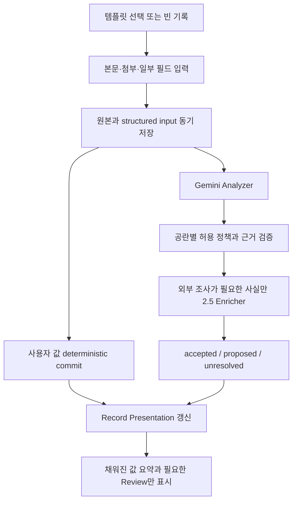

# 12. Adaptive Capture Templates

## 1. 목적

템플릿은 사용자가 무엇을 기록할지 떠올리도록 돕는 선택적 입력 안내층이다. 리뷰라면 대상 작품, 경험 날짜, 함께한 사람, 평점이 먼저 보이고, 사용자는 구조를 고민하지 않은 채 기억과 감상에 집중할 수 있어야 한다.

핵심 원칙은 다음과 같다.

> 템플릿은 기억을 꺼내는 단서이지 완성을 강요하는 양식이 아니다. 사용자가 먼저 기록하고, AI는 제출 후 근거가 있는 공란만 보완한다.

## 2. 확정 결정

| 항목 | 결정 |
| --- | --- |
| 제품 위치 | 자유 입력 위에 얹는 선택적 capture mode |
| 데이터 의미 | 문서 유형이나 DB 스키마가 아닌 입력·단서·배치 설정 |
| 필드 연결 | 자유 문자열 대신 기존 `field_definition`, relation predicate, core field를 참조 |
| 기본 진입 | `빈 기록`을 항상 유지하고 최근·고정 템플릿을 최대 3개 제안 |
| 필수 입력 | 없음; 데이터 타입 오류 외에는 빈칸 때문에 저장을 막지 않음 |
| AI 보완 | 제출 후 현재 캡처 근거, 계산, 허용된 외부 조사 범위 안에서만 수행 |
| 사용자 값 | AI가 덮어쓰지 않는 `user_explicit` 값 |
| AI 추론 | 사실처럼 확정하지 않고 `proposed`로 표시 |
| 생성 | 기존 글 하나 이상에서 AI 초안을 만들 수 있지만 사용자가 `이 템플릿 유지`를 명시적으로 선택하기 전에는 active로 게시하지 않음 |
| 자동 생성 | 반복 기준을 충족하면 백그라운드에서 `generated_draft`를 자동 생성하되 사용자의 Capture 메뉴에는 제안으로만 노출 |
| 버전 | 게시된 template version은 불변; 과거 캡처는 사용한 version을 참조 |
| 본문 | 템플릿 질문을 Markdown에 자동 삽입하지 않음 |

템플릿을 선택했어도 AI Analyzer는 실제 자료를 독립적으로 판단한다. 잘못 선택한 템플릿 때문에 기록을 강제로 리뷰나 운동 기록으로 분류하지 않는다.

## 3. 인지심리학을 제품 규칙으로 바꾸기

### 빈 화면보다 구체적인 회상 단서

“무엇을 쓰지?”라는 자유 회상보다 “누구와 있었는가?”, “언제였는가?”, “가장 남은 장면은 무엇인가?” 같은 단서는 당시 경험에 접근할 경로를 제공한다. 따라서 필드 label은 데이터베이스 용어가 아니라 자연스러운 질문으로 표현한다.

```text
participants  →  누구와 함께였나요?
occurred_at   →  언제 본 작품인가요?
user_rating   →  지금 남아 있는 평점은?
```

### 사용자가 먼저 생성

AI가 감상문을 먼저 써주면 사용자는 내용을 검토하는 사람이 된다. 템플릿은 기억을 꺼낼 단서만 제공하고, 본문과 개인 평가를 미리 채우지 않는다. AI 자동 보완은 사용자가 제출한 뒤 수행한다.

빈 기록의 첫 화면에서는 본문에 즉시 focus한다. 자동 생성 template과 AI 추천은 첫 문장을 쓰기 전에 펼쳐 보이지 않는다. 예외는 다음 두 경우뿐이다.

- 사용자가 직접 고정한 template을 선택해 진입
- 사용자가 `도움받아 쓰기`를 명시적으로 열어 template을 선택

시스템은 작성 중인 본문을 감시해 template panel을 자동으로 열거나 전환하지 않는다.

### 자기참조와 맥락 복원

작품의 감독·출시일보다 다음 질문을 먼저 보여준다.

- 그때 누구와 어디에 있었는가?
- 무엇을 기대했는가?
- 어떤 장면·문장·맛이 남았는가?
- 나에게 왜 중요했는가?
- 누구에게 권하고 싶은가?

외부 사실은 AI가 나중에 찾을 수 있지만 개인 경험은 사용자가 아니면 복원하기 어렵다.

### 질문 과잉 방지

- 첫 화면의 core cue는 3~5개
- reflection cue는 한 번에 1개를 우선 제안
- 나머지는 `더 떠올려보기`에서 점진적으로 공개
- 공란은 허용하고 완료율 progress bar를 사용하지 않음
- “필수” 대신 `먼저`, `생각해볼 것`, `선택 사항`의 세 단계만 사용
- 중립적 질문을 사용하고 특정 감정이나 평가를 유도하지 않음

3~5개는 초기 UI 가설이지 고정된 심리 법칙이 아니다. 빈 기록, core cue 3개, core cue 5개 조건을 비교해 글 시작 시간, 고유 세부사항, 방해감, 저자성을 측정한 뒤 조정한다.

템플릿 작성 완료율을 목표로 최적화하지 않는다. 목표는 더 풍부하고 개인적인 기록을 적은 부담으로 남기는 것이다.

### 전제와 유도 질문 방지

AI가 생성한 prompt는 게시 전에 `PromptSafetyLint`를 통과한다.

| 피해야 할 표현 | 문제 | 권장 표현 |
| --- | --- | --- |
| 누구와 함께였나요? | 동행자가 있었다고 전제 | 함께한 사람이 있었나요? 혼자였다면 비워두세요. |
| 가장 좋았던 점은? | 긍정 평가를 전제 | 가장 기억에 남은 점은 무엇인가요? |
| 왜 중요했나요? | 중요성을 전제 | 중요하게 느껴졌다면 무엇 때문인가요? |
| 상대는 왜 그렇게 말했나요? | 타인의 의도를 추론하게 함 | 상대가 직접 밝힌 이유가 있었나요? |
| 결국 무엇을 합의했나요? | 합의가 있었다고 전제 | 명시적으로 합의하거나 결정한 내용이 있었나요? |

system seed와 AI-derived template은 경고가 남아 있으면 게시할 수 없다. 사용자가 만든 개인 template은 의도적인 질문임을 확인하고 유지할 수 있지만, 그 질문으로 얻은 답을 AI가 타인의 의도나 관계 사실로 자동 확정하지는 않는다.

## 4. 세 가지 입력 요소

템플릿은 서로 역할이 다른 요소를 섞지 않는다.

### Structured Input

본문 밖의 실제 구조화 값이다.

- 평점
- 날짜
- 장소·작품·책·게임
- 함께한 사람
- 거리·시간·심박
- 추천 상황

저장 후 `property_value`, relation, event, core field에 연결된다.

### Recall Cue

기억을 떠올리기 위한 일시적 질문이다.

```text
기대와 달랐던 점이 있었나요?
가장 먼저 떠오르는 장면은 무엇인가요?
그날의 분위기를 한 문장으로 적는다면?
```

질문 자체는 본문과 데이터에 저장하지 않는다. 사용자가 답하면 답은 `body_markdown`에 들어간다. 사용자가 명시적으로 `질문도 본문에 넣기`를 선택한 경우에만 Markdown heading이나 문장으로 삽입한다.

### Optional Scaffold

에세이 개요나 반복 보고서처럼 실제 Markdown 구조가 필요할 때만 사용한다. 이는 사용자가 명시적으로 적용해야 하며, 빈 placeholder 문장은 저장 전에 제거한다.

## 5. Capture 화면

### 템플릿을 고르기 전 — memory-first

```text
새 기록                                      저장 후 AI 정리 [켜짐]

무엇이든 적거나 이미지를 붙여넣으세요.

[도움받아 쓰기]  [첨부]
```

- `빈 기록`이 별도 선택지가 아니라 기본 상태다.
- 본문이 첫 focus를 받고 template 목록은 `도움받아 쓰기` 안에서 연다.
- 사용자가 직접 고정한 template은 `도움받아 쓰기`를 열었을 때 첫 section에 최대 3개만 보인다.
- 자동 생성 초안은 초기 편집 화면에 독립 chip으로 노출하지 않는다.
- 템플릿을 선택하지 않아도 기존 자유 Capture 흐름은 그대로 동작한다.

### 사용자가 리뷰 템플릿을 선택한 경우

```text
리뷰                                      템플릿 변경

어떤 작품인가요?     [작품 검색 또는 직접 입력]
언제 경험했나요?     [날짜]
누구와 함께였나요?   [인물 여러 명]
내 평점               [☆ ☆ ☆ ☆ ☆]

┌──────────────────────────────────────────────┐
│ 자유롭게 감상을 적으세요.                   │
│                                              │
│                                              │
└──────────────────────────────────────────────┘

떠올림 단서  [가장 남은 장면은?] [누구에게 권하고 싶은가요?]
[더 떠올려보기]

사진·파일
[저장하고 AI로 공란 정리]
```

- desktop에서는 본문 오른쪽의 assistance rail, mobile에서는 사용자가 연 bottom sheet에 core cue를 배치한다.
- 본문은 여전히 가장 큰 영역이다.
- 상세 필드는 접힌다.
- 빈 필드에는 `저장 후 AI가 현재 자료에서 찾아봅니다`라는 한 번의 안내만 표시한다.
- 템플릿 변경은 이미 입력한 본문과 호환되는 필드값을 보존한다.
- assistance rail을 닫아도 template session과 입력값은 유지되며 본문 폭은 즉시 집중 폭으로 돌아간다.

### Full Writer

Full Writer에서도 템플릿을 적용할 수 있지만 본문을 교체하지 않는다.

- 새 문서: 사용자가 연 assistance rail에서 template item과 recall cue 제공
- 기존 문서: 현재 유형·값을 기준으로 관련 템플릿 제안
- 이미 값이 있는 필드: 기존 값을 표시
- 빈 필드: AI 보완 정책 표시
- optional scaffold: 별도 diff 미리보기 후 본문에 적용

## 6. 공란의 의미

공란을 하나의 `null`로만 취급하지 않는다.

| 상태 | 의미 | AI 동작 |
| --- | --- | --- |
| `unanswered` | 아직 답하지 않음 | item의 정책 범위에서 보완 가능 |
| `unknown` | 사용자가 모름 | 외부에서 확인 가능한 사실만 조사 가능 |
| `not_applicable` | 해당 없음 | 채우지 않음 |
| `withheld` | 의도적으로 기록하지 않음 | 채우거나 추론하지 않음 |

기본 공란은 `unanswered`다. 사용자는 필드의 더보기 메뉴에서 나머지 상태를 선택할 수 있다. `withheld`는 AI 입력 계약에도 전달하여 과거 데이터나 외부 소스에서 우회 추론하지 못하게 한다.

## 7. AI 보완 정책

각 template item은 허용된 AI 작업을 선언한다.

| 정책 | 허용 예 | 금지 예 |
| --- | --- | --- |
| `none` | 사용자가 직접 쓰는 개인 메모 | AI가 개인 의견 생성 |
| `extract_from_capture` | 본문의 “민서와 봤다”에서 동행인 추출 | 과거 습관으로 동행인 추측 |
| `resolve_entity` | 입력한 작품명을 정본 작품과 연결 | 단서가 약한 동명 작품 자동 병합 |
| `enrich_external` | 감독, 배우, 주소, 출시일 조사 | 개인 평점이나 함께한 사람 조사 |
| `calculate` | 거리와 시간에서 평균 페이스 계산 | 입력값 없는 수치 생성 |
| `interpret_proposed` | 주제, 정서, 추천 상황 제안 | 사용자 사실로 자동 확정 |

### 값별 commit 규칙

- 사용자가 직접 입력: `user_explicit`, 즉시 accepted, AI overwrite 금지
- 현재 본문·이미지·녹취에서 명시 추출: 근거가 있으면 accepted
- 안정된 외부 사실: URL과 개체 식별이 있으면 accepted
- 계산값: 공식과 입력 근거가 있으면 accepted
- 개인 경험에 대한 AI 추론: proposed
- 근거가 없거나 충돌: 공란 유지 또는 Review

“누구와 봤는지”가 비어 있고 현재 자료에 이름이 없다면 AI는 채우지 않는다. 반면 영화 제목이 있고 감독이 비어 있다면 Grounded Enricher가 출처와 함께 채울 수 있다.

## 8. 저장과 처리 흐름



사용자가 저장 완료를 기다리는 조건은 기존과 마찬가지로 원본 commit이다. AI 보완 실패 때문에 템플릿 입력이나 본문 저장을 롤백하지 않는다.

### Analyzer 입력

```json
{
  "template_context": {
    "template_version_id": "tplv_review_3",
    "expected_roles": ["primary_document", "subject_entity", "experience_event"],
    "inputs": [
      {
        "item_key": "user_rating",
        "state": "unanswered",
        "allowed_ai_operations": ["extract_from_capture"]
      },
      {
        "item_key": "companions",
        "state": "withheld",
        "allowed_ai_operations": []
      }
    ]
  }
}
```

템플릿은 Analyzer에 유용한 가설을 주지만 실제 유형·객체·관계를 강제하지 않는다.

## 9. Template Definition v1

템플릿 정의는 검증 가능한 JSON 계약으로 저장한다.

```ts
type TemplateDefinition = {
  contractVersion: 1;
  name: string;
  description?: string;
  expectedTypeIds: string[];
  objectRoles: Array<{
    role: "primary_document" | "subject_entity" | "experience_event";
    typeId?: string;
    optional: boolean;
  }>;
  sections: TemplateSection[];
};

type TemplateItem = {
  key: string;
  kind: "field" | "relation" | "core" | "recall_cue" | "scaffold" | "attachment";
  prompt: string;
  helperText?: string;
  prominence: "core" | "suggested" | "optional";
  binding?: {
    ownerRole: "primary_document" | "subject_entity" | "experience_event";
    fieldDefinitionId?: string;
    predicateKey?: string;
    corePath?: "document.title" | "document.written_at" | "event.occurred_at";
  };
  inputKind?: string;
  cardinality?: "one" | "many";
  allowedAiOperations: string[];
};
```

`inputKind`는 `rating`, `date`, `entity_picker`, `person_picker`, `measurement`, `chips`, `text`, `long_text` 등 서버 허용 목록만 사용한다. AI가 HTML, React component, SQL, JSON Schema 코드를 직접 만들지 않는다.

## 10. 데이터 모델

### `capture_templates`

| 필드 | 설명 |
| --- | --- |
| `id`, `user_id` | 소유 템플릿 |
| `name`, `description` | 표시 정보 |
| `icon_key` | type profile에서 상속하거나 사용자가 확정한 semantic icon key |
| `origin` | system_seed, user_created, ai_derived, imported |
| `status` | draft, generated_draft, suggested, trial, active, dismissed, archived |
| `current_version_id` | 현재 게시 version |
| `pinned`, `usage_count` | 노출과 추천 |
| `created_at`, `updated_at` | 이력 |

### `capture_template_versions`

- immutable version number
- validated `definition_json`
- registry snapshot version
- 생성 모델·prompt version
- 사용자 승인 시각
- 이전 version ID

### `template_source_links`

AI가 어떤 기존 문서에서 구조를 추출했는지 기록한다.

- `template_version_id`
- `source_document_id`
- `source_revision_id`
- `role`: example, pattern_source, user_selected

### `capture_template_sessions`

- capture draft 또는 capture bundle ID
- 선택한 template version ID
- 적용·해제 시각
- item별 blank state
- 제출 시점의 user input snapshot

### `template_pattern_observations`

- normalized pattern signature와 version
- source document·revision IDs
- type·field·relation·heading·attachment feature
- similarity와 cluster ID
- first/last observed date
- 생성·dismiss·기존 template merge 결과

dismissed pattern signature는 보존하여 같은 구조를 이름만 바꿔 다시 제안하지 않게 한다. 원본 본문 전문을 pattern row에 복제하지 않는다.

`generated_draft`의 `icon_key`는 표시 후보일 뿐이다. 연결된 type profile을 기본 상속하고 사용자가 `이 템플릿 유지`를 선택하기 전에는 override를 확정하지 않는다. icon은 상세 record의 view preset이나 type assignment를 결정하지 않는다.

### `capture_input_values`

사용자가 폼에 직접 입력한 구조화 원본이다.

- template session과 item key
- binding snapshot
- typed value
- input order
- blank state
- client timestamp

이 값은 Source Layer에 속하며 AI가 수정하지 않는다. Knowledge Layer의 property·relation으로 projection할 때 `form_field` evidence를 연결한다.

## 11. 기존 글에서 템플릿 만들기

### 사용자가 직접 요청

```text
문서 1개 이상 선택
→ 템플릿으로 만들기
→ AI가 반복 구조와 회상 단서 제안
→ 레지스트리 field·predicate와 reconcile
→ 값이 제거된 빈 preview 생성
→ 사용자가 질문·순서·AI 정책 확인
→ active version 게시
```

한 글만으로도 만들 수 있다. 여러 글을 선택하면 공통 패턴과 선택 패턴을 분리한다.

### 시스템의 자동 생성과 제안

자주 쓰는 글은 사용자가 매번 “템플릿으로 만들기”를 누르지 않아도 시스템이 백그라운드에서 `generated_draft` 템플릿을 만든다. 자동 생성은 다음 조건을 모두 만족해야 한다.

- 서로 다른 문서 3건 이상
- 최소 3개의 서로 다른 날짜에 작성됨
- 같은 상위 유형 또는 유사한 객체 역할 구조
- 반복된 field·relation·heading·attachment 역할이 3개 이상
- pattern similarity 기본값 0.80 이상
- 기존 active·trial template과 similarity 0.85 미만
- literal 제거와 registry binding validator 통과

횟수와 similarity는 운영 지표를 보고 조정 가능한 정책으로 둔다. 생성된 초안은 Template Library의 `자동 초안`에 즉시 보관하되 전역 템플릿 목록이나 내비게이션에는 자동으로 추가하지 않는다. 다음 관련 기록을 시작할 때 다음과 같이 제안한다.

```text
최근 영화 감상 4개에서
작품 · 감상일 · 동행인 · 평점 · 인상 깊은 장면을 반복해 기록했습니다.

[템플릿 초안 보기] [나중에] [다시 제안하지 않기]
```

자동 생성은 빈도뿐 아니라 다음을 확인한다.

- 같은 유형 또는 가까운 상위 유형
- 반복된 field·relation pattern
- 사용자가 실제로 수정·조회한 값
- 기존 템플릿과의 중복
- private literal을 prompt나 default로 복사하지 않았는지

### 자동 생성 template 생명주기

```text
pattern_observed
→ generated_draft
→ suggested
→ trial
→ explicit_keep
→ active
→ archived
       ↘ dismissed
```

| 상태 | 의미 |
| --- | --- |
| `generated_draft` | 시스템이 만들고 validator를 통과했지만 아직 사용자에게 보이지 않은 초안 |
| `suggested` | Capture 또는 Template Library에서 제안된 상태 |
| `trial` | 사용자가 `이번에 사용`으로 한 번 이상 적용한 상태 |
| `active` | 사용자가 `이 템플릿 유지`를 명시적으로 선택하여 기본 추천 대상이 된 상태 |
| `dismissed` | 사용자가 관심 없다고 판단하여 동일 pattern 제안을 숨긴 상태 |
| `archived` | 과거 사용 이력은 유지하지만 새 입력에는 추천하지 않는 상태 |

`이번에 사용`은 템플릿을 즉시 고정하지 않는다. 반복 사용 횟수는 `계속 사용할까요?`를 물을 수 있는 신호일 뿐 승인으로 해석하지 않는다. 사용자가 응답하지 않으면 계속 `trial`이며, 거절하거나 dismiss하면 같은 pattern을 다시 제안하지 않는다.

### 반복 패턴 signature

개별 문장 표현이 아니라 다음 구조를 정규화해 비교한다.

- primary·secondary type ID
- document, subject entity, experience event의 역할
- 사용자가 명시하거나 수정한 field definition ID
- relation predicate
- 반복된 Markdown heading 의미
- attachment의 역할과 종류
- 사용자가 실제로 다시 찾거나 필터한 값

본문 embedding은 후보군을 찾는 보조 신호로만 사용하며, 비슷한 주제를 썼다는 이유만으로 같은 템플릿을 만들지 않는다.

### active template의 진화

새 반복 패턴이 기존 active template과 가깝다면 새로운 템플릿을 만들지 않는다. 기존 version에 대한 `revision_proposal`을 만든다.

```text
최근 4개 기록에서 ‘다시 보고 싶은가요?’를 반복해 적었습니다.
[템플릿에 추가] [한 번만 사용] [무시]
```

승인 전에는 active definition을 바꾸지 않는다. 승인하면 새 immutable template version을 게시한다.

### 값 제거 규칙

원본의 `민서`, `4.5`, `듄: 파트 2`를 템플릿 기본값으로 복사하지 않는다. AI는 이를 `함께한 사람`, `내 평점`, `대상 작품`이라는 binding과 자연어 질문으로 바꾼다. 사용자가 명시적으로 기본값을 지정할 때만 저장한다.

## 12. 템플릿 편집기

사용자는 코드나 스키마를 보지 않는다.

- 이름과 설명
- preview에서 drag & drop 순서 변경
- core / suggested / optional 단계 변경
- 질문 문구 편집
- 필드 추가: 레지스트리 검색 또는 새 필드 제안
- AI 보완 허용 범위 확인
- 입력 component 미리보기
- 모바일 preview
- 테스트 입력 후 예상 저장 구조 보기

새 필드 제안은 템플릿 안에 고립시키지 않고 Registry Reconciler를 거친다. 기존 필드의 alias라면 동일 definition을 재사용한다.

## 13. 템플릿 추천

추천 우선순위:

1. 사용자가 고정한 템플릿
2. 현재 화면의 객체·컬렉션 문맥
3. 최근 사용
4. 붙여넣은 URL·첨부의 명백한 형식
5. 작성 중 명시적으로 `템플릿 추천`을 요청한 경우의 Gemini 분류

AI가 작성 중 텍스트를 보고 템플릿을 자동 전환하지 않는다. 추천은 작은 chip으로만 표시하고 사용자가 선택해야 layout이 변한다.

빈 Capture에서는 이 chip도 본문보다 먼저 보이지 않는다. 사용자가 `도움받아 쓰기`를 열었거나 source를 저장한 뒤 다음 행동을 고르는 시점에만 표시한다.

저장 후 Analyzer가 반복 유형을 알아낸 경우 다음 기록을 위한 템플릿을 제안할 수 있다. 이는 현재 기록의 저장이나 분류를 막지 않는다.

## 14. 템플릿과 상세 화면의 분리

템플릿은 입력 당시의 도움이다. 저장된 레코드의 상세 화면은 템플릿이 아니라 현재 데이터와 `Presentation Projector`로 렌더링한다.

- 템플릿을 삭제해도 기록은 유지
- 템플릿 순서를 바꿔도 과거 기록 표시 불변
- 과거 기록은 사용한 template version과 form evidence를 추적 가능
- 템플릿에 없던 AI 신규 필드도 상세 화면에서 표시 가능
- 템플릿에 있었지만 공란인 필드는 읽기 화면에서 숨김

## 15. 보안과 실패 안전성

- AI 생성 prompt·label은 plain text로 sanitize
- 허용된 item kind, binding, input kind만 validator가 수용
- 원문 속 “시스템 지시”를 template instruction으로 실행하지 않음
- 템플릿은 DDL, SQL, HTML, JavaScript를 포함할 수 없음
- binding 대상 field가 merged되면 canonical field로 자동 재투영
- field가 archived되면 편집 시 교체 후보를 보여주되 과거 version은 유지
- 템플릿 분석 실패 시 빈 기록으로 계속 저장 가능
- AI가 공란을 채우지 못해도 오류가 아니라 `unresolved` 상태

## 16. MVP와 단계

### MVP

- `빈 기록` 유지
- 사용자 고정 템플릿 최대 3개 노출
- 범용 리뷰 템플릿 1개
- field, relation, recall cue item
- 공란 상태 4종
- 제출 후 정책 기반 AI 보완
- 사용자 값 overwrite 방지
- template version과 form evidence
- 간단한 템플릿 편집·복제
- 기존 문서 1개에서 템플릿 초안 만들기

범용 리뷰 템플릿 하나로 영화, 게임, 책, 드라마, 애니메이션을 처리하되 subject entity subtype을 실제 분석 결과에 따라 구분한다. 장소 리뷰는 같은 상위 템플릿을 복제해 방문 사건과 메뉴 field를 추가할 수 있다.

### 다음 단계

- 여러 문서에서 공통 패턴 추출
- 반복 패턴 기반 자동 제안
- 대화·운동·묵상 템플릿
- 템플릿 검색과 공유·import/export
- 사용 패턴 기반 prompt 추가·제거 제안
- 캡처 문맥 기반 추천

템플릿마다 전용 React 화면을 만들지 않는다. 모든 템플릿은 같은 `TemplateRenderer`와 허용된 input component 집합을 사용한다.

## 17. 평가 기준

### 경험 지표

- 빈 기록과 템플릿 사이를 한 동작으로 전환 가능
- 빈 기록 진입 후 1초 안에 본문 focus
- 템플릿 선택 후 2초 안에 본문 입력 시작 가능
- core cue가 첫 화면에서 5개를 넘지 않음
- 빈 필드가 저장을 막지 않음
- 모바일에서 본문 영역이 metadata에 밀리지 않음
- 자동 생성 template이 사용자의 첫 문장보다 먼저 펼쳐지는 비율 0%
- 반복 사용만으로 template이 active가 되는 비율 0%

### AI 품질

| 지표 | MVP 목표 |
| --- | ---: |
| 사용자 입력값 overwrite | 0% |
| `withheld` / `not_applicable` 자동 보완 | 0% |
| 개인 경험 무근거 자동 채움 | 0% |
| 감정·의도·성격·관계·인과의 무근거 accepted | 0% |
| 자동 채운 accepted 값의 evidence coverage | 100% |
| 외부 보강값 provenance coverage | 100% |
| template binding validation | 100% |

### 실제 가치

골든 코퍼스의 동일 기록을 자유 입력과 템플릿 입력으로 각각 수행해 다음을 비교한다.

- 기록 시작까지 걸린 시간
- 사용자가 남긴 개인 맥락의 수
- template prompt에 포함되지 않은 고유 세부사항의 수
- AI가 보완한 필드 중 수정된 비율
- 나중의 구조 검색·타임라인 포함률
- 사용자가 느낀 방해 정도
- 작성 결과에 대한 소유감과 `내가 쓴 글 같다`는 평가

필드 완료율이나 글자 수가 늘었다는 이유만으로 성공으로 판단하지 않는다.
