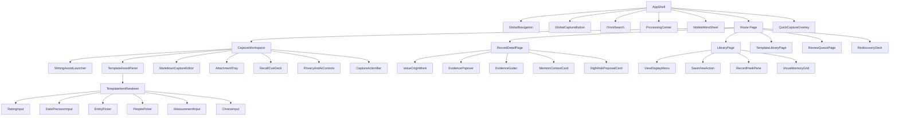

# 13. Component Architecture and Interaction Specification

## 1. 목적

이 문서는 V2에서 실제로 보이는 화면을 구현 가능한 컴포넌트 단위로 나눈다. 특정 글 유형이 추가될 때 새 페이지와 새 폼을 만드는 구조가 아니라, 동일한 입력·표시 컴포넌트가 레지스트리 계약을 렌더링해야 한다.

우선순위는 다음과 같다.

1. 사용자가 즉시 기록할 수 있다.
2. 템플릿이 기억을 돕지만 본문을 밀어내지 않는다.
3. 저장과 AI 처리 상태를 혼동하지 않는다.
4. 새 유형과 새 필드가 기존 layout을 깨지 않는다.
5. 컴포넌트가 원시 EAV 데이터와 Gemini 응답에 직접 결합하지 않는다.
6. 사용자의 첫 문장이 자동 template·AI 제안보다 먼저 온다.
7. 사용자 입력이 아닌 값은 출처가 보이고, 상세 근거는 한 번 더 열 수 있다.
8. 민감 기록과 고위험 사람 추론은 편의보다 심리적 안전을 우선한다.

## 2. 화면 경로

```text
/capture                         전체 Capture Workspace
/library                         모든 문서와 저장 뷰
/library/inbox                   수집함 system view
/library/views                   모든 저장 뷰
/library/views/:viewId           저장 뷰 결과
/library/templates               Template Library
/library/templates/:templateId   Template Detail / Studio
/records/:objectId               document · entity · event 상세
/search                          자연어·정밀 검색
/explore                         개체·사건·관계 탐색
/explore/rediscovery             사용자가 시작하는 다시 보기 session
/review                          오류·충돌·식별 Review
/settings                        AI·데이터·내보내기
```

전역 `GlobalCaptureButton`은 현재 화면 위에 `QuickCaptureOverlay`를 연다. 내용이 길어지거나 템플릿 편집이 필요하면 draft를 유지한 채 `/capture`로 확장한다.

`/`는 `/library`로 redirect한다. desktop Library·Search의 `RecordPeekPane`은 URL의 `peek` query로 선택 상태를 보존하고, mobile은 `/records/:objectId` full page를 연다. 검색어·filter·sort·layout·group·density는 URL 또는 saved view display state에 유지한다. 전반 route와 responsive navigation 계약은 [15_INFORMATION_ARCHITECTURE_AND_RESPONSIVE_NAVIGATION.md](./15_INFORMATION_ARCHITECTURE_AND_RESPONSIVE_NAVIGATION.md)를 따른다.

## 3. 컴포넌트 계층



## 4. 컴포넌트 층별 책임

### UI Primitive

데이터 의미를 모르는 작은 컴포넌트다.

- `Button`
- `IconButton`
- `TextInput`
- `Textarea`
- `Popover`
- `Dialog`
- `Sheet`
- `Tabs`
- `SegmentedControl`
- `Disclosure`
- `Menu`
- `Tooltip`
- `Progress`
- `Skeleton`
- `VisuallyHidden`

Primitive는 AI provenance, field definition, template binding을 해석하지 않는다.

### Semantic Input

검증된 입력 계약을 실제 조작 UI로 바꾼다.

| 컴포넌트 | 입력 데이터 | 주요 동작 |
| --- | --- | --- |
| `RatingInput` | scale, max, step | 별·숫자 표시, 키보드 조절, 초기화 |
| `DatePrecisionInput` | date/datetime, precision | 정확한 날짜와 연·월 정도의 불확실성 지원 |
| `EntityPicker` | entity kind, candidate query | 기존 개체 선택, 직접 입력, 새 후보 생성 |
| `PeoplePicker` | person entity relation | 여러 인물 선택과 미확정 이름 입력 |
| `MeasurementInput` | dimension, units | 값·단위 입력과 canonical unit 변환 |
| `DurationInput` | duration | 시·분·초 입력 |
| `ChoiceInput` | option set, multiple | 단일·복수 선택과 직접 입력 |
| `BooleanInput` | yes/no/unknown | 이분법을 강제하지 않는 미정 상태 |
| `ShortTextInput` | text rule | 짧은 값 입력 |
| `LongTextInput` | long text rule | 본문과 구분되는 구조화 장문 값 |
| `BlankMeaningMenu` | blank state | unanswered, unknown, not applicable, withheld |

Semantic Input은 동일 field가 Capture, Inspector, Review에서 같은 방식으로 편집되도록 공유한다.

### Contract Renderer

서버가 보낸 허용된 계약을 semantic component로 분배한다.

- `TemplateItemRenderer`
- `PresentedValueRenderer`
- `EvidenceLocatorRenderer`
- `ReviewItemRenderer`

알 수 없는 kind는 화면을 중단하지 않고 `UnsupportedContractFallback`을 표시하고 telemetry를 남긴다. raw JSON을 사용자에게 기본 출력하지 않는다.

### Product Composite

사용자 과업 단위의 컴포넌트다.

- Capture components
- Template components
- Record components
- Library and Search components
- Review components

## 5. 전역 셸

### `AppShell`

책임:

- 전역 navigation
- route content 영역
- overlay·sheet portal
- background processing 상태
- 전역 단축키와 toast
- online/offline 상태

V1의 도메인별 `GlobalNav + LocalNav` 이중 구조는 V2에서 제거한다. 사용자-facing primary destination은 `보관함`, `탐색`, `확인할 내용`이며 `새 기록`과 `검색`은 전역 action, `처리 상태`와 `설정`은 utility다.

### `GlobalNavigation`

Desktop wide는 224px sidebar, compact desktop·tablet은 64px rail, mobile은 하단 navigation을 사용한다.

- `새 기록`은 일반 navigation item보다 명확한 primary action
- `확인할 내용`은 high-impact 항목이 있을 때만 count 표시
- background AI 처리 수는 navigation badge로 표시하지 않음
- Template Library와 내 목록은 `보관함` 하위이며 전역 primary navigation을 차지하지 않음
- desktop sidebar의 고정 내 목록은 최대 5개
- desktop 검색은 top `OmniSearch`와 `Ctrl/Cmd+K`, mobile 검색은 bottom navigation의 독립 destination
- mobile bottom navigation 순서는 `보관함`, `검색`, `새 기록`, `탐색`, `더보기`
- mobile `더보기`는 확인할 내용, 내 목록, 템플릿, 처리 상태, 설정을 연다.

### `DesktopSidebar`와 `CompactNavigationRail`

- wide desktop: 224px expanded sidebar
- compact desktop·tablet: 64px rail
- expanded sidebar에는 보관함 child, 사용자 고정 내 목록 최대 5개, 모든 목록을 표시
- rail의 child navigation은 click·keyboard로 anchored panel을 열고 hover에 의존하지 않음
- expand·collapse preference는 device-local로 저장
- current route는 text, shape, `aria-current`로 표시

### `OmniSearch`

- desktop top utility bar의 `기록, 사람, 장소, 목록 검색`
- `Ctrl/Cmd+K`로 overlay open
- 최근·고정 기록, record·entity·event, saved view·template·setting destination, command, 전체 검색을 section으로 구분
- 선택 결과는 오른쪽 `RecordPeekPresentation` 또는 destination preview에 즉시 표시
- `새 기록`, `현재 보기를 저장`, `오늘 기록 보기` 같은 명령을 제공하되 content query와 시각적으로 구분
- 선택된 결과가 있으면 Enter로 열고, 자유 query Enter는 `/search` route로 이동해 query를 URL에 보존
- 자연어 query를 chat transcript로 만들지 않음
- mobile에서는 bottom `검색`이 같은 contract의 full page를 사용

### `MobileBottomNavigation`과 `MobileMoreSheet`

- bottom navigation item은 `보관함`, `검색`, `새 기록`, `탐색`, `더보기` 다섯 개로 고정
- label을 숨기고 icon만 표시하지 않음
- `더보기`는 확인할 내용, 내 목록, 템플릿, 처리 상태, 설정을 full-height가 아닌 content-sized sheet로 표시
- visible close, focus trap·restore, Android back, safe-area inset 지원
- keyboard가 열린 Capture에서는 bottom navigation을 숨길 수 있지만 save action은 visual viewport 위에 유지

### `ProcessingCenter`

업로드·OCR·분석·보강·색인의 백그라운드 상태를 모은다.

```text
처리 중 2
├── 한강 달리기 — 외부 보강 대기
└── 영화 감상 — 색인 생성 중
```

- 성공은 조용히 사라짐
- 재시도 가능한 실패는 직접 재시도 제공
- 사용자 판단이 필요한 문제만 Review로 이동

### `GlobalCaptureButton`

- Desktop: navigation 상단의 `새 기록`
- Mobile: bottom navigation 중앙의 `새 기록`
- 단축키: `Ctrl/Cmd+N`
- 현재 선택한 record·entity가 있으면 context suggestion만 전달하고 입력을 강제하지 않음

## 6. Capture Workspace

### Desktop 골격

```text
┌────────────────────────────────────────────────────────────────────────────┐
│ 새 기록          임시 저장됨       민감도: 일반   AI 정리: 켜짐    닫기 │
├────────────────────────────────────────────────────────────────────────────┤
│                                                                            │
│                제목                                                        │
│                ─────────────────────────────────────────                   │
│                                                                            │
│                무엇이든 적거나 이미지를 붙여넣으세요.                     │
│                글을 자유롭게 작성하는 Markdown 편집 영역                  │
│                                                                            │
│                                                                            │
│                [도움받아 쓰기]  [떠올림 단서]  [첨부 2]                   │
│                                                                            │
├────────────────────────────────────────────────────────────────────────────┤
│ 저장 후 AI가 구조와 검색 정보를 정리합니다.                  [기록 저장] │
└────────────────────────────────────────────────────────────────────────────┘
```

첫 진입은 위 상태이며 본문에 즉시 focus한다. template 목록과 자동 초안은 펼치지 않는다. 사용자가 `도움받아 쓰기`를 열고 template을 선택하면 오른쪽 assistance rail을 추가한다.

```text
┌──────────────────────────────────────────────┬─────────────────────────────┐
│ 제목                                         │ 리뷰 · 이번 기록에만 사용   │
│                                              │                             │
│ 본문                                         │ 어떤 작품인가요? [_______]  │
│                                              │ 언제 경험했나요? [_______]  │
│                                              │ 함께한 사람이 있었나요?     │
│                                              │ 내 평점 [☆☆☆☆☆]             │
│                                              │                             │
│                                              │ [다른 항목] [패널 닫기]      │
└──────────────────────────────────────────────┴─────────────────────────────┘
```

assistance rail은 300~340px이며 본문을 640px 미만으로 압축해야 하는 폭에서는 overlay sheet로 전환한다. core item은 최대 5개, suggested·optional item은 disclosure 안에 둔다. panel을 닫아도 값과 template session은 유지된다.

### Mobile 골격

```text
┌─────────────────────────┐
│ 취소   새 기록    저장  │
│ 일반 · AI 정리 켜짐     │
├─────────────────────────┤
│ 제목                    │
│                         │
│ 본문                    │
│                         │
├─────────────────────────┤
│ 도움받아 쓰기 · 첨부    │
└─────────────────────────┘
```

- mobile에서 template item은 한 열
- sticky footer가 keyboard를 가리지 않도록 visual viewport 대응
- template·떠올림 단서·첨부·민감도는 사용자가 여는 bottom sheet
- template panel은 자동으로 열리지 않으며 닫아도 입력값 유지
- AI 정리 상태는 header의 짧은 text control로 확인하고 bottom sheet에서 변경

### `CaptureWorkspace`

전체 draft의 조정자다.

```ts
type CaptureDraftViewModel = {
  draftId: string;
  title: string;
  bodyMarkdown: string;
  selectedTemplate?: TemplateSessionView;
  inputValues: TemplateInputView[];
  attachments: AttachmentDraftView[];
  saveState: "clean" | "dirty" | "saving_local" | "saving_server" | "saved" | "offline" | "conflict";
  submitState: "idle" | "committing_source" | "committed" | "failed";
};
```

책임:

- local draft와 server working copy 조정
- template 변경 시 호환 입력값 보존
- attachment upload와 본문 저장 분리
- 한국어 IME composition 중 단축키 제출 방지
- source commit 이후 `CaptureReceipt` 전환

AI 분석 상태는 source submit state와 별도 store·query로 관리한다.

### `CaptureHeader`

- 화면명. 현재 template은 assistance panel 안에서 표시하여 제목처럼 사용자를 규정하지 않음
- `SaveStateIndicator`
- `SensitivityControl`: 일반, 민감, 제한됨
- `AiProcessingControl`: 저장 후 AI 정리 켜짐·꺼짐
- full/overlay 전환
- 닫기
- 충돌 상태 진입점

글자 수, AI confidence, template 완료율은 표시하지 않는다.

### `WritingAssistLauncher`

초기 Capture에 보이는 유일한 template 진입점이다.

- visible label: `도움받아 쓰기`
- 현재 template이 있으면 `리뷰 도움 사용 중`처럼 상태를 설명
- 열면 `TemplateAssistPanel` 또는 `TemplatePicker`로 이동
- 자동 생성 template·최근 template을 초기 화면에 독립 chip으로 펼치지 않음
- 작성 중인 본문을 분석해 launcher를 흔들거나 강조하지 않음

사용자가 고정한 template으로 직접 진입한 경우에만 launcher 옆에 template 이름을 표시할 수 있다. blank capture를 별도 chip으로 표시하지 않는다. panel을 닫으면 자연스럽게 blank writing surface로 돌아간다.

### `TemplatePicker`

Desktop dialog, mobile full-height sheet다.

section:

1. 고정
2. 최근 사용
3. 자동 생성 초안
4. 모든 템플릿
5. 새 템플릿 만들기

검색은 name뿐 아니라 type, field label, 예시 용도로 찾는다. preview를 오른쪽 또는 다음 화면에서 보여주며 선택 전에 field wall 전체를 펼치지 않는다.

자동 생성 초안은 사용자가 picker를 연 경우에만 이 section에서 보인다. 두 번 사용했다는 이유로 고정·active 영역에 자동 이동하지 않는다.

### `TemplateAssistPanel`

- core item 3~5개
- suggested item disclosure
- optional item picker
- template 변경·해제
- item-level blank meaning menu
- AI가 제출 후 할 수 있는 일을 한 문장으로 설명
- desktop assistance rail, 좁은 desktop과 mobile에서는 sheet
- 사용자가 닫아도 session과 값 유지
- panel open·close가 editor selection과 scroll을 잃지 않음
- panel 제목에 `이번 기록에만 사용` 또는 `내가 유지한 템플릿` 상태 표시

`TemplateDefinition`을 직접 해석하지 않고 서버의 `TemplatePresentation`을 받는다.

```ts
type TemplatePresentation = {
  templateVersionId: string;
  name: string;
  iconKey: string;
  origin: "system_seed" | "user_created" | "ai_derived";
  stage: "active" | "trial" | "suggested";
  coreItems: PresentedTemplateItem[];
  suggestedItems: PresentedTemplateItem[];
  optionalItems: PresentedTemplateItem[];
};
```

### `RecallCueDeck`

- 한 번에 cue 1개를 기본 표시
- `다른 단서`로 교체
- `더 떠올려보기`에서 최대 3개
- cue 답변은 본문 cursor 위치에 사용자가 직접 작성
- 답변 입력칸을 별도로 만들지 않음
- cue를 dismiss해도 blank field나 validation 상태에 영향 없음

### `MarkdownCaptureEditor`

Full Writer와 같은 Markdown model을 사용하지만 도구를 줄인다.

- plain paragraph, heading, list, quote, link, image paste
- selection이 있을 때만 나타나는 `SelectionToolbar`
- raw block 이름보다 `제목`, `인용`, `이미지`, `기록 연결`, `사람 연결` 같은 의도를 먼저 보여주는 `/` command
- internal entity/document link
- focus mode
- template placeholder 자동 삽입 금지
- toolbar·menu·focus mode 전환 뒤 editor cursor·selection·scroll 복원
- 한국어 IME composition 중 slash 검색·Enter 확정과 global shortcut 방지

긴 글쓰기 기능은 `전체 편집기로 열기`에서 확장한다.

### `AttachmentTray`

- thumbnail 또는 file row
- upload state
- drag reorder
- 역할 선택: source, inline, quotation, identifier
- OCR/분석 상태는 업로드 완료 후 보조 표시
- upload 실패가 텍스트 저장을 막지 않음

### `CaptureActionBar`

주요 action은 하나다.

- Primary: `기록 저장`
- `AiProcessingControl`이 켜져 있으면 설명: `저장 후 AI가 현재 자료에서 구조와 검색 정보를 정리합니다`
- 꺼져 있으면 설명: `원본만 저장합니다. 나중에 정리할 수 있습니다`
- Secondary menu: 저장 후 Full Writer 열기
- 공란 수나 완료 percentage를 CTA에 표시하지 않음

### `QuickCaptureOverlay`

`CaptureWorkspace`의 compact composition이다. 별도 상태 모델이나 API를 만들지 않는다.

- 너비 680~760px
- `WritingAssistLauncher`
- 사용자가 template을 선택한 경우에만 compact `TemplateAssistPanel`, core item 최대 4개
- 최소 Markdown editor
- attachment tray
- 항상 확인 가능한 AI 정리와 민감도 상태
- `전체 화면으로 확장`
- `Ctrl/Cmd+Enter` 저장, Enter 줄바꿈

V1처럼 Enter 단독으로 제출하지 않는다.

## 7. 자동 생성 템플릿 컴포넌트

자동 생성 템플릿은 오류가 아니므로 `ReviewQueue`에 섞지 않는다.

### `GeneratedTemplateSuggestionEntry`

빈 Capture의 첫 화면에는 표시하지 않는다. 다음 세 위치에서만 나타난다.

1. 사용자가 직접 연 `TemplatePicker`의 자동 생성 초안 section
2. source 저장 후 `CaptureReceipt`의 방해하지 않는 다음 행동
3. Template Library의 자동 초안 section

```text
최근 영화 감상 기록에서 반복된 입력 방식을 찾았습니다.
[초안 보기] [관심 없음]
```

- `초안 보기` 후 사용자가 `이번에 사용`을 선택해야 `trial` session으로 적용
- sparkle은 출처를 알리는 장식이며 AI confidence를 뜻하지 않음
- dismiss하면 동일 pattern signature를 다시 제안하지 않음
- 사용 횟수는 active 전환 조건이 아님

### `GeneratedTemplateSuggestionCard`

Template Library의 `자동 초안` section에 표시한다.

```text
영화 감상 기록

4개의 글에서 반복된 구조를 찾았습니다.
작품 · 감상일 · 함께한 사람 · 평점 · 인상 깊은 장면

[이번에 사용] [내용 보기] [관심 없음]
```

confidence percentage를 표시하지 않고 관찰된 문서 수와 반복 요소를 설명한다.

### `PatternEvidencePanel`

`내용 보기`에서 연다.

- pattern source 문서 수
- 반복된 type, field, relation, heading
- 기존 template과 다른 점
- literal 제거 결과
- source 문서 바로가기

본문 전문을 한 화면에 재노출하지 않는다. 사용자가 source를 선택해야 원문을 연다.

### `TemplateTrialBanner`

자동 초안을 적용한 Capture에 한 번만 표시한다.

```text
반복 기록에서 만든 임시 템플릿입니다.
[이 템플릿 유지] [이번에만 사용] [수정]
```

기본값은 `이번에만 사용`이다.

`이 템플릿 유지`를 선택한 경우에만 active가 된다. 반복 적용은 이 질문을 보여줄 수 있는 신호일 뿐 묵시적 동의가 아니다.

### `TemplateEvolutionSuggestion`

active template에 반복되는 새 항목을 발견했을 때 Template Studio 또는 Library에 표시한다.

- 기존 version과 proposed version diff
- 새 항목의 pattern evidence
- 추가, 한 번만 적용, 무시
- 승인 시 새 immutable version 생성

Capture 도중 modal로 막지 않는다.

### `ExplainableSuggestionCard`

자동 template, saved view, emerging type, field evolution 제안은 같은 anatomy를 공유한다.

1. 무엇을 제안하는가
2. 왜 제안했는가
3. 어떤 record에서 관찰했는가
4. 적용하면 무엇이 바뀌는가
5. 한 번 사용, 계속 사용, 수정, 관심 없음

`GeneratedTemplateSuggestionCard`는 이 공통 anatomy의 template variant다. confidence percentage와 sparkle을 품질 점수처럼 사용하지 않으며 어떤 variant도 자동 active·pin·navigation 생성으로 이어지지 않는다.

## 8. Template Library

### 화면 골격

```text
Templates                                      [새 템플릿]

고정
[리뷰] [장소 방문]

자동 초안 2
[영화 감상 제안 카드]
[운동 기록 제안 카드]

모든 템플릿
[검색] [상태 필터]
```

### `TemplateLibraryPage`

- `PinnedTemplateGrid`
- `GeneratedDraftSection`
- `TemplateList`
- `TemplateSearchBar`
- `TemplateStatusFilter`

초기에는 card와 list 두 layout만 제공한다.

### `TemplateCard`

- 이름
- 설명 한 줄
- core cue label 최대 4개
- origin: 내가 만듦 / 기록에서 생성 / 기본 제공
- 사용 횟수와 최근 사용일
- 상태: trial, active, draft, archived
- 사용, 편집, 복제, archive

템플릿 품질을 나타내는 AI confidence는 표시하지 않는다.

### `TemplateStudio`

Desktop은 editor + preview 2열, mobile은 Edit/Preview tab이다.

```text
┌────────────────────────────┬────────────────────────────┐
│ 이름과 설명                │ 실제 Capture Preview       │
│                            │                            │
│ 핵심 정보                  │ 작품 [____]               │
│ ☰ 대상 작품      core      │ 날짜 [____]  평점 [☆☆☆☆☆]│
│ ☰ 경험 날짜      core      │                            │
│ ☰ 평점           core      │ 본문                       │
│                            │                            │
│ 생각해볼 것                │ 떠올림 단서                │
│ ☰ 인상 깊은 장면           │                            │
│                            │                            │
│ [+ 항목]                   │                            │
└────────────────────────────┴────────────────────────────┘
```

하위 컴포넌트:

- `TemplateIdentityEditor`
- `TemplateSectionEditor`
- `TemplateItemRow`
- `TemplateItemSettingsSheet`
- `BindingPicker`
- `AiOperationSelector`
- `TemplateLivePreview`
- `TemplateVersionDiff`
- `PublishTemplateBar`

### `TemplateItemRow`

- drag handle
- 자연어 prompt
- binding label
- prominence
- input kind icon
- AI policy summary
- duplicate·delete

row에서 모든 설정을 펼치지 않는다. 세부 설정은 side sheet를 사용한다.

### `BindingPicker`

검색 순서:

1. 현재 expected type의 기존 field·relation
2. 상위 유형 field
3. 전체 레지스트리
4. 새 field 제안

새 field는 Registry Reconciler 결과가 나오기 전 게시할 수 없다. alias, reuse, specialize, candidate 중 결과를 사람이 읽을 수 있게 보여준다.

### `AiOperationSelector`

사용자에게 모델명이나 내부 enum 대신 의미를 보여준다.

```text
이 공란을 AI가 어떻게 도울까요?
( ) 자동으로 채우지 않음
( ) 내가 쓴 글과 첨부에서만 찾기
( ) 작품·장소의 공개 정보도 확인
( ) 해석으로 제안하되 확인받기
```

개인 경험 field에는 공개 정보 조사를 선택할 수 없도록 binding authority가 option을 제한한다.

### `PromptSafetyLint`

Template Studio에서 AI-derived·system seed 질문의 전제와 유도를 검사한다.

- 존재 전제: `누구와 함께였나요?`, `무엇을 합의했나요?`
- 감정·평가 방향 전제: `가장 좋았던 점`, `왜 실망했나요?`
- 타인의 내면 추론: `상대는 왜 그랬나요?`
- 정체성 고정: `나는 어떤 사람인가요?`를 반복 특성 field로 저장
- 답변 강요: 공란을 실패로 취급하는 문구

각 경고는 문제, 중립적 대안, 영향받는 binding을 보여준다. AI-derived·system seed template은 미해결 경고가 있으면 publish할 수 없다. 사용자가 만든 개인 template은 의도적 질문으로 유지할 수 있지만 고위험 답변의 commit authority는 높아지지 않는다.

## 9. 저장 후 전환

### `CaptureReceipt`

source commit 직후 editor를 가리지 않는 compact success state다.

```text
기록을 안전하게 저장했습니다.  14:32
[기록 열기] [계속 새 기록]

AI가 정리 중입니다.
```

- source commit ID는 상세 disclosure에서만 표시
- AI 처리 완료를 저장 성공으로 오인하지 않음
- 앱을 닫아도 처리된다는 안내

### `ProcessingSummary`

분석 완료 후 다음 변화만 요약한다.

- 생성된 문서·사건·개체
- 채워진 공란
- 외부 조사 완료
- Review가 필요한 항목

```text
영화 감상으로 정리했습니다.
감독과 주연 배우를 확인했고, 본문에서 감상일을 찾았습니다.
함께한 사람은 근거가 없어 비워두었습니다.

[기록 보기] [수정할 내용 1]
```

AI가 채우지 못한 모든 공란을 실패처럼 나열하지 않는다. 사용자가 기대했을 가능성이 높은 core item만 설명한다.

## 10. Record Detail 컴포넌트

### `RecordDetailLayout`

- `RecordHeader`
- `ProcessingBanner`
- `HighlightStrip`
- object kind별 main slot
- `RelatedRecords`
- `RecordInspector`

### Main slot

| object kind | 컴포넌트 |
| --- | --- |
| document | `DocumentCanvas` 또는 `MarkdownDocumentEditor` |
| entity | `EntityOverview` + `EntityTimeline` |
| event | `EventOverview` + `EventEvidenceTimeline` |

장소 map, 작품 cover, 운동 chart는 `ContextModuleSlot`에 조건부로 꽂는다. page shell과 Inspector를 복제하지 않는다. module은 code-owned `ContextModuleRegistry`에 등록하고 서버 `PresentedModule`만 입력받는다.

### `RecordInspector`

tab:

- Facts
- Connections
- Sources
- History

Template은 과거 입력 provenance이므로 History의 `작성 방식`에서 확인한다. 상세 화면 field 배치는 template이 아니라 `RecordPresentation`이 정한다.

`Connections`는 related object title만 나열하지 않는다. `MentionContextCard`가 source record 제목·날짜, 직접 언급 또는 사건 문맥 1~3줄, relation predicate, origin, source 위치로 이동을 보여준다. entity·event에 연결된 방문·글·사진·사람 collection은 `RelatedViewModule`로 투영하며 module schema는 server가 결정한다.

### `FieldRow`

- label
- formatted value
- 사용자 입력이 아닌 값의 `ValueOriginMark`
- warning 또는 proposed state
- edit button

선택하면 `FieldEditorSheet`를 연다. desktop에서도 field inline edit로 layout이 흔들리지 않게 한다.

### `EvidenceGutter`와 `EvidencePeek`

desktop document body margin에 비사용자 핵심값의 source anchor를 조용히 표시한다.

- `FieldRow` 선택 → 해당 text span·image region·transcript timecode·external source 강조
- evidence anchor 선택 → 관련 Inspector field 강조
- Search match와 evidence origin은 다른 shape·label 사용
- 편집 mode에서는 기본 접힘
- sensitive·restricted는 server `previewPolicy`가 허용한 source만 표시
- mobile은 gutter를 만들지 않고 full-screen `EvidenceViewer` 사용

`EvidencePopover`는 짧은 설명과 `근거에서 보기` action을 유지한다. 실제 source 왕복과 focus restore는 `EvidencePeek`가 담당한다.

### `ValueOriginMark`

출처를 신뢰도 숫자나 단순 AI badge로 표현하지 않는다.

| origin | 표시 label | 기본 노출 |
| --- | --- | --- |
| user input | 내가 입력 | 보통 생략, History에서 확인 |
| text extract | 원문에서 추출 | 항상 |
| image OCR | 이미지에서 읽음 | 항상 |
| transcript | 녹취에서 추출 | 항상 |
| external grounding | 외부 출처 | 항상 |
| calculation | 계산 | 항상 |
| AI interpretation | AI 해석 | 항상 |

작은 icon과 text label을 함께 사용하며 color만으로 구분하지 않는다. 선택하면 `EvidencePopover`가 열리고 원문 span, image region, timecode, URL, 계산식을 보여준다. confidence percentage는 개발·감사 화면 외에는 표시하지 않는다.

### `HighRiskProposalCard`

감정·의도·동기·성격·관계·인과·약속·합의·결정을 AI가 해석했을 때 사용하는 유일한 일반 UI다.

```text
AI 해석 · 확인 필요
“다음 주에 다시 이야기하자”를 후속 약속으로 볼까요?
근거  32:14의 직접 발언

[내 기록으로 확인] [표현 수정] [해석으로만 보관] [버리기]
```

- `accepted`라는 내부 용어를 사용자에게 노출하지 않음
- 근거를 카드 안에서 최소 한 줄 보여줌
- 인물 Overview, Highlight, 자동 타임라인에 확인 전 값을 투영하지 않음
- 타인의 성격·의도는 확인 action을 제공하더라도 영구 trait field로 만들지 않음

### `SensitivityControl`과 `PreviewPolicy`

- `normal`: 일반 card·snippet·사용자 설정 기반 재노출
- `sensitive`: 본문 snippet 가림, 최근·알림·자동 추천 기본 제외
- `restricted`: 잠금 metadata만 표시, snippet과 자동 재노출 금지

Capture Header와 Record Header에서 현재 상태를 확인할 수 있다. 실제 preview content는 클라이언트가 자르지 않고 서버의 `previewPolicy` projection을 사용한다.

## 11. Library와 Search 컴포넌트

### `LibraryPage`

- `CollectionHeader`
- `QueryBar`
- `FacetBar`
- `ActiveFilterChips`
- `ViewDisplayMenu`
- `SaveViewAction`
- `RecordCollection`

`ViewDisplayMenu`는 layout, sort, group, visible field, density, date axis를 조절한다. active type의 stable·pinned field를 먼저 보여주고 candidate field 전체를 toolbar에 펼치지 않는다. active filter가 있을 때 `SaveViewAction`을 노출하며 저장된 view는 사용자 action 없이 sidebar에 pin하지 않는다.

### `RecordCollection`

layout별 renderer를 분리한다.

- `RecordList`
- `RecordCardGrid`
- `VisualMemoryGrid`
- `RecordTimeline`
- `RecordMap`
- `RecordTable`

모두 같은 `RecordSummaryPresentation[]`을 입력으로 받는다.

### `RecordPeekPane`

목록에서 선택한 record를 가볍게 읽는다.

- 제목, 주 유형, 날짜
- 안전한 본문 snippet 4~6줄 또는 entity/event 요약
- highlight 3개
- Search에서는 `InclusionReason`
- 관련 record 소수
- 전체 화면 열기

interaction:

- `Space`: preview 고정·해제
- `Space` hold: 누르는 동안 임시 preview
- `↑/↓`: collection 선택과 preview 동기화
- `Enter`: full record route
- `Esc`: close와 collection focus restore
- wide 380~440px pane, compact drawer, mobile full record route
- selection, filter, layout, scroll anchor 보존

`VisualMemoryGrid`는 image-rich collection에서만 노출한다. 원본 image ratio를 유지하고 OCR text를 image 위에 덮지 않으며 title·date·type은 hover와 keyboard focus에서 모두 확인할 수 있어야 한다. 기본 `/library` layout은 list다.

V1의 zettel/place/media switch를 제거하고 `objectKind` main slot만 분기한다.

## 12. Explore와 재발견

### `RediscoveryDeck`

`탐색 > 다시 보기`의 opt-in module이다.

- 한 번에 normal record 하나
- 표시 이유
- `열기`, `나중에`, `다시 보여주지 않기`
- sensitive는 별도 resurfacing 허용 시에만, restricted는 항상 제외
- 사람의 감정·의도·성격·관계 해석은 조건과 reason에서 제외
- dismiss한 record·reason 조합 재제안 금지
- 자동 notification·Home dashboard 생성 금지

`Top of Mind`에 해당하는 기능은 별도 dashboard가 아니라 사용자가 직접 고정하는 `요즘 자주 보는 기록` saved view로 구현한다.

## 13. Review 컴포넌트

Review에는 사용자 판단이 필요한 것만 들어간다. 자동 생성 template은 포함하지 않는다.

### `ReviewQueuePage`

- impact별 section
- review kind filter
- `ReviewCard`
- keyboard next/previous
- 나중에 보기

### `ReviewCard`

공통 anatomy:

1. 무엇이 문제인지
2. 현재 값과 제안값
3. 결과가 영향을 미치는 곳
4. 직접 근거
5. 명확한 action

kind별 body는 `ReviewItemRenderer`가 선택한다.

- `EntityCandidateReview`
- `ValueConflictReview`
- `DatePrecisionReview`
- `DocumentSplitReview`
- `RegistryMergeReview`
- `ProcessingFailureReview`

### `EvidenceViewer`

- text span highlight
- image bounding box
- transcript timecode playback
- external source link와 확인일
- calculation inputs

Review action 후 record presentation을 낙관적으로 갱신하고 실패하면 원상 복구한다.

## 14. 상태와 오류 표현

### 공통 비동기 상태

| 상태 | 표현 |
| --- | --- |
| initial loading | layout skeleton |
| empty | 다음 행동이 있는 설명형 empty state |
| refreshing | 기존 내용을 유지하고 작은 activity 표시 |
| partial | 성공한 데이터 유지, 누락 영역만 retry |
| offline | 로컬 저장 여부와 server sync 대기 표시 |
| permission error | 내용 노출 없이 재인증 경로 |
| contract mismatch | fallback + telemetry + retry |

### 저장과 AI 상태 분리

```text
SaveState: dirty → local_saved → server_saved
ProcessingState: queued → analyzing → enriching → indexed
ReviewState: clear | needs_attention
```

세 상태를 하나의 spinner로 합치지 않는다.

### 색상 규칙

- neutral: 처리 중·미확정
- green: source 저장·사용자 승인
- amber: 충돌·검토 필요
- red: 원본 저장 실패·복구 필요
- accent: 선택된 template과 현재 focus

AI 생성이라는 이유만으로 모든 요소를 보라색으로 칠하지 않는다.

## 15. 접근성과 입력 규칙

- 모든 semantic input은 visible label을 가짐
- rating은 시각적 별과 radio semantics를 함께 제공
- drag reorder에는 keyboard move action 제공
- color만으로 source·status를 구분하지 않음
- dialog와 sheet는 focus trap, Escape, focus restore 지원
- 최소 touch target 44px
- 한국어 IME composition 중 Enter·shortcut 처리 금지
- mobile keyboard가 action bar와 현재 입력을 가리지 않게 함
- reduced motion에서 drawer·reorder animation 축소
- image에는 alt text 입력과 OCR description 구분
- cue 질문은 aria-live로 갑자기 읽히지 않고 사용자가 요청할 때 갱신

### 안내 밀도

`GuidanceDensityControl`은 Settings와 Capture의 도움 panel에서 변경할 수 있다.

| 설정 | Capture 동작 |
| --- | --- |
| `quiet` · 조용히 | editor, attachment, save만 우선. cue와 template은 사용자가 열 때만 표시 |
| `balanced` · 균형 | 기본값. 도움 launcher와 한 번에 한 cue를 요청 가능 |
| `guided` · 안내 중심 | 선택한 template의 helper text와 더 많은 선택 항목을 점진적으로 노출 |

어떤 설정에서도 빈칸을 오류로 만들거나 완료율을 표시하지 않는다. 시스템은 사용 빈도·작성 속도만 보고 이 값을 자동으로 바꾸지 않는다.

## 16. 서버와 클라이언트 경계

### 서버 책임

- Template Definition validation
- Template Presentation projection
- Record Presentation projection
- Icon Catalog·view preset·context module projection과 key validation
- field binding과 AI operation 권한 계산
- 자동 pattern detection과 template draft 생성
- source commit과 optimistic version 검사
- Review impact 계산

### 클라이언트 책임

- 편집 중 local state
- IndexedDB recovery
- 화면 disclosure와 focus
- upload progress
- optimistic UI
- 허용된 presentation contract rendering
- semantic `iconKey`를 code catalog의 검증된 renderer로 해석
- 등록된 context module만 lazy render하고 module error boundary 제공

클라이언트가 Gemini raw output, registry merge, provenance priority를 결정하지 않는다.

## 17. 프론트엔드 폴더 경계

```text
apps/web/src/components/v2/
├── shell/
│   ├── app-shell.tsx
│   ├── global-navigation.tsx
│   ├── desktop-sidebar.tsx
│   ├── compact-navigation-rail.tsx
│   ├── mobile-bottom-navigation.tsx
│   ├── mobile-more-sheet.tsx
│   ├── omni-search.tsx
│   └── processing-center.tsx
├── extensions/
│   ├── icon-catalog.ts
│   ├── view-preset-registry.ts
│   ├── context-module-registry.ts
│   ├── context-module-boundary.tsx
│   └── modules/
├── capture/
│   ├── capture-workspace.tsx
│   ├── quick-capture-overlay.tsx
│   ├── writing-assist-launcher.tsx
│   ├── template-assist-panel.tsx
│   ├── recall-cue-deck.tsx
│   ├── attachment-tray.tsx
│   ├── sensitivity-control.tsx
│   ├── ai-processing-control.tsx
│   └── capture-action-bar.tsx
├── editor/
│   ├── markdown-capture-editor.tsx
│   ├── markdown-document-editor.tsx
│   ├── selection-toolbar.tsx
│   ├── editor-command-menu.tsx
│   └── focus-mode.tsx
├── templates/
│   ├── template-picker.tsx
│   ├── template-library.tsx
│   ├── generated-template-suggestion.tsx
│   ├── template-studio.tsx
│   ├── prompt-safety-lint.tsx
│   └── template-version-diff.tsx
├── fields/
│   ├── template-item-renderer.tsx
│   ├── presented-value-renderer.tsx
│   ├── rating-input.tsx
│   ├── date-precision-input.tsx
│   ├── entity-picker.tsx
│   ├── people-picker.tsx
│   └── measurement-input.tsx
├── records/
│   ├── record-detail-layout.tsx
│   ├── record-header.tsx
│   ├── record-inspector.tsx
│   ├── value-origin-mark.tsx
│   ├── evidence-popover.tsx
│   ├── evidence-gutter.tsx
│   ├── evidence-peek.tsx
│   ├── mention-context-card.tsx
│   ├── related-view-module.tsx
│   ├── high-risk-proposal-card.tsx
│   ├── document-canvas.tsx
│   ├── entity-overview.tsx
│   └── event-overview.tsx
├── library/
│   ├── record-collection.tsx
│   ├── record-card.tsx
│   ├── record-peek-pane.tsx
│   ├── visual-memory-grid.tsx
│   ├── view-display-menu.tsx
│   ├── save-view-action.tsx
│   └── facet-bar.tsx
├── explore/
│   └── rediscovery-deck.tsx
├── suggestions/
│   └── explainable-suggestion-card.tsx
└── review/
    ├── review-queue.tsx
    ├── review-item-renderer.tsx
    └── evidence-viewer.tsx
```

V1 컴포넌트를 같은 이름으로 점진 변형하지 않는다. `/components/v2`와 V2 route에서 병행 구현해 legacy 화면과 충돌을 줄인다. 충분한 전환 기준을 통과한 뒤 공통 primitive만 선별적으로 끌어올린다.

## 18. 구현 순서

### Slice A — 자유 Capture

- V2 AppShell route
- `CaptureWorkspace`
- Markdown text input
- attachment upload
- `WritingAssistLauncher`가 닫힌 memory-first initial state
- `SensitivityControl`과 `AiProcessingControl`
- local/server save state
- source commit receipt
- `SelectionToolbar`, intent-based command menu, focus mode의 최소 editor interaction

AI와 템플릿 없이도 완전히 동작해야 한다.

### Slice B — Review Template

- `WritingAssistLauncher`
- `TemplateAssistPanel`
- `TemplateItemRenderer`
- Rating, date, entity, people inputs
- blank meaning
- form evidence commit
- AI allowed-operation context

### Slice C — 자동 생성 Template

- pattern signature job
- generated draft validator
- `GeneratedTemplateSuggestionCard`
- trial 적용
- `이 템플릿 유지`에 의한 명시적 active 전환
- dismiss와 중복 억제
- `PatternEvidencePanel`

### Slice D — Record Presentation

- `Presentation Projector`
- document detail
- Inspector와 evidence
- `EvidenceGutter`·`EvidencePeek`
- `MentionContextCard`와 `RelatedViewModule`
- semantic `IconCatalog`, generic view preset, `ContextModuleRegistry`
- unknown key·module failure generic fallback
- `ValueOriginMark`와 `HighRiskProposalCard`
- privacy level별 `PreviewPolicy`
- AI filled field summary

### Slice E — Library and Review

- Record collection
- facets
- `ViewDisplayMenu`와 `SaveViewAction`
- `RecordPeekPane`과 OmniSearch result preview
- image-rich collection의 `VisualMemoryGrid`
- high-impact Review components

### Slice F — Explore and Rediscovery

- `RediscoveryDeck`
- resurfacing reason projection
- sensitive·restricted exclusion
- dismiss suppression
- `ExplainableSuggestionCard`의 saved view·type variant

### Slice G — Template Studio

- definition editor
- binding picker
- live preview
- immutable publish
- evolution proposal diff

## 19. 첫 프로토타입 범위

첫 시각 프로토타입은 여섯 상태를 만든다.

1. 본문에 즉시 focus한 빈 Quick Capture
2. 사용자가 `도움받아 쓰기`를 열어 리뷰 템플릿을 적용한 Full Capture
3. 자동 생성 템플릿 초안을 명시적으로 유지하거나 버리는 Template Library
4. 의미적 출처·`EvidenceGutter`·문맥 backlink·고위험 제안이 구분된 Document Detail
5. `ViewDisplayMenu`와 keyboard `RecordPeekPane`이 열린 Library
6. 빠른 이동·명령·전체 검색과 result preview가 구분된 `OmniSearch`

동일한 장소 리뷰 사례를 여섯 상태에 연속으로 넣어 정보의 계보가 보이게 한다.

```text
Capture form의 평점
→ form_field evidence
→ user_explicit property
→ Document Highlight
→ Library filter와 card
→ RecordPeekPane inclusion reason
→ EvidenceGutter에서 원문으로 복귀
```

## 20. 컴포넌트 수용 기준

### Capture

- 빈 기록에서 1초 안에 본문 focus
- 자동 template·AI cue가 사용자의 첫 문장보다 먼저 펼쳐지지 않음
- template 적용·해제 시 본문과 호환 값 유실 없음
- core item 최대 5개
- 공란 때문에 저장 차단 없음
- source 저장과 AI 상태가 분리되어 보임
- AI 정리 켜짐·꺼짐과 민감도 상태를 저장 전에 확인 가능

### 자동 템플릿

- 반복 조건 이전에는 생성되지 않음
- existing template duplicate 생성률 5% 이하
- literal value 유출 0건
- 사용자가 dismiss한 pattern 재제안 0건
- 반복 사용만으로 active 전환 0건
- AI-derived prompt의 미해결 전제·유도 경고 0건
- 자동 초안이 전역 navigation을 늘리지 않음

### Renderer

- 알 수 없는 field kind가 page crash를 만들지 않음
- user input과 AI value의 provenance 보존 100%
- 비사용자 핵심값의 `ValueOriginMark` 표시 100%
- 고위험 개인·사회적 추론의 무근거 accepted 0건
- `sensitive`·`restricted` snippet·재노출 정책 위반 0건
- desktop·mobile에서 같은 typed value를 동일하게 수정 가능
- keyboard와 screen reader로 core flow 완료 가능
- unknown icon·preset·module에서 generic fallback 렌더링 성공 100%
- catalog 밖 AI icon key와 미등록 module 실행 0건
- restricted unlock 전 context module payload 전송 0건

### Library와 Search

- Peek open·close·next·previous·full open이 keyboard와 pointer에서 동등하게 가능
- Peek 종료 후 collection focus·filter·layout·scroll 복원
- active filter에서 2번 이하의 동작으로 saved view 생성
- saved view 생성만으로 sidebar 자동 pin 0건
- image가 부족한 collection에 빈 `VisualMemoryGrid` 제안 0건
- OmniSearch의 빠른 이동·명령·전체 검색이 screen reader label과 section으로 구분

### Evidence와 Connections

- 비사용자 핵심값에서 2번 이하의 동작으로 직접 evidence 확인
- field→source와 source→field 양방향 이동 성공
- backlink에서 source의 정확한 문맥과 relation origin 확인 가능
- 편집 mode에서 gutter가 body selection을 방해하는 사례 0건

### Rediscovery와 suggestion

- restricted resurfacing 0건
- 별도 허용 없는 sensitive resurfacing 0건
- 사람의 고위험 AI 해석을 resurfacing reason으로 사용 0건
- dismiss한 record·reason 조합 재제안 0건
- suggestion의 자동 active·pin·navigation 생성 0건

### 시각적 우선순위

- 본문이 가장 큰 입력 영역
- AI badge가 사용자 글보다 강하게 보이지 않음
- template 완료율·confidence percentage 없음
- 한 화면 primary action 하나
- 사용자 입력과 AI 해석이 text label 없이 color만으로 구분되는 사례 없음
- AI 정체성 요약은 근거 기간과 기록 수를 표시하고 영구 trait label을 만들지 않음
