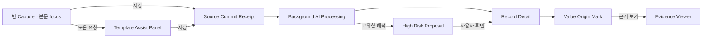

# 14. Psychological UI/UX and Component Specification

## 1. 목적

이 문서는 심리학적 리뷰를 실제 화면 규칙과 컴포넌트 상호작용으로 바꾼다. 목표는 AI 기능을 많이 보여주는 것이 아니라 사용자가 자기 글과 기억의 주도권을 유지하면서 기록하고, AI가 더한 구조를 출처와 함께 이해하고, 나중에 안전하게 다시 찾게 하는 것이다.

핵심 문장:

> 먼저 쓰고, 필요할 때 도움받고, 저장된 뒤에는 무엇이 내 기록이고 무엇이 AI·외부 정보인지 잊지 않게 한다.

이 문서는 [13_COMPONENT_ARCHITECTURE_AND_INTERACTIONS.md](./13_COMPONENT_ARCHITECTURE_AND_INTERACTIONS.md)의 구현 구조를 보완한다. 컴포넌트 이름과 상태 계약은 13을 따르고, 시각적 우선순위·microcopy·노출 시점·심리적 안전은 이 문서를 따른다. 전역 메뉴, route, desktop sidebar, mobile bottom navigation은 [15_INFORMATION_ARCHITECTURE_AND_RESPONSIVE_NAVIGATION.md](./15_INFORMATION_ARCHITECTURE_AND_RESPONSIVE_NAVIGATION.md)를 따른다.

## 2. UX 불변조건

### UX-01. Memory-first

- 빈 Capture 진입 즉시 본문에 focus한다.
- 자동 template, AI cue, 분류 후보를 먼저 펼치지 않는다.
- 사용자가 고정한 template으로 직접 진입하거나 `도움받아 쓰기`를 연 경우만 구조 입력을 먼저 보여준다.
- 작성 중 텍스트를 보고 panel을 자동으로 열거나 template을 자동 전환하지 않는다.

### UX-02. Body dominance

- 편집·읽기 화면에서 사용자 본문이 가장 큰 면적과 가장 강한 타이포그래피를 가진다.
- 외부 작품 정보, AI 주제, 처리 상태가 본문보다 먼저 시선을 차지하지 않는다.
- desktop 본문 집중 폭은 680~760px를 목표로 하고, assistance rail 때문에 640px 미만이 되면 rail을 overlay로 바꾼다.

### UX-03. Visible origin, inspectable evidence

- confidence percentage는 일반 화면에 표시하지 않는다.
- 사용자 입력이 아닌 값의 의미적 출처는 항상 보인다.
- 상세 근거는 한 번의 추가 동작으로 연다.
- field에서 source로, source에서 field로 양방향 이동할 수 있어야 한다.
- 근거를 확인하고 돌아왔을 때 선택한 field, 본문 위치, keyboard focus를 보존한다.
- 출처는 color나 sparkle만으로 표현하지 않고 text label을 포함한다.

### UX-04. No silent identity claims

- 감정·의도·동기·성격·관계·인과·약속·합의·결정은 AI가 확정 문장으로 보여주지 않는다.
- 제안에는 직접 근거와 `AI 해석` label이 필요하다.
- 인물 화면에는 AI trait profile을 누적하지 않는다.
- 자기 서사 요약은 `최근 4개 기록 · 2026년 6~8월`처럼 범위를 표시한다.

### UX-05. No completion pressure

- 필수 표시, 완료율, 공란 수 badge, streak, 빨간 미완료 상태를 사용하지 않는다.
- 공란은 `아직 답하지 않음`, `모름`, `해당 없음`, `기록하지 않음`으로 다룬다.
- 개인 기록의 길이와 template field 수를 성취 점수로 만들지 않는다.

### UX-06. Explicit automation

- `저장 후 AI 정리` 상태는 저장 전에 확인할 수 있다.
- source 저장과 AI 처리 완료를 별도 상태로 표시한다.
- 자동 template은 반복 사용만으로 active가 되지 않는다.
- 사용자가 명시적으로 `이 템플릿 유지`를 선택해야 active가 된다.

### UX-07. Safe resurfacing

- `privacy_level`은 저장 권한뿐 아니라 preview와 재노출 정책이다.
- sensitive·restricted 기록은 최근 기록, 알림, 관련 기록 추천, 이날의 기록에 기본 노출하지 않는다.
- 검색 결과가 존재 여부를 알려야 할 때도 본문 snippet을 자동 노출하지 않는다.
- `RediscoveryDeck`은 사용자가 Explore에서 직접 시작하는 opt-in 세션이며 자동 알림을 보내지 않는다.
- 한 번에 기록 하나만 보여주고 `왜 지금 보여주는가`를 사람이 이해할 수 있는 문장으로 설명한다.
- sensitive는 사용자가 별도로 포함할 때만 제목 없는 보호 card로 제안하며, restricted는 항상 제외한다.
- 인물의 성격·감정·관계 변화 같은 고위험 추론을 재노출 이유로 사용하지 않는다.

## 3. 주의 계층

한 화면의 시각적 우선순위는 다음 순서를 유지한다.

1. 현재 사용자가 쓰거나 읽는 본문
2. 사용자가 직접 입력한 핵심 맥락
3. 저장·복구에 필요한 상태
4. 사용자가 요청한 template·회상 도움
5. 원문·이미지·녹취에서 추출한 구조
6. 외부 사실
7. AI 해석과 제안
8. 내부 처리 세부사항

AI라는 이유로 더 강한 색이나 animation을 사용하지 않는다. 처리 중 animation은 background activity에만 사용하고, 성공한 자동 처리는 조용히 사라진다.

## 4. 핵심 화면 정보 구조



이 흐름에서 B와 D는 실패해도 A의 source 저장과 E의 원문 읽기를 막지 않는다.

## 5. Capture Workspace

### 5.1 초기 상태

```text
┌────────────────────────────────────────────────────────────────────┐
│ 새 기록        임시 저장됨       일반 · AI 정리 켜짐        닫기 │
├────────────────────────────────────────────────────────────────────┤
│                                                                    │
│              제목                                                  │
│              ─────────────────────────────────────                 │
│                                                                    │
│              무엇이든 적거나 이미지를 붙여넣으세요.               │
│                                                                    │
│                                                                    │
│              도움받아 쓰기   떠올림 단서   첨부                   │
│                                                                    │
├────────────────────────────────────────────────────────────────────┤
│ 저장 후 AI가 구조와 검색 정보를 정리합니다.          기록 저장  │
└────────────────────────────────────────────────────────────────────┘
```

규칙:

- 화면 mount 후 title이 아니라 body에 focus한다. 제목은 나중에 입력할 수 있다.
- placeholder는 유형 예시를 길게 열거하지 않는다. 게임·식당·운동 같은 예시는 글 방향을 고정할 수 있다.
- `도움받아 쓰기`, `떠올림 단서`, `첨부`는 동등한 저강도 text action이다.
- AI 정리와 민감도는 현재 상태가 보이지만 본문보다 강하게 강조하지 않는다.
- 저장은 유일한 primary action이다.

### 5.2 `WritingAssistLauncher`

기본 label은 `도움받아 쓰기`다. 다음 상황에서만 상태 label을 붙인다.

- 사용자가 template 선택: `리뷰 도움 사용 중`
- user-pinned template deep link: `장소 방문 템플릿`
- trial template: `임시 템플릿 사용 중`

자동 분석이 글을 리뷰로 판단했다는 이유만으로 `리뷰로 바꾸기`를 작성 중에 띄우지 않는다.

### 5.3 `TemplatePicker`

Desktop은 dialog, mobile은 full-height sheet다.

```text
도움받아 쓰기                                      닫기

고정
리뷰                     작품 · 날짜 · 평점 · 함께한 사람
장소 방문                장소 · 방문일 · 메뉴 · 평점

최근 사용
운동 기록                운동일 · 거리 · 시간 · 메모

자동 초안
영화 감상                최근 4개 기록에서 반복된 구조

검색 ______________________________________________
```

- preview는 질문 전체가 아니라 목적과 core item label만 먼저 보여준다.
- 자동 초안은 AI sparkle보다 `최근 4개 기록에서`라는 근거 문구를 우선한다.
- `자동 초안`을 선택해도 즉시 active가 되지 않는다.
- picker에서 고른 뒤 editor selection과 scroll을 그대로 유지한다.

### 5.4 `TemplateAssistPanel`

Desktop rail:

```text
리뷰                                    이번 기록에만 사용

어떤 작품인가요?                       [직접 입력 또는 검색]
언제 경험했나요?                       [날짜]
함께한 사람이 있었나요?               [혼자였음] [사람 추가]
지금 남아 있는 평점은?                 [☆☆☆☆☆] [평점 없음]

다른 항목
이 템플릿 유지 · 템플릿 바꾸기 · 패널 닫기
```

UX 규칙:

- panel은 본문과 별도의 scroll 영역을 만들지 않는 것을 우선한다.
- 질문은 label이고 helper text는 필요할 때만 한 줄 사용한다.
- `함께한 사람이 있었나요?`에는 `혼자였음`과 공란을 모두 허용한다.
- rating에는 `평점 없음`과 초기화 action을 제공한다.
- panel을 닫는 것은 template 해제가 아니다. 해제는 별도 action이다.
- field를 비웠다고 warning color를 사용하지 않는다.

### 5.5 `RecallCueDeck`

- 사용자가 `떠올림 단서`를 눌러야 첫 cue가 보인다.
- 한 번에 한 문장만 보여준다.
- 답변용 별도 input을 만들지 않고 본문 cursor로 돌아간다.
- `다른 단서`, `닫기`만 제공한다.
- `도움이 되었나요?` 같은 평가를 작성 도중 요청하지 않는다.
- cue는 template field와 completion 상태를 만들지 않는다.

중립적 예:

- 지금 가장 먼저 떠오르는 장면이나 문장은 무엇인가요?
- 기대와 달랐던 점이 있었다면 무엇인가요?
- 그날의 분위기를 한 문장으로 남긴다면?

피해야 할 예:

- 가장 감동적이었던 장면은?
- 왜 그 사람에게 화가 났나요?
- 무엇을 합의했나요?

### 5.6 `PrivacyAndAiControls`

두 제어를 하나의 모호한 `옵션` 메뉴에 숨기지 않는다.

```text
공개 범위  일반 ▾
저장 후 AI 정리  켜짐 ▾
```

민감도 설명:

- `일반`: Library preview와 사용자 설정 기반 추천 가능
- `민감`: 본문 preview와 자동 재노출 기본 차단
- `제한됨`: 잠금 metadata 외 preview 금지

AI 정리 설명:

- `켜짐`: source 저장 후 구조화·OCR·녹취·허용된 보강 실행
- `꺼짐`: source와 기본 검색용 텍스트만 저장, 나중에 수동 실행 가능

사용자의 기본값을 기억할 수 있지만 sensitive·restricted 기록의 선택을 normal로 자동 되돌리지 않는다.

### 5.7 `CaptureActionBar`

- Primary: `기록 저장`
- 저장 전: 현재 AI 정리 상태를 한 문장으로 설명
- 저장 중: source commit만 기준으로 progress
- attachment 일부 실패: 본문을 저장하고 실패한 attachment만 retry
- 공란 수, template 완료율, AI 예상 결과 수를 표시하지 않음

## 6. 저장 후 상태

### 6.1 `CaptureReceipt`

```text
기록을 안전하게 저장했습니다.  14:32

AI가 구조와 검색 정보를 정리하고 있습니다.
앱을 닫아도 계속됩니다.

기록 열기     새 기록 계속
```

- source commit 성공을 가장 먼저 알린다.
- AI 처리 성공을 저장 성공처럼 표현하지 않는다.
- 자동 template 제안이 있다면 primary receipt 아래의 낮은 우선순위 next action으로만 표시한다.

### 6.2 `ProcessingSummary`

완료된 변화와 사용자 판단이 필요한 것만 보여준다.

```text
장소 방문 기록으로 정리했습니다.

원문에서 추출  평점 4.5 · 가지튀김
외부 출처      모모식당 연남점 주소
확인 필요      지점 후보 2개

기록 보기     확인할 내용 1
```

AI가 채우지 못한 모든 공란을 실패 목록으로 만들지 않는다.

## 7. Record Detail

### 7.1 기본 구조

```text
┌──────────┬──────────────────────────────────────┬────────────────────┐
│ 보관함   │ 장소 방문 · 2026-08-10       편집  │ 정보               │
│ 탐색     │ 모모식당 연남점                     │                    │
│ 확인     │ ★ 4.5  가지튀김  데이트             │ 내 기록            │
│          │                                      │ 평점 4.5           │
│          │ 사용자 본문                         │ 원문에서 추출      │
│          │ 이미지                              │                    │
│          │                                      │ 대상 정보          │
│          │ 관련 기록                           │ 주소               │
│          │                                      │ 외부 출처          │
└──────────┴──────────────────────────────────────┴────────────────────┘
```

- 사용자 본문과 사용자 입력 highlight는 별도 AI badge 없이 자연스럽게 보인다.
- 추출·외부·계산·해석 값에는 `ValueOriginMark`가 붙는다.
- `AI 해석`은 `내 기록`과 `대상 정보`를 섞지 않고 `주제와 색인` 안에 둔다.

### 7.2 `ValueOriginMark`

표시 문구:

- 원문에서 추출
- 이미지에서 읽음
- 녹취에서 추출
- 외부 출처
- 계산
- AI 해석
- 내가 확인함

시각 규칙:

- 11px보다 작게 만들지 않는다.
- badge 모양을 모든 값에 반복하지 않고 짧은 inline label로 사용한다.
- user input에는 기본적으로 label을 생략한다.
- `AI 해석`만 보라색으로 칠하는 식의 AI 장식 체계를 만들지 않는다.
- proposed·disputed는 origin과 별도로 `확인 필요`, `서로 다른 근거` 상태를 표시한다.

### 7.3 `EvidencePopover`, `EvidenceGutter`, `EvidencePeek`

field row에서 origin label 또는 근거 action을 누르면 열린다.

```text
원문에서 추출
“별점은 4개 반. 데이트하러 오면 좋겠다.”

문서 3번째 문단 · 2026-08-10 분석
[원문에서 보기] [값 수정]
```

image OCR은 같은 위치에 thumbnail과 bounding box를 보여주고, transcript는 timecode 재생을 제공한다. 외부 정보는 URL, 제공자, 확인일을 보여준다.

- `EvidencePopover`는 짧은 확인과 값 수정에 사용한다.
- 넓은 desktop에서는 사용자가 원할 때 `EvidenceGutter`를 열어 여러 field와 원문을 나란히 검토한다. 편집 시작 시에는 닫혀 있어야 한다.
- compact desktop과 tablet에서는 `EvidencePeek`, mobile에서는 원문 viewer 전체 화면으로 전환한다.
- field를 고르면 관련 text span·OCR box·timecode로 이동하고, 근거를 고르면 연결된 field를 강조한다.
- `원문에서 보기`를 닫으면 기존 field와 scroll 위치로 돌아간다. 근거 탐색 때문에 작성 맥락을 잃게 하지 않는다.

### 7.4 `HighRiskProposalCard`

고위험 해석은 일반 `FieldRow`가 아니라 별도 review anatomy를 사용한다.

```text
AI 해석 · 확인 필요

후속 약속이 있었던 것으로 정리할까요?
근거: “다음 주에 다시 이야기하자.”  32:14

내 기록으로 확인
표현 수정
해석으로만 보관
버리기
```

`내 기록으로 확인`은 사용자가 기록으로 채택했다는 뜻이며 객관적 진실 인증이 아니다. 다른 사람의 성격·의도는 확인해도 person trait field로 만들지 않는다.

### 7.5 Narrative Summary

허용:

```text
최근 4개 영화 감상 기록 · 2026년 6~8월
낯선 세계관보다 인물의 선택을 오래 기록하는 경향이 있었습니다.
AI 해석 · 관련 기록 보기
```

금지:

```text
당신은 인물 중심적인 사람입니다.
민서는 갈등을 피하는 성격입니다.
두 사람의 관계는 악화되었습니다.
```

## 8. Library, Search, Preview

### 8.1 일반 card

- 제목 1개
- 주 유형 1개
- 대표 날짜 1개
- snippet 2~3줄
- highlight 최대 3개
- non-user highlight에는 origin label 또는 accessible origin 설명

### 8.2 sensitive card

```text
개인 기록                         2026-08-10
민감한 기록 · 본문 미리보기 숨김
[열기]
```

검색어가 본문에 일치해도 snippet을 자동 생성하지 않는다. 사용자가 record를 명시적으로 열 때만 내용을 보여준다.

### 8.3 restricted card

```text
제한된 기록                       2026-08-10
내용을 보려면 잠금을 해제하세요.
```

관련 기록 추천, 최근 기록, 알림, 이날의 기록에서는 항상 제외한다.

### 8.4 Person과 관계 탐색

- 참여한 사건과 직접 발언을 우선한다.
- AI가 만든 감정·의도·성격 label을 facet으로 제공하지 않는다.
- 관계 변화는 사용자가 명시했거나 확인한 사건으로만 표현한다.
- 대화 요약은 화자 attribution과 source timecode를 유지한다.

### 8.5 `RecordPeekPane`

- Library와 Search에서 `Space` 또는 preview action으로 열며 route를 바꾸지 않는다.
- 화살표로 다음 record를 선택해도 pane는 유지되고, `Enter`는 상세 화면, `Esc`는 목록으로 돌아간다.
- 제목, 날짜, 사용자 snippet, 대표 attachment, 핵심 사용자 field를 먼저 보여주고 AI 해석은 접힌 영역에 둔다.
- 닫은 뒤 선택 row, scroll 위치, keyboard focus를 정확히 복원한다.
- sensitive는 명시적 열기 전 snippet과 attachment를 숨기고, restricted는 잠금 해제 전 preview를 만들지 않는다.

### 8.6 `VisualMemoryGrid`

- 이미지가 기억 단서인 기록을 위한 선택 layout이며 기본 목록을 대체하지 않는다.
- 이미지, 제목, 대표 날짜만 우선하고 badge·AI label·hover action을 최소화한다.
- 이미지가 없는 기록을 불완전하게 표현하지 않고 차분한 text tile로 보여준다.
- layout 변경은 내용 분류나 record type 변경으로 오인되지 않게 `보기 방식` 안에 둔다.

### 8.7 문맥과 재발견

- `MentionContextCard`는 backlink의 제목뿐 아니라 내가 이 기록을 언급한 정확한 문장을 보여준다.
- `RelatedViewModule`은 관계 종류와 직접 근거를 표시하며, 관계가 약하면 자동으로 강한 서사를 만들지 않는다.
- `RediscoveryDeck`은 `같은 날짜`, `같은 장소`, `직접 연결`, `오래 보지 않음`처럼 검증 가능한 이유만 사용한다.
- 사용자는 `다음`, `기록 열기`, `이번 세션에서 제외`를 선택할 수 있으며 평가·streak·회고 의무를 만들지 않는다.

## 9. Template Library와 Studio

### 9.1 자동 초안 card

```text
영화 감상 기록
최근 4개 글에서 반복된 구조를 찾았습니다.

작품 · 감상일 · 평점 · 인상 깊은 장면

이번에 사용     내용 보기     관심 없음
```

- confidence percentage를 표시하지 않는다.
- 사용 횟수는 증거로 보여줄 수 있지만 품질 점수로 사용하지 않는다.
- 두 번 사용해도 active가 되지 않는다.
- 반복 사용 후 `이 템플릿을 계속 유지할까요?`를 물을 수 있지만 무응답은 trial 유지다.

### 9.2 `PromptSafetyLint`

Template Studio의 publish 전 검사 항목:

1. 존재를 전제하는가?
2. 긍정·부정 감정을 유도하는가?
3. 타인의 내면을 추론하게 하는가?
4. 합의·갈등·관계를 사실로 전제하는가?
5. 사용자의 정체성을 고정 label로 만들 수 있는가?
6. 공란을 실패처럼 표현하는가?

AI-derived와 system seed template은 미해결 경고가 있으면 publish action을 비활성화한다. 경고에는 자동 수정안과 영향을 받는 field authority를 표시한다.

### 9.3 `ExplainableSuggestionCard`

template·saved view·property 제안은 다음을 반드시 보여준다.

1. 무엇을 제안하는가
2. 어떤 반복 또는 직접 근거 때문에 제안했는가
3. 적용하면 무엇이 바뀌고 무엇은 바뀌지 않는가
4. `미리 보기`, `이번에만 사용`, `유지`, `관심 없음` 중 허용되는 선택

confidence percentage, AI 권위 장식, 긴급감을 사용하지 않는다. 사용 또는 무응답만으로 pin·active·schema 승격이 일어나지 않는다.

## 10. 모바일과 이미지 중심 Capture

### 10.1 모바일 초기 화면

- 상단: 취소, `새 기록`, 저장
- 다음 행: `일반 · AI 정리 켜짐`
- 본문 전체 폭
- 하단 keyboard 위: 도움받아 쓰기, 첨부
- template은 bottom sheet
- attachment는 별도 bottom sheet가 아니라 같은 capture flow 안에서 thumbnail로 즉시 확인

### 10.2 공유 시트

이미지·URL·텍스트를 공유받으면 다음 순서다.

```text
공유받은 원본 preview
→ 짧은 메모 optional
→ 일반/민감/제한됨
→ AI 정리 켜짐/꺼짐
→ 저장
```

카테고리와 template 선택을 요구하지 않는다. 저장 후 앱에서 열었을 때 `도움받아 쓰기`를 선택할 수 있다.

### 10.3 OCR 결과

- OCR text를 사용자 본문처럼 편집기에 자동 삽입하지 않는다.
- 원본 이미지와 `이미지에서 읽음` 결과를 분리한다.
- 중요한 수치와 인용은 bounding box 근거를 제공한다.
- 인용 정확성이 불확실하면 `확인 필요`이며 검색 인용문으로 확정하지 않는다.

## 11. Microcopy 원칙

| 피할 문구 | 사용할 문구 |
| --- | --- |
| AI가 완성해 드릴게요 | 저장 후 구조와 검색 정보를 정리합니다 |
| 3개 항목이 비어 있습니다 | 비워둬도 저장할 수 있습니다 |
| 분석 성공 | 정리가 끝났습니다 |
| 분석 실패 | 원본은 저장되었습니다. 정리를 다시 시도할 수 있습니다 |
| AI가 판단한 당신의 성향 | 최근 N개 기록에서 발견한 AI 해석 |
| 승인 | 내 기록으로 확인 |
| 올바른 값 | 현재 사용 중인 값 |
| 템플릿 80% 완성 | 표시하지 않음 |

오류 color는 source 저장 실패, 복구 불가 위험, 사용자가 즉시 조치해야 하는 충돌에만 사용한다. 개인적 공란과 AI 무응답은 오류가 아니다.

## 12. 안내 밀도와 개인차

### 조용히

- editor, attachment, save 중심
- cue와 template은 요청할 때만
- Processing Summary 최소화

### 균형 — 기본값

- `도움받아 쓰기`와 한 번에 한 cue
- 의미적 출처 label 표시
- 필요한 Review만 요약

### 안내 중심

- 선택한 template helper text 표시
- optional item을 더 쉽게 탐색
- 저장 후 변화 설명을 조금 더 상세히 표시

안내 밀도는 사용자가 선택한다. 나이, 작성 속도, 사용 빈도, 오류 횟수만으로 자동 변경하지 않는다. 모든 모드에서 provenance와 민감도 정책은 동일하다.

## 13. 상태 모델

### Capture attention state

```text
writing_clean
→ assist_opened_by_user
→ assist_applied
→ assist_closed_values_retained
→ source_committed
```

금지 상태:

- `assist_auto_opened_from_body`
- `template_auto_switched`
- `blank_blocked_submission`

### Template consent state

```text
generated_draft
→ suggested
→ trial
→ explicit_keep
→ active

suggested/trial
→ dismissed
```

`usage_count`는 transition을 일으키지 않는다.

### Value epistemic state

```text
user_input
source_extract
external_fact
calculated
ai_interpretation
```

이 상태는 `accepted/proposed/disputed`와 별개다. 예를 들어 외부 사실도 disputed일 수 있고, AI interpretation은 사용자가 보관해도 `AI 해석` origin을 잃지 않는다.

## 14. Prototype Matrix

첫 prototype은 다음 아홉 상태를 동일 사례로 연결한다.

1. Desktop blank Capture
2. Desktop template assistance rail open
3. Mobile image-first Capture
4. Source commit receipt와 background processing
5. Record Detail의 `원문에서 추출`, `외부 출처`, `AI 해석`
6. sensitive search result와 high-risk proposal
7. Library의 saved view, `RecordPeekPane`, focus 복원
8. `EvidenceGutter`의 field-source 양방향 이동과 정확한 backlink 문맥
9. normal·sensitive·restricted가 섞인 `RediscoveryDeck`

장소 리뷰 사례:

```text
“모모식당에서 가지튀김을 먹었다. 별점은 4개 반. 데이트하기 좋겠다.”
```

계보:

```text
본문의 4개 반
→ 원문 span evidence
→ user_context property 4.5 / 5
→ ValueOriginMark: 원문에서 추출
→ 사용자가 확인·수정 가능
```

주소는 `외부 출처`, 데이트 추천은 원문에서 사용자가 명시했으므로 사용자 경험, 동행자는 근거가 없으므로 공란이다.

## 15. 사용자 검증

### 실험 A — template anchoring

조건:

- blank Capture
- neutral cue 3개
- neutral cue 5개

측정:

- 첫 의미 있는 문장까지 시간
- 저장 전 이탈
- prompt에 없던 고유 세부사항
- 작성 결과 소유감
- 흐름 방해감

같은 실제 기억을 반복 작성하게 하지 않고 서로 다른 동등 난이도의 경험 또는 통제 자료를 counterbalance한다.

### 실험 B — source attribution

가상의 작품·사건·대화 자료를 사용한다. AI가 추가한 올바른 외부 사실과 일부 명확히 검토해야 하는 제안을 섞고 24시간·7일 후 다음을 묻는다.

- 내가 직접 입력했는가?
- 원문·이미지에서 추출되었는가?
- 외부 출처에서 왔는가?
- AI 해석이었는가?

실제 개인 기억에 의도적인 거짓 정보를 넣지 않는다.

### 실험 C — template consent

비교:

- 두 번 사용 후 자동 active
- 반복 사용 후 명시적 `이 템플릿 유지`

자동 active 조건은 구현하지 않지만 통제 prototype으로만 비교하여 후회, 계속 사용 의사, 구조 다양성 차이를 확인한다.

### 실험 D — sensitive resurfacing

normal, sensitive, restricted record를 Library, Search, Recent, Related, notification prototype에 넣고 예상 밖 내용 노출이 0인지 확인한다.

### 실험 E — preview와 문맥 보존

목록에서 세 기록을 연속으로 preview하고 상세 화면을 방문한 뒤 돌아오게 한다. 목표 record 재탐색 시간, scroll·focus 복원 성공률, 방향 상실 횟수를 측정한다.

### 실험 F — 설명 가능한 재발견

같은 날짜·장소·직접 연결·AI 유사도만 있는 기록을 비교한다. 사용자가 노출 이유를 올바르게 설명하는지, 예상 밖 민감 정보 노출을 느끼는지, 제안을 거부하는 데 심리적 압박이 있는지 확인한다.

## 16. UI Release Gate

- blank Capture에서 1초 안에 body focus
- 자동 template·AI cue의 선행 노출 0건
- 공란으로 인한 저장 차단 0건
- 비사용자 핵심값 origin label coverage 100%
- evidence를 2번 이하의 동작으로 열 수 있음
- field-source 양방향 이동 후 선택·scroll·focus 복원 성공률 100%
- 고위험 개인·사회적 추론의 무근거 accepted 0건
- 인물 trait 자동 profile 생성 0건
- 반복 사용만으로 active 전환 0건
- AI-derived template의 미해결 prompt lint 0건
- sensitive·restricted preview와 자동 재노출 위반 0건
- restricted 자동 재발견 0건, sensitive 명시적 opt-in 없는 재발견 0건
- 제안 card에서 근거와 적용 범위를 설명할 수 없는 항목 0건
- keyboard·screen reader·한국어 IME로 핵심 flow 완료
- 320px 폭에서 본문과 저장 action이 metadata panel에 가려지지 않음

## 17. 구현 우선순위

### P0 — 계약과 안전

1. `claimRisk` validator
2. `ValueOriginMark`와 evidence contract
3. `previewPolicy` projection
4. 명시적 template active transition
5. `PromptSafetyLint`

### P1 — 핵심 Capture

1. memory-first `CaptureWorkspace`
2. `WritingAssistLauncher`
3. desktop rail·mobile sheet `TemplateAssistPanel`
4. `SensitivityControl`과 `AiProcessingControl`
5. source commit receipt

### P2 — 읽기와 Review

1. origin-aware `FieldRow`
2. `EvidencePopover`
3. `HighRiskProposalCard`
4. safe `RecordCard`·`RecordPeekPane`
5. `EvidenceGutter`·`MentionContextCard`
6. time-bounded Narrative Summary

### P3 — 개인화

1. 안내 밀도
2. template pattern suggestion
3. `ViewDisplayMenu`와 saved display preferences
4. `VisualMemoryGrid`
5. opt-in `RediscoveryDeck`와 설명 가능한 제안

P0와 P1이 검증되기 전에 AI theme dashboard, 성향 분석, 자동 회고 알림, 사람 관계 profile을 만들지 않는다.
