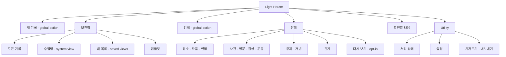

# 15. Information Architecture and Responsive Navigation

## 1. 목적

이 문서는 Light House V2의 전반 정보구조와 메뉴 접근 방식을 확정한다. 데스크톱을 주 사용 환경으로 최적화하되 모바일을 축소판이 아니라 같은 정보구조를 다른 navigation container로 사용하는 완전한 입력·검색 환경으로 설계한다.

핵심 원칙:

> 데이터 유형은 계속 늘어날 수 있지만 사용자의 주요 과업은 기록하기, 찾아보기, 관계를 탐색하기, 필요한 판단을 확인하기로 안정적이다. 메뉴는 데이터 분류가 아니라 이 과업을 반영한다.

## 2. IA 설계 원칙

### IA-01. Stable tasks, dynamic data

장소, 영화, 책, 운동, 대화 같은 유형은 전역 메뉴가 아니다. 새로운 유형이 생겨도 navigation item을 추가하지 않고 `보관함`의 filter와 `탐색`의 scope로 나타낸다.

### IA-02. Capture and Search are actions

`새 기록`과 `검색`은 특정 정보 공간에 종속되지 않는 전역 action이다. 데스크톱에서는 항상 보이는 button·OmniSearch로, 모바일에서는 하단 navigation의 중심 action·독립 목적지로 제공한다.

### IA-03. Library is home

첫 화면은 Dashboard가 아니라 `보관함 > 모든 기록`이다. 최근 기록은 기본 정렬이며 widget dashboard, 통계 card, AI 추천 feed를 별도 Home으로 만들지 않는다.

### IA-04. Exceptions do not become destinations

AI 처리 상태와 Review는 다르다. background processing은 utility이고 사용자의 판단이 필요한 고영향 항목만 `확인할 내용`에 들어간다.

### IA-05. Same routes, different containers

데스크톱 sidebar, compact rail, 모바일 bottom navigation은 같은 route와 권한을 표현한다. 모바일에서 기능을 제거하지 않고 drawer·sheet·full-page로 바꾼다.

### IA-06. No hidden-only access

hover, 우클릭, swipe gesture만으로 접근 가능한 핵심 기능을 만들지 않는다. 모든 route와 action은 visible control, keyboard, deep link 가운데 하나 이상으로 접근할 수 있어야 한다.

## 3. 개념적 정보구조



### 영역의 의미

| 영역 | 사용자의 질문 | 포함하는 것 | 포함하지 않는 것 |
| --- | --- | --- | --- |
| 보관함 | 내가 남긴 기록을 보고 싶다 | 문서, 캡처, 저장 뷰, template | 외부 개체만 있는 catalog |
| 검색 | 기억나는 단서로 찾고 싶다 | 자연어, keyword, 구조 filter 결과 | 별도 데이터 복제 |
| 탐색 | 사람·장소·작품·사건의 연결을 보고 싶다 | entity, event, topic, relation projection | 유형별 전용 app |
| 확인할 내용 | 내 판단이 필요한 것만 보고 싶다 | 충돌, 애매한 식별, 고위험 AI 제안 | 정상 processing job, 모든 AI field |
| 새 기록 | 지금 내용을 넣고 싶다 | text, image, audio, file, template assistance | 사전 분류 강제 |

## 4. 사용자-facing 명칭

기술 route와 화면 label을 분리한다.

| 기술 명칭 | 사용자 label | 설명 |
| --- | --- | --- |
| Library | 보관함 | 모든 기록과 내가 만든 목록 |
| Explore | 탐색 | 장소·작품·인물·사건·주제의 연결 |
| Search | 검색 | 키워드·자연어·정밀 조건 검색 |
| Review | 확인할 내용 | 사용자 판단이 필요한 고영향 항목 |
| Capture | 새 기록 | 어디서나 여는 입력 action |
| Saved Views | 내 목록 | 조건을 저장한 동적 목록 |
| Templates | 템플릿 | 입력을 돕는 선택적 구조 |
| Processing Center | 처리 상태 | 업로드·OCR·분석·색인의 background 상태 |
| Settings | 설정 | AI, 데이터, 보안, 내보내기 |

`Inbox`는 사용자에게 `수집함`으로 표시한다. 정리되지 않았다는 죄책감을 만들지 않도록 count를 기본 강조하지 않고, 아직 lifecycle 상태를 정하지 않은 기록을 찾는 system view로만 제공한다.

## 5. Route 구조

```text
/                               → /library redirect
/library                        모든 기록
/library/inbox                  수집함 system view
/library/views                  모든 내 목록
/library/views/:viewId          저장 뷰 결과
/library/templates              Template Library
/library/templates/:templateId  Template Detail / Studio
/search                         검색 결과; query와 filter를 URL에 보존
/explore                        개체·사건·주제·관계 탐색
/explore/rediscovery            사용자가 시작하는 다시 보기 session
/review                         확인할 내용
/records/:objectId              document · entity · event 상세
/capture                        전체 Capture Workspace
/settings                       설정 index
/settings/ai                    AI와 모델 동작
/settings/data                  가져오기·내보내기·backup
/settings/privacy               민감도·잠금·재노출 정책
```

### Overlay와 URL

- Desktop `QuickCaptureOverlay`는 현재 route 위에 열리지만 `/capture`로 직접 접근할 수 있다.
- overlay를 전체 화면으로 확장해도 같은 `draftId`를 유지한다.
- Library·Search의 desktop Peek는 `?peek=:objectId`로 URL에 반영하되 목록 route를 떠나지 않는다.
- mobile에서는 Peek 대신 `/records/:objectId` full page를 연다.
- 검색어, facet, sort, layout, group, density, visible fields, saved view ID는 URL 또는 saved view display state에 보존하여 새로고침·공유·뒤로가기를 지원한다.

## 6. 데스크톱 전역 셸

### 6.1 Wide shell · 1180px 이상

```text
┌──────────────────────┬──────────────────────────────────────────────────────┐
│ Light House          │ 현재 위치          [검색 Ctrl+K]  처리 상태  ···    │
│                      ├──────────────────────────────────────────────────────┤
│ [+ 새 기록]          │                                                      │
│                      │                                                      │
│ 보관함               │                 Route content                        │
│   모든 기록          │                                                      │
│   수집함             │                                                      │
│                      │                                                      │
│ 내 목록              │                                                      │
│   별점 높은 리뷰     │                                                      │
│   방문한 장소        │                                                      │
│   독후감             │                                                      │
│   모든 목록          │                                                      │
│                      │                                                      │
│ 탐색                 │                                                      │
│ 확인할 내용       2  │                                                      │
│                      │                                                      │
│ 템플릿               │                                                      │
│ 설정                 │                                                      │
└──────────────────────┴──────────────────────────────────────────────────────┘
```

### 6.2 Sidebar 규칙

- 기본 폭 224px, 사용자가 64px rail로 접을 수 있다.
- 접힘 상태는 device-local preference로 유지한다.
- `새 기록`은 sidebar 상단의 유일한 filled primary action이다.
- `보관함`, `탐색`, `확인할 내용`이 1차 navigation이다.
- `모든 기록`, `수집함`, 고정한 `내 목록`은 보관함의 2차 항목이다.
- 고정 `내 목록`은 최근 사용이 아니라 사용자가 명시적으로 고정한 최대 5개만 표시한다.
- `모든 목록`에서 검색·재정렬·고정 해제를 관리한다.
- `템플릿`은 보관함의 입력 도구이므로 global primary navigation으로 강조하지 않는다.
- `설정`은 sidebar 하단 utility에 고정한다.
- `확인할 내용` count는 high-impact item 수만 표시한다.
- AI processing job 수는 sidebar badge로 표시하지 않는다.

### 6.3 Compact desktop·tablet · 768~1179px

```text
┌──────┬──────────────────────────────────────────────────────┐
│  +   │ 현재 위치       [검색]        처리 상태             │
│  ▣   ├──────────────────────────────────────────────────────┤
│  ◇   │                                                      │
│  !   │                 Route content                        │
│      │                                                      │
│  ⚙   │                                                      │
└──────┴──────────────────────────────────────────────────────┘
```

- 64px icon rail을 사용하되 accessible name과 tooltip을 제공한다.
- 2차 navigation은 rail item을 선택했을 때 anchored panel로 연다.
- hover 없이 click·keyboard focus로 열 수 있다.
- record inspector, facet panel, template assistance는 persistent column이 아니라 drawer로 전환한다.
- keyboard와 pointer 사용자가 동일 route에 접근할 수 있다.

### 6.4 Top utility bar

전역 top bar는 route마다 새 menu를 만들지 않는다.

왼쪽:

- breadcrumb 또는 현재 view title
- mobile이 아닌 경우 sidebar toggle

가운데 또는 넓은 빈 공간:

- `OmniSearch`: `기록, 사람, 장소, 목록 검색`

오른쪽:

- `ProcessingIndicator`: 실패 또는 진행 중일 때만 나타나는 중립 상태
- route-specific primary action 최대 1개
- overflow menu

avatar, 알림 bell, AI assistant button을 기능이 없는데 장식으로 추가하지 않는다.

## 7. 모바일 전역 셸

### 7.1 Bottom navigation

```text
┌─────────────────────────────┐
│ 보관함              필터 ···│
├─────────────────────────────┤
│                             │
│        Route content        │
│                             │
├─────────────────────────────┤
│ 보관함  검색   ＋   탐색  더보기 │
└─────────────────────────────┘
```

고정 순서:

1. `보관함`
2. `검색`
3. `새 기록` — 중앙 primary action
4. `탐색`
5. `더보기`

이 순서는 사용 빈도 추정으로 자동 변경하지 않는다. navigation label을 숨기고 icon만 보여주지 않는다.

### 7.2 `더보기` sheet

```text
더보기

확인할 내용                         2
내 목록
템플릿
처리 상태
설정
```

- `확인할 내용`에 high-impact item이 있으면 `더보기` item에도 작은 count를 표시할 수 있다.
- sheet는 drag gesture 없이 visible close button과 Escape·back 처리를 지원한다.
- `내 목록`을 열면 full-page list에서 검색·고정·재정렬한다.
- 가져오기·내보내기는 `설정 > 데이터`에 둔다.

### 7.3 Mobile top app bar

- 현재 route title 또는 record title
- back button이 필요한 계층에서 명시적 back 제공
- route-specific action 최대 2개; 나머지는 overflow
- global search icon은 bottom Search가 있으므로 중복하지 않음
- scroll을 내려도 저장·back 같은 파괴적이지 않은 핵심 action을 잃지 않도록 필요 화면에서만 sticky 사용

### 7.4 모바일 Capture 접근

- bottom center `새 기록`을 누르면 full-height Capture sheet를 연다.
- 사진·URL·텍스트 공유 시트는 같은 capture route와 draft contract를 사용한다.
- keyboard가 열리면 bottom navigation은 숨길 수 있지만 Capture save action은 visual viewport 위에 유지한다.
- Capture를 닫으면 원래 route와 scroll 위치로 돌아간다.

## 8. 전역 검색과 명령 접근

### Desktop

- top bar click 또는 `Ctrl/Cmd+K`로 `OmniSearchOverlay`를 연다.
- 첫 화면은 최근 검색보다 빈 input과 scope 설명을 우선한다.
- 결과 group: 최근·고정 기록, 기록·개체·사건, 내 목록·template·setting destination, 명령, 전체 검색.
- action: 새 기록, 현재 보기를 내 목록으로 저장, record 열기.
- keyboard로 선택한 결과는 오른쪽 `RecordPeekPresentation` 또는 destination preview에 즉시 표시한다.
- `↑/↓`는 결과 이동, `Enter`는 목적지 열기, `Esc`는 원래 화면과 focus로 돌아간다.
- 자연어 답변과 navigation command를 한 모호한 AI chat로 섞지 않는다.
- Enter는 `/search?q=...`로 이동하고 query를 URL에 남긴다.

### Mobile

- bottom `검색`은 `/search` full page를 연다.
- search input에 즉시 focus하되 keyboard back으로 검색 결과를 잃지 않는다.
- filter와 sort는 bottom sheet, active condition은 removable chip으로 표시한다.
- voice input은 OS keyboard 기능을 우선하고 별도 음성 assistant를 MVP에 추가하지 않는다.

## 9. 화면별 레이아웃 패턴

### 9.1 Library

Wide:

```text
Global sidebar | Collection header + query/facets | optional RecordPeekPane
```

- 기본은 list이며 `ViewDisplayMenu`에서 cards·visual·timeline·map·table, sort, group, visible fields, density, date axis를 조절한다.
- image-rich collection에서만 `VisualMemoryGrid`를 제공하고 image가 없는 record도 text tile로 유지한다.
- active filter가 있으면 `SaveViewAction`으로 query와 display state를 함께 내 목록에 저장한다. 저장 직후 sidebar에 자동 고정하지 않는다.
- 1280px 이상에서 `RecordPeekPane` 380~440px를 열 수 있다.
- Peek 때문에 list main 영역이 520px 미만이 되면 overlay drawer로 바꾼다.
- `Space`는 선택 record Peek 고정·해제, `Space` hold는 임시 Peek, `↑/↓`는 다음 record, `Enter`는 상세, `Esc`는 collection focus 복원이다.
- 선택 record ID, filter, display state, scroll anchor를 route·view state로 보존한다.

Mobile:

- 한 열 list 또는 2열 compact card만 허용한다.
- visual·timeline·map은 full page layout, table은 핵심 column만 보여주고 상세는 record page로 이동한다.
- Peek를 만들지 않고 record full page를 연다.

### 9.2 Search

Wide:

- query bar
- active filter row
- 결과 list/main
- 필요할 때만 240px facet drawer 또는 panel
- 선택 결과의 inclusion reason
- Library와 같은 `RecordPeekPane`를 사용하되 검색 match와 `InclusionReason`을 먼저 보여준다.
- 현재 query·filter와 `ViewDisplayMenu` 상태를 `SaveViewAction`으로 내 목록에 저장할 수 있다.

Mobile:

- query bar sticky
- filter·sort bottom sheet
- 결과는 한 열
- 검색어와 filter는 browser back 후 복구

### 9.3 Explore

`장소`, `작품`, `인물`, `사건`, `주제`는 전역 navigation이 아니라 Explore scope다. registry의 모든 type을 tab으로 만들지 않는다.

type별 전용 표현은 새 전역 route가 아니라 현재 collection·record route 안의 view preset과 `ContextModuleSlot`으로 시작한다. generic shell로 완료할 수 없는 독립 multi-step workflow가 반복 검증된 경우에만 dedicated route를 추가한다. 기준은 [20_ICON_AND_VIEW_EXTENSION_CONTRACT.md](./20_ICON_AND_VIEW_EXTENSION_CONTRACT.md)를 따른다.

`다시 보기`는 Explore 안의 opt-in module이다. Home feed나 notification 목적지를 만들지 않는다.

Wide:

- scope switcher 최대 5개 stable object group
- 관계·날짜·유형 filter
- list, timeline, map, relation view 중 데이터가 지원하는 것만 표시
- `다시 보기`를 시작하면 `RediscoveryDeck`이 한 번에 하나의 record와 노출 이유를 보여준다.

Mobile:

- scope는 top select 또는 horizontally wrapping controls가 아니라 한 줄 segmented control + `다른 범위` sheet
- map·timeline은 full canvas
- relation detail은 bottom sheet에서 시작해 record page로 확장
- `다시 보기`는 full-page session이며 back으로 원래 Explore scope와 위치를 복원

재발견 정책:

- normal만 기본 대상, sensitive는 별도 opt-in, restricted는 항상 제외
- 날짜·장소·직접 연결·사용자 고정 주제·오래 열지 않음처럼 설명 가능한 reason만 사용
- dismiss한 record·reason 조합은 다시 제안하지 않음
- 사람의 감정·의도·성격·관계 해석을 추천 조건으로 사용하지 않음

### 9.4 Record Detail

Wide:

```text
Global sidebar | optional EvidenceGutter | body 680~760px | inspector 320~360px
```

- 1180px 미만에서는 inspector drawer
- 본문 편집 중 inspector는 기본 닫힘
- `EvidenceGutter`는 읽기·검토 때만 열고 field와 원문 span·OCR box·timecode를 양방향 연결한다.
- `Connections`는 제목 목록 대신 `MentionContextCard`로 정확한 언급 문맥을 보여준다.
- related records는 `RelatedViewModule`로 본문 아래에 두고 metadata보다 낮은 우선순위를 유지한다.

Mobile:

- 본문 전체 폭
- `정보` button이 inspector bottom sheet를 연다.
- Sources evidence는 `EvidencePeek`에서 시작해 필요하면 full-screen viewer로 확장한다.

### 9.5 Review

Wide:

```text
Review list 320~380px | selected issue + direct evidence
```

Mobile:

- issue list → review detail의 두 route
- 한 화면에서 하나의 판단만 요구
- next/previous는 visible button으로 제공하고 swipe에 의존하지 않음

### 9.6 Template Library

- 보관함 sidebar의 `템플릿` 또는 mobile `더보기 > 템플릿`에서 접근
- Capture 도중 template 관리는 별도 page로 이동하지 않고 picker에서 `템플릿 관리`를 연다.
- Studio desktop은 editor + preview, mobile은 Edit/Preview tab을 사용한다.

## 10. 내 목록과 동적 IA

저장 뷰는 데이터가 아니라 query definition이다. IA에서는 다음 lifecycle을 사용한다.

```text
search/filter result
→ 내 목록으로 저장
→ /library/views/:viewId
→ optional pin to sidebar
→ archive 또는 delete
```

규칙:

- sidebar 고정 최대 5개
- 이름 중복 허용하되 description과 condition summary 표시
- 자동 생성 목록은 sidebar에 자동 고정하지 않음
- system view와 user view를 구분
- 데이터 유형이 새로 생겨도 자동으로 global menu를 추가하지 않음
- `내가 갔던 장소`, `리뷰한 게임`, `독후감`은 초기 seed view 후보지만 실제 data condition으로 동작

## 11. Navigation 상태와 뒤로가기

### 보존해야 할 상태

- Library/search filter와 sort
- collection layout·group·visible fields·density·date axis
- scroll anchor
- selected Peek record와 pane open state
- Explore scope와 map bounds
- Rediscovery session 위치와 제외한 record·reason
- open inspector tab
- Evidence target과 돌아갈 field·본문 위치
- Capture 이전 route

### Browser history 원칙

- route가 바뀌는 선택은 history entry를 만든다.
- 단순 inspector tab·popover는 URL을 오염시키지 않는다.
- mobile full-page record에서 back하면 정확한 list position으로 돌아간다.
- Quick Capture overlay close는 이전 route로 돌아가고 draft는 복구 가능하다.
- deep link로 들어온 record에서 back target이 없으면 보관함으로 이동한다.

## 12. 접근성과 menu 조작

- sidebar, rail, bottom navigation은 semantic `nav`와 현재 page indication을 사용한다.
- rail icon에는 visible tooltip과 screen-reader label을 제공한다.
- mobile bottom navigation touch target 최소 44px, safe-area inset 반영
- bottom sheet는 focus trap, focus restore, visible close, Android back 처리
- `Ctrl/Cmd+N`: 새 기록
- `Ctrl/Cmd+K`: 검색
- collection에 keyboard focus가 있을 때 `Space`: Peek 고정·해제, `Enter`: record 열기, `Esc`: Peek 닫기
- editor·input·IME composition 중에는 collection shortcut을 실행하지 않음
- shortcut을 몰라도 모든 기능을 pointer·touch로 수행 가능
- 한국어 IME composition 중 global shortcut이 editor 입력을 가로채지 않음
- navigation count는 `확인할 내용 2`처럼 의미를 함께 읽고 숫자만 발표하지 않음
- active state를 color만으로 표시하지 않음

## 13. Responsive 결정표

| 요소 | Wide ≥1180 | Compact 768~1179 | Mobile <768 |
| --- | --- | --- | --- |
| Global navigation | 224px sidebar | 64px rail | bottom navigation |
| 새 기록 | sidebar primary button | rail primary icon+label tooltip | center bottom action |
| 검색 | top OmniSearch, Ctrl+K | top icon/input, Ctrl+K | bottom Search full page |
| Library child | sidebar nested items | anchored panel | page header·More |
| 내 목록 | pinned 5 + 모든 목록 | anchored panel | More > 내 목록 |
| Template | Library child | Library panel | More > 템플릿 |
| Processing | top utility popover | top utility popover | More > 처리 상태 |
| Review | sidebar, high-impact count | rail, high-impact count | More, high-impact count |
| Record inspector | right column | drawer | bottom sheet |
| Record Peek | 380~440px right pane | overlay drawer | full record page |
| View display | header menu | header menu | bottom sheet |
| Visual memory | optional grid | optional grid | full-page grid |
| Evidence | optional gutter·popover | Peek/drawer | full-screen viewer |
| Facets | inline or side panel | drawer | bottom sheet |
| Capture assistance | right rail | overlay sheet | bottom sheet |

## 14. 수용 기준

### Information scent

- 처음 보는 사용자가 `기록하기`, `내 글 보기`, `검색하기`, `장소·사람 탐색`, `확인할 문제 보기`를 5초 안에 찾을 수 있음
- 새 유형이 생겨도 global primary navigation item 수가 늘지 않음
- desktop primary destinations는 3개, global actions는 2개를 유지
- mobile bottom navigation은 5개 item을 넘지 않음

### Cross-device parity

- 모든 desktop route가 mobile에서도 접근 가능
- desktop sidebar child가 mobile에서 유실되지 않고 More·page header·sheet 가운데 하나로 이동
- mobile에서 record, template, Review, setting deep link를 직접 열 수 있음
- desktop과 mobile이 같은 saved view URL을 해석함

### State recovery

- list → record → back 후 filter·sort·scroll 복구
- Peek close 후 선택 row·scroll·keyboard focus 복구
- field → evidence → field 왕복 후 선택·본문 위치 복구
- Quick Capture 열기·닫기 후 이전 route 복구
- sidebar 접힘 상태 device-local 보존
- mobile keyboard·rotation 이후 save action과 bottom navigation 중 필요한 하나가 가려지지 않음

### Accessibility

- keyboard만으로 desktop global navigation과 OmniSearch 사용 가능
- screen reader가 현재 route와 Review count를 의미 있게 읽음
- hover·swipe 없이 모든 primary destination 접근 가능
- 320px viewport에서 navigation label, route title, primary action이 겹치지 않음

## 15. 첫 IA Prototype

다음 아홉 상태를 하나의 prototype에서 확인한다.

1. Wide Library + expanded sidebar
2. Wide Library + `ViewDisplayMenu` + saved view
3. Wide Library/Search + `RecordPeekPane`
4. Wide Record Detail + `EvidenceGutter` + exact backlink context
5. Compact rail + inspector·Peek drawer
6. Mobile Library + bottom navigation
7. Mobile More sheet
8. Desktop OmniSearch + grouped results + right preview
9. Explore `RediscoveryDeck`의 normal·sensitive·restricted 정책

동일한 saved view와 record를 desktop·mobile에서 열어 route, label, selected state가 같은 의미인지 검증한다.
