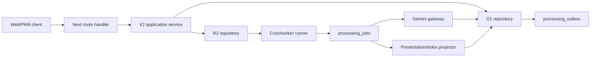

# 21. Implementation Architecture, Security, and Data Lifecycle

> 상태: 구현 기준선 v1.0 · additive schema/runtime `0029` local contract · remote `0018`~`0029`/deploy 미실행  
> 최초 기준일: 2026-08-12 · 최신 구현 기준: 2026-08-29
> 적용 범위: V2 source 저장, 인증, D1·R2 경계, privacy, 삭제·복구

## 1. 결론

V2는 기존 Light House의 도메인 모듈을 확장하지 않는다. 기존 인증·Cloudflare 배포 기반은 재사용하되, V2는 별도 route와 additive schema로 구축한다.

핵심 실행 원칙은 다음과 같다.

1. **원본 저장은 AI와 분리된 하나의 원자적 commit이다.**
2. **commit과 같은 D1 transaction에서 outbox job을 만든다.**
3. **AI·OCR·검색·preview가 실패해도 source는 열 수 있다.**
4. **모든 repository query는 `user_id` scope를 API 인자가 아니라 인증 context에서 받는다.**
5. **restricted record는 잠금 해제 전 본문·첨부·module payload를 client로 보내지 않는다.**
6. **legacy table은 읽기 전용 source이며 V2 정본을 겸하지 않는다.**

## 2. 현재 구현 감사

2026-08-12 코드 기준으로 재사용 가능한 것과 교체할 경계는 다음과 같다.

| 영역 | 현재 상태 | V2 판단 |
| --- | --- | --- |
| Next.js·React·Tailwind | 앱 shell과 배포 기반 존재 | 재사용 |
| D1 | REST API helper로 단일 query 실행 | V2 repository는 Worker binding과 batch transaction으로 전환 |
| R2 | S3 호환 presigned upload, authenticated read 존재 | bucket 재사용, reservation·검증·private key 정책 추가 |
| session | opaque cookie, 7일 만료 | 형식 재사용, rotation·revocation·재인증 보강 |
| upload | attachment row를 먼저 만들고 client metadata를 신뢰 | V2 attachment reservation으로 분리, 서버 검증 후 committed 전환 |
| image preview | complete request에서 원본 전체를 읽어 동기 생성 | queue stage로 이동 |
| AI | API route에서 동기 호출, raw prompt/output 저장 | durable job과 redacted run metadata로 교체 |
| cron | request session을 내부 job 사용자로 사용 | system scheduler와 target user를 명시적으로 분리 |
| export | 전체 ZIP을 메모리에 생성 | 비동기 streaming export job으로 교체 |
| backup | 실제 backup이 아니라 count 메타 기록 | bundle snapshot + 검증 가능한 restore로 교체 |
| audit log | snapshot에 본문·AI 결과 저장 가능 | event metadata allowlist와 redaction 적용 |

`apps/web/src/lib/server/cloudflare-d1.ts`와 V1 domain server module은 V2 구현 중 점진적으로 감싸되, 한 번에 제거하지 않는다.

## 3. 배포·모듈 경계

### 3.1 실행 topology



MVP는 개인 사용 규모이므로 별도 message broker를 먼저 도입하지 않는다. D1 기반 lease queue로 시작하고 다음 중 하나가 실제 측정에서 발생할 때 Cloudflare Queues 또는 Workflows로 옮긴다.

- 평균 queue wait가 interactive 목표를 지속적으로 넘음
- D1 write contention 또는 subrequest 한도 때문에 batch claim이 불안정함
- 장시간 media job의 재개 지점을 D1 lease만으로 관리하기 어려움
- 외부 provider callback을 안정적으로 fan-out해야 함

정본과 job idempotency contract가 저장소와 분리되어 있으므로 queue 구현을 바꿔도 데이터 모델은 바뀌지 않는다.

### 3.2 권장 코드 구조

```text
apps/web/src/
  app/(v2)/                         # V2 화면 route
  app/api/v2/                       # thin HTTP adapters
  components/v2/                    # A+ design components
  features/v2/capture/              # feature UI and client state
  features/v2/library/
  features/v2/record/
  lib/v2/application/               # use cases, no framework imports
  lib/v2/domain/                    # invariants and contracts
  lib/v2/infrastructure/d1/         # repositories, migrations
  lib/v2/infrastructure/r2/
  lib/v2/infrastructure/gemini/
  lib/v2/presentation/              # RecordPresentation projector
  lib/v2/security/                  # auth context, privacy policy
  workers/v2/                       # job handlers and scheduler entry
```

의존 방향은 `route/component → application → domain`이다. infrastructure가 domain interface를 구현하며 domain layer는 Next, D1, R2, Gemini를 import하지 않는다.

## 4. Source commit 계약

### 4.1 두 단계 capture

큰 binary를 D1 transaction에 넣을 수 없으므로 capture는 `attachment reservation`과 `source commit` 두 단계로 구성한다.

```text
1. client가 draft_id와 attachment manifest 생성
2. POST /api/v2/attachments/reserve
3. client가 각 원본을 private R2 key에 직접 upload
4. POST /api/v2/attachments/{id}/verify
5. POST /api/v2/captures/commit
6. D1 batch transaction:
   capture_bundle + source_items + attachment_links + outbox 삽입
7. 201 source_committed 반환
8. worker가 outbox를 processing_jobs로 dispatch
```

텍스트만 있는 capture는 2~4를 건너뛴다. upload가 일부만 끝난 경우 사용자는 완료된 원본만 저장하거나 draft를 유지할 수 있으며 시스템이 조용히 누락시키지 않는다.

### 4.2 idempotency

모든 mutation은 다음을 사용한다.

- client가 만든 ULID `draft_id`
- 요청별 `Idempotency-Key`
- user scope를 포함한 unique key `(user_id, operation, idempotency_key)`
- 동일 key·동일 payload hash: 기존 결과 반환
- 동일 key·다른 payload hash: `409 idempotency_conflict`

source commit unique key는 `(user_id, draft_id)`다. 네트워크 재시도로 document·attachment·job이 중복 생성되지 않아야 한다.

### 4.3 transaction 불변조건

commit 성공 응답 전에 다음이 모두 존재해야 한다.

- `capture_bundles`
- 1개 이상의 `source_items`
- verify가 끝난 attachment의 source link
- `processing_outbox`의 최초 `analyze` event 또는 사용자가 AI를 끈 상태
- idempotency result

Cloudflare D1의 `batch()`는 한 statement 실패 시 sequence 전체를 rollback하는 transaction으로 사용한다. V2 runtime은 REST helper 대신 Worker binding을 우선 사용한다. 배포 adapter에서 binding 접근이 불가능하면 source foundation 구현 전에 blocker로 처리하며, 여러 독립 REST call로 이 계약을 흉내 내지 않는다.

## 5. V2 schema 배치

전체 conceptual schema를 한 migration에 넣지 않고 vertical slice별로 추가한다.

### Migration V2-001 — source foundation

- `v2_capture_bundles`
- `v2_source_items`
- `v2_attachment_reservations`
- `v2_source_attachment_links`
- `v2_idempotency_records`
- `v2_processing_outbox`
- `v2_processing_jobs`
- `v2_processing_runs`

### Migration V2-002 — document foundation

- `v2_objects`
- `v2_documents`
- `v2_document_revisions`
- `v2_document_source_links`
- `v2_deletion_tombstones`

### Migration V2-003 — knowledge and provenance

- entity, event, relation
- type·field registry
- typed property values
- evidence refs
- user confirmation and dispute history

### Migration V2-004 — templates and presentation

- template/version/session/input values
- view preset and type presentation profile
- record presentation cache
- semantic icon binding

### Migration V2-005 — retrieval and portability

- FTS/property/timeline projection
- export jobs, backup snapshots, import batches
- change sequence and restore mapping

모든 V2 table 이름은 전환 기간 동안 `v2_` prefix를 사용한다. cutover 뒤에도 prefix 제거 migration은 가치가 없으므로 하지 않는다.

### 5.1 현재 additive migration 기준선

위 V2-001~005는 개념적 배치다. 실제 repository의 구현 순서는 `0006`부터 시작하며 현재 local contract는 `0029`까지다.

| migration | 구현 불변조건 |
| --- | --- |
| `0026` | terminal migration batch가 `succeeded`가 되기 전에 manifest·projection receipt·mapping lifecycle을 D1 trigger로 재대조 |
| `0027` | batch revision/CAS, pause·active·complete·quarantine control, reversible mapping basis, provenance assertion과 quarantine receipt |
| `0028` | FTS `source_text` backfill과 insert/delete trigger가 document owner와 source owner가 같은 link만 색인 |
| `0029` | provider gateway 호출 중인 object의 legacy mapping 격리, archive/delete, quarantine을 막는 invocation lease |

legacy importer가 만든 object의 일반 접근 조건은 lifecycle만이 아니다. 같은 owner의 연결 mapping이 모두 `projected`여야 하며 하나라도 `source_only`, `knowledge_pending`, `superseded` 또는 미래의 알 수 없는 상태면 숨긴다. `legacy:` capture namespace의 object도 authoritative projected mapping 없이는 노출하지 않는다. 이 predicate는 Record·Library·Search·timeline·rediscovery·Review·template·processing 입력에서 공유한다.

repository의 relation·revision·type·field·template join과 canonical export는 child의 `user_id`만 신뢰하지 않는다. 필수 parent가 같은 owner이고 현재 선택 scope에 들어오는지 함께 검사해 cross-owner foreign ID나 orphan이 읽기·AI·archive 경계를 통과하지 못하게 한다.

## 6. 인증과 사용자 격리

### 6.1 server auth context

V2 route는 `resolveCurrentUser()`를 직접 반복 호출하지 않고 다음 한 경계를 사용한다.

```ts
type RequestContext = {
  userId: string;
  sessionId: string;
  sessionIssuedAt: string;
  restrictedGrant?: { expiresAt: string };
};
```

`requireRequestContext(request)`가 cookie, CSRF, session, restricted grant를 검증한다. repository public method는 임의 `userId`를 받지 않고 생성 시 주입된 context user에 고정한다.

### 6.2 session 결정

- login 성공 시 기존 session을 폐기하고 새 opaque ID 발급
- 기본 idle TTL 7일, absolute TTL 30일
- 정상 사용 시 하루에 한 번 이하로 idle expiry 연장
- logout은 현재 session revoke
- 설정에서 `다른 기기에서 로그아웃` 제공
- 비밀번호 변경·account recovery 시 모든 session revoke
- session ID와 restricted grant는 로그에 남기지 않음

### 6.3 CSRF와 mutation

`SameSite=Lax`만을 유일한 방어로 보지 않는다.

- state-changing route는 `Origin`이 configured app origin과 일치해야 함
- JSON content type 또는 명시적 multipart endpoint만 허용
- share target POST는 service worker가 local draft로 받아 정상 authenticated commit 흐름으로 넘김
- migration export와 restricted 포함 export의 생성·재개·download, permanent delete, restricted unlock은 recent reauthentication 요구

## 7. Privacy level access matrix

| 동작 | normal | sensitive | restricted |
| --- | --- | --- | --- |
| Library title | 표시 | 표시 또는 사용자 설정 별칭 | 잠금 placeholder |
| body snippet | 표시 | 기본 차단 | 항상 차단 |
| search match | title·snippet | title·`일치함`만 | unlock session에서만 존재 표시 |
| related/rediscovery | 허용 | 명시 opt-in | 금지 |
| browser notification | 제목 가능 | generic 문구 | 금지 |
| AI 처리 | 기본 허용 | capture별 확인 가능한 설정 | unlock 상태에서 명시 실행만 |
| local offline body | 허용 | device opt-in | 저장 금지 |
| attachment cache | thumbnail 제한 | 명시 열람 중 memory only | memory only, no Cache API |
| export | 범위 선택 | warning | recent reauth + 별도 선택 |

`restricted`는 client-side 숨김이 아니다. unlock 전 server projection은 다음을 보내지 않는다.

- title, body, summary
- dynamic property values
- relation context
- attachment key·URL·thumbnail
- context module payload
- embedding-derived snippet

### 7.1 restricted unlock

MVP에서는 별도 end-to-end encryption을 주장하지 않는다. 실제 보호 의미는 **탈취된 열린 browser tab이나 일반 session만으로 restricted 내용을 읽지 못하게 하는 server-side reauthentication gate**다.

- password 재입력 후 15분짜리 server-side grant
- grant는 session과 device context에 결합
- inactivity 또는 tab 명시 잠금 시 revoke
- response header `Cache-Control: private, no-store`
- prefetch, RSC cache, service worker cache 제외
- HTML/source에 잠금 전 payload를 포함하지 않음

Cloudflare의 저장 시 암호화는 인프라 보호이며 restricted 기능의 대체물이 아니다. 향후 client-held encryption은 key recovery와 검색 제한을 별도 제품 결정한 뒤에만 도입한다.

## 8. Attachment 보안과 lifecycle

### 8.1 key와 접근

```text
users/{user_id}/originals/{yyyy}/{mm}/{attachment_id}/{safe_filename}
users/{user_id}/derived/{attachment_id}/{derivative_version}/{variant}
users/{user_id}/exports/{export_job_id}/bundle.zip
```

- R2 bucket은 public access 금지
- DB에는 public CDN URL을 정본으로 저장하지 않음
- client read는 짧은 signed URL 또는 authenticated streaming route
- signed URL은 user authorization 후 발급하며 restricted는 unlock grant 필요
- filename은 표시 메타일 뿐 object key path로 그대로 사용하지 않음

### 8.2 upload validation

reservation 시 server가 allowlist, claimed MIME, size를 검사한다. verify 시 R2 object의 실제 size·checksum·content type을 확인하고 가능하면 magic-byte 검사한다.

초기 정책:

- image: JPEG, PNG, WebP, HEIC/HEIF spike 후 허용
- audio: M4A, MP3, WAV, WebM
- video: MP4, WebM
- document: PDF, plain text, Markdown
- unknown executable, HTML, SVG는 MVP upload 차단
- capture 하나 20 files, 개별 100 MB, 전체 250 MB를 provisional limit로 사용하고 실제 device test 후 조정

상태는 `reserved → uploaded_unverified → verified → committed → deleted`다. 24시간 동안 commit되지 않은 reservation과 R2 object는 cleanup job이 제거한다.

preview/OCR/transcode는 원본 commit 뒤 비동기로 수행한다. 파생 실패는 원본 상태를 실패로 바꾸지 않는다.

## 9. 삭제·휴지통·복구

### 9.1 사용자 기록

- `삭제`: 즉시 Library·search·relation projection에서 제외하고 30일 휴지통 이동
- `복구`: 같은 object ID와 revision lineage로 복구
- `영구 삭제`: recent reauth와 대상 summary 확인 필요
- 휴지통 30일 경과: purge job이 knowledge row, projection, binary ref를 순서대로 제거
- source와 attachment가 여러 object에 참조되면 마지막 live reference가 사라질 때만 binary purge
- purge 실패는 재시도 가능 tombstone으로 남기며 UI에는 진행 상태 표시

### 9.2 AI와 외부 provider 데이터

record purge 시 다음도 삭제한다.

- raw OCR/transcript derivative
- AI debug payload가 존재한다면 해당 object 참조분
- embeddings와 search projection
- grounded enrichment cache의 user-specific link

운영 감사에는 본문 대신 event type, actor, object opaque ID, outcome, timestamp만 최대 90일 남긴다. 삭제된 객체의 제목·본문·external query는 남기지 않는다.

### 9.3 account 삭제

account deletion은 별도 job이다.

1. recent reauth
2. 선택적 full export 완료 확인
3. 새 login과 write 차단
4. D1 user-scoped rows purge
5. `users/{user_id}/` R2 objects inventory와 purge
6. 잔여 count 0 검증
7. 최소 tombstone만 보존

부분 실패는 retry하고 완료로 가장하지 않는다.

## 10. Logging and telemetry contract

기본 로그 allowlist:

- request ID, route template, status, duration
- user의 비가역 keyed hash
- object kind와 opaque ID
- bytes, file count, stage, model role
- token count, latency, retry count, provider error class
- schema/prompt/model/registry version

기본 금지:

- 본문, OCR, transcript, search query 전문
- filename, 사람 이름, 장소명, URL query string
- Gemini request·response body
- session/cookie, signed URL, API key
- restricted 존재를 추론할 수 있는 상세 metadata

debug payload는 기본 off다. 사용자가 문제 진단을 위해 명시적으로 켠 normal record에만 최대 7일 저장하며, sensitive와 restricted에서는 켤 수 없다.

## 11. API error grammar

V2 API는 사용자 문구와 기계 코드를 분리한다.

```json
{
  "error": {
    "code": "attachment_not_verified",
    "message": "아직 업로드가 끝나지 않은 파일이 있습니다.",
    "requestId": "...",
    "retryable": true,
    "details": { "pendingCount": 1 }
  }
}
```

server stack, SQL, provider body를 client에 노출하지 않는다.

## 12. Security verification gate

Source Foundation 완료 전에 자동화한다.

- 서로 다른 두 fixture user 사이의 object·search·attachment 접근 0건
- restricted unlock 전 HTML, RSC, JSON, cache에 payload 0건
- idempotent retry 20회에서 capture·job 중복 0건
- upload size·MIME·checksum mismatch 모두 reject
- source commit transaction 중 각 statement 강제 실패 시 partial row 0건
- session rotation과 all-device revoke 검증
- Origin mismatch mutation reject
- trash restore와 30일 purge dry-run
- redaction snapshot에서 금지 field 0건

## 13. Architecture decision records

구현과 함께 다음 ADR을 짧게 작성한다.

| ADR | 결정 |
| --- | --- |
| ADR-001 | V2 additive schema와 legacy read-only boundary |
| ADR-002 | D1 binding batch transaction과 outbox |
| ADR-003 | DB-backed lease queue를 MVP topology로 선택 |
| ADR-004 | private R2 reservation/verify/commit lifecycle |
| ADR-005 | restricted server-side reauthentication gate, no E2EE claim |
| ADR-006 | repository-scoped user isolation과 logging allowlist |

ADR은 이 문서의 결정을 다시 토론하는 공간이 아니라, 실제 코드 선택·대안·검증 결과를 기록하는 증거다.
