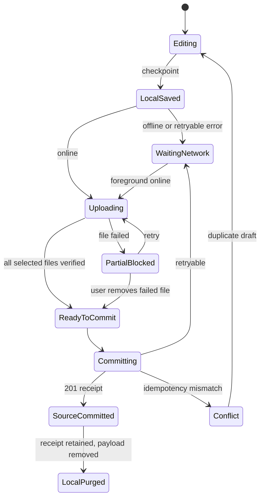

# 22. Offline, Sync, PWA, and Mobile Share Contract

> 상태: MVP 결정 확정, cross-device spike 전  
> 기준일: 2026-08-12

## 1. 결론

PWA 설치와 offline capture를 MVP에 포함한다. Light House는 데스크톱 중심이지만, 사진·스크린샷·공유 링크를 떠오른 순간 넣는 흐름이 핵심 가치이기 때문이다.

다만 브라우저 기능을 제품 보장으로 오해하지 않도록 범위를 제한한다.

- text·image·URL capture는 offline 저장 가능
- 여러 attachment를 포함한 draft도 IndexedDB에 보관
- foreground sync가 정본이며 Background Sync는 보조 수단
- Android의 설치된 PWA에서는 Web Share Target을 제공
- iOS·미지원 browser는 일반 Capture route, paste, file picker를 동일한 fallback으로 제공
- offline Library 전체 열람이나 양방향 모든 데이터 동기화는 MVP 범위가 아님
- restricted body와 attachment는 persistent local storage에 저장하지 않음

## 2. Local-first의 범위

V2는 완전한 local-first database가 아니다. D1·R2가 정본이며 browser의 IndexedDB는 **미전송 draft와 upload outbox**의 내구성 계층이다.

```text
editor memory
→ IndexedDB draft checkpoint
→ D1/R2 source commit
→ server receipt 저장
→ local source payload 제거
```

서버에서 내려받은 Library·record response는 일반 HTTP cache와 service worker cache에 저장하지 않는다. offline 화면은 미전송 draft와 마지막 sync receipt만 보여준다.

## 3. PWA application shell

### MVP 포함

- installable web manifest
- standalone display
- app icons와 theme color
- service worker가 versioned static app shell cache
- `/capture`와 `/share-target`의 offline navigation fallback
- update available banner와 안전한 reload

### cache allowlist

- hashed JS/CSS/font assets
- app icon과 정적 empty-state asset
- offline capture shell

### cache denylist

- `/api/**`
- record HTML/RSC payload
- search result
- attachment·thumbnail·signed URL
- export bundle
- account/settings response

`sensitive`와 `restricted` 여부를 response를 받은 뒤 판단하는 방식은 늦다. 동적 record route 전체를 Cache API에서 제외한다.

## 4. IndexedDB schema

DB 이름은 `lighthouse_capture_v1`로 versioning한다.

### `drafts`

```ts
type LocalDraft = {
  draftId: string;
  bodyMarkdown: string;
  captureChannel: "web" | "mobile_share" | "clipboard";
  privacyLevel: "normal" | "sensitive" | "restricted";
  templateVersionId?: string;
  templateValues: LocalTemplateValue[];
  attachmentIds: string[];
  createdAt: string;
  updatedAt: string;
  clientTimezone: string;
  localVersion: number;
  state: LocalDraftState;
};
```

### `attachment_blobs`

- `localAttachmentId`
- original `Blob`
- filename, MIME, bytes
- SHA-256
- width·height·duration when locally available
- upload session and byte progress
- retry metadata

### `outbox`

- operation ID and idempotency key
- ordered dependencies
- attempt count, next attempt, last error class
- payload hash
- server receipt

### `receipts`

- draft ID → capture ID
- committed time
- processing status URL
- attachment verification result
- retained 30 days without body

## 5. Draft state machine



사용자에게 `저장됨`은 세 단계로 구분해 표시한다.

| 상태 | 문구 | 의미 |
| --- | --- | --- |
| local checkpoint | `이 기기에 임시 저장됨` | 아직 server·backup에 없음 |
| source commit | `원본 저장 완료` | D1/R2 정본과 receipt 존재 |
| AI processing | `정리 중` | 저장 성공과 별개 |

red success 색은 source commit에만 사용한다. AI 완료를 저장 완료처럼 표현하지 않는다.

## 6. Checkpoint 정책

- text 변화 후 800ms idle
- attachment 추가·삭제, template value, privacy 변경 즉시
- tab hidden과 page navigation 직전 best-effort
- 최대 50개 local draft 또는 browser quota의 60% 중 먼저 도달한 값
- 오래된 committed receipt부터 정리하며 미전송 draft는 자동 삭제하지 않음
- quota 70% 경고, 85%에서는 새 대용량 attachment 전에 사용자 선택 요구

`navigator.storage.persist()`는 지원 browser에서 사용자가 offline capture를 켰을 때 요청하되, 승인 여부에 의존하지 않는다. 저장 quota·eviction 가능성을 UI와 test에서 다룬다.

## 7. Privacy와 local draft

| 수준 | 기본 local 정책 | offline commit |
| --- | --- | --- |
| normal | IndexedDB checkpoint | 가능 |
| sensitive | 기본 off, device별 명시 opt-in | opt-in 시 가능 |
| restricted | persistent storage 금지 | 불가 |

sensitive opt-in 시 body와 Blob을 Web Crypto의 non-extractable device key로 암호화한다. 이것은 casual local inspection을 줄이는 수단일 뿐 XSS, unlocked OS account, 악성 browser extension에 대한 E2EE라고 주장하지 않는다.

사용자가 편집 중 privacy를 restricted로 바꾸면:

1. IndexedDB payload를 즉시 삭제
2. 현재 tab memory에는 남아 있음을 알림
3. online이면 바로 server commit 가능
4. offline이면 tab을 닫을 경우 유실된다는 명확한 warning 제공
5. `sensitive device draft로 낮춰 저장`은 사용자의 별도 선택일 때만 제공

AI가 사후에 민감 가능성을 판단해도 이미 저장된 source를 몰래 restricted로 바꾸지 않는다. `privacy 제안`으로 Review에 올리고 사용자에게 local-copy cleanup 영향을 함께 알린다.

## 8. Sync algorithm

### 8.1 정본 trigger

다음 시점에 `drainOutbox()`를 호출한다.

- 앱 시작 후 authentication 확인
- `online` event
- tab이 foreground로 돌아옴
- 사용자가 `지금 전송` 선택
- 파일별 upload retry

Background Sync는 지원될 때 같은 함수를 깨우는 최적화일 뿐 유일한 전송 수단이 아니다. 지원되지 않거나 browser가 작업을 종료해도 foreground sync로 완료할 수 있어야 한다.

### 8.2 순서

한 draft 안에서는 다음 dependency를 지킨다.

```text
reserve attachments
→ upload each blob independently
→ verify each object
→ commit capture once
→ fetch receipt/status
```

서로 다른 draft는 mobile에서 최대 2개, desktop에서 최대 3개를 병렬 처리한다. 같은 file은 hash와 local attachment ID로 중복 upload하지 않는다.

### 8.3 retry

- offline, timeout, 408, 429, 5xx: exponential backoff + jitter
- authentication expired: retry 중지, login 안내, local draft 유지
- validation 4xx: 자동 retry 금지, 해당 item 수정 UI
- upload URL expired: 같은 reservation의 새 URL 요청
- checksum mismatch: object 폐기 후 1회 재upload, 반복 시 blocked

## 9. Device conflict matrix

Source item과 revision은 불변이므로 silent last-write-wins를 사용하지 않는다.

| 상황 | 처리 |
| --- | --- |
| 같은 draft ID를 두 기기에서 commit | 첫 commit 반환, payload hash가 다르면 409 |
| 같은 document의 서로 다른 revision 편집 | `base_revision_id` 비교, 둘 다 보존 후 merge UI |
| 한 기기 삭제, 다른 기기 편집 | deleted tombstone을 우선 알리고 복구+새 revision 선택 |
| 같은 attachment 재업로드 | checksum 같으면 기존 binary reuse, source link는 별도 |
| template version 변경 중 offline 작성 | capture session은 작성 당시 immutable version 유지 |
| AI result가 오래된 revision 기준 | stale 표지, current presentation에 자동 적용 금지 |

MVP는 CRDT를 도입하지 않는다. 개인 사용에서 드문 동시 편집을 위해 복잡도를 늘리기보다 revision fork를 잃지 않고 보여준다.

## 10. Web Share Target

### 10.1 지원 경로

설치된 PWA와 browser/OS가 지원하면 manifest에 다음 개념의 target을 둔다.

```json
{
  "share_target": {
    "action": "/share-target",
    "method": "POST",
    "enctype": "multipart/form-data",
    "params": {
      "title": "title",
      "text": "text",
      "url": "url",
      "files": [{ "name": "files", "accept": ["image/*", "text/plain", "application/pdf"] }]
    }
  }
}
```

service worker는 POST body를 local draft로 변환하고 `/capture?draft={id}&from=share`로 redirect한다. 사용자는 강제 분류 없이 다음 세 동작 안에 source를 저장할 수 있어야 한다.

1. Light House 선택
2. note·privacy 확인 또는 그대로 두기
3. `저장`

### 10.2 fallback

- `/capture`에서 clipboard paste
- system file picker와 camera capture
- 공유 URL을 paste하면 title/text/url을 별 source item으로 유지
- desktop browser extension은 MVP에 만들지 않음
- iOS native share extension은 P2이며 PWA 지원 여부를 설치 test matrix로 기록

UI는 지원되지 않는 platform에서 존재하지 않는 `공유 대상에 추가됨`을 약속하지 않는다.

## 11. Mobile capture interaction

- route 진입 즉시 body 또는 shared preview에 focus
- camera permission은 사용자가 camera action을 눌렀을 때만 요청
- permission 거절 뒤 gallery/file 경로 유지
- photo picker 취소는 기존 draft를 지우지 않음
- HEIC orientation과 EXIF time은 server verify/preview stage에서 정규화
- OCR text는 source image를 대체하지 않고 receipt 이후 파생 결과로 나타남
- upload 중 화면을 닫아도 local state에서 이어짐
- browser가 background task를 중단할 수 있으므로 `앱을 다시 열면 계속 전송됩니다`라고 정확히 표현

## 12. Offline UX surfaces

### `OfflineCaptureBanner`

- `오프라인 — 이 기기에 임시 저장합니다`
- 저장된 draft count
- local privacy policy 진입

### `SyncQueueSheet`

- draft 단위 progress
- source commit 여부
- 실패 file과 retry/remove
- local storage bytes
- `모두 전송`과 draft별 취소

### `CommitReceipt`

- 원본 저장 시각
- attachment count
- AI 정리 on/off와 현재 stage
- `보관함에서 보기`
- local payload cleanup 상태

background job count는 전역 navigation badge로 사용하지 않는다.

## 13. Cross-device test matrix

MVP gate는 실제 기기 또는 동등한 browser 환경에서 다음을 검증한다.

| Platform | 필수 검증 |
| --- | --- |
| Windows Chrome/Edge | install, offline text/image, reconnect, update |
| macOS Safari/Chrome | IndexedDB draft, foreground sync, file upload |
| Android Chrome | install, Web Share Target text/url/image, camera, process kill 후 resume |
| iOS Safari installed web app | add-to-home, image picker, offline draft, foreground sync, share fallback |
| Firefox desktop | install 불가 fallback, IndexedDB capture, foreground sync |

### Failure drills

- upload 70%에서 offline
- signed URL 만료
- login expiry 중 outbox 존재
- browser process kill
- quota 부족
- 동일 draft를 두 tab에서 commit
- sensitive opt-in 해제
- restricted 전환 중 offline
- service worker update 중 pending draft

## 14. 완료 gate

- offline text·3 images capture를 browser restart 뒤 복구
- reconnect 후 source 중복 없이 정확히 한 번 commit
- Background Sync를 강제로 끈 상태에서도 완료
- Android share target이 text·URL·image를 source 순서와 함께 보존
- 미지원 platform에서 3단계 이내 fallback capture
- committed source payload가 local DB에서 정해진 시간 안에 제거
- restricted persistent local payload 0건
- update·logout·session expiry가 미전송 normal draft를 삭제하지 않음

## 15. 근거와 spike 경계

IndexedDB는 Blob과 구조 데이터를 저장할 수 있고 넓게 지원되므로 draft durability의 기준으로 사용한다. 반면 Background Sync는 널리 지원되는 baseline이 아니므로 보조 기능으로만 사용한다. Web Share Target은 설치된 PWA와 지원 OS/browser에 의존하므로 Android 우선 기능으로 두고 모든 platform에 동일한 fallback을 제공한다.
