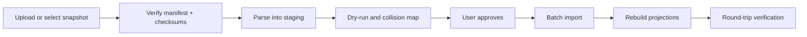

# 23. Export, Backup, Restore, and Portability Contract

> 상태: `Lighthouse Export Bundle v1`과 resumable Worker 구현 · canonical schema `v2-030` 로컬 회귀 통과 · remote deploy 미실행  
> 최초 기준일: 2026-08-12 · 최신 구현 기준: 2026-09-08

## 1. 목적과 결론

Light House의 데이터는 앱과 AI provider보다 오래 살아야 한다. V2는 읽기 좋은 portable export와 손실 없는 migration backup을 분리한다.

| profile | 목적 | 기본 형식 |
| --- | --- | --- |
| `portable` | 앱 없이 글과 원본 읽기 | ZIP: Markdown + JSON + originals |
| `migration` | 다른 Light House 환경에 왕복 복원 | ZIP: canonical JSONL + revisions + registries + checksums |
| `backup` | 자동 복구 지점 | private R2 snapshot manifest + content-addressed blobs |

한 bundle에 profile을 표시할 수 있지만 `portable`을 선택했다고 내부 모든 revision·운영 로그가 따라오지는 않는다.

## 2. 현재 구현과 교체 이유

기존 V1 `createExportArchive()`는 domain snapshot을 JSZip에 모두 넣고 메모리에서 `uint8array`를 만들었다. 첨부 원본, revision, evidence, registry가 포함되지 않으며 큰 archive에서 Worker memory를 초과할 수 있어 V2 정본으로 재사용하지 않았다.

현재 V2는 API request 안에서 ZIP을 완성하지 않는 resumable job으로 구현돼 있다.

```text
POST /api/v2/exports
→ export_jobs row + scope snapshot
→ background exporter
→ private R2 bundle + checksum
→ short-lived authenticated download
```

job은 entry 단위로 streaming하거나 bounded chunk를 사용한다. 전체 archive를 process memory에 유지하는 구현은 금지한다.

## 3. Bundle directory layout

```text
lighthouse-export-2026-08-12/
  README.md
  manifest.json
  checksums.sha256
  documents/
    {document_id}/
      index.md
      metadata.json
      revisions/
        {revision_id}.md
  sources/
    captures.jsonl
    source-items.jsonl
    template-input-values.jsonl
  objects/
    entities.jsonl
    events.jsonl
    relations.jsonl
    type-assignments.jsonl
    property-values.jsonl
    evidence-refs.jsonl
  registries/
    types.jsonl
    fields.jsonl
    predicates.jsonl
    units.jsonl
    presentation-profiles.jsonl
    icon-bindings.jsonl
    view-presets.jsonl
    templates.jsonl
    template-versions.jsonl
  views/
    saved-views.jsonl
  attachments/
    originals/{attachment_id}/{sanitized_filename}
    metadata.jsonl
  extensions/
    manifest.json
  migration/
    legacy-migration-batches.jsonl
    legacy-migration-batch-items.jsonl
    legacy-source-envelopes.jsonl
    legacy-source-mappings.jsonl
```

`portable` profile은 기본적으로 `documents`, `attachments/originals`, 사람이 이해할 수 있는 최소 metadata, README, manifest, checksum을 포함한다. `migration` profile은 위 구조 전체를 포함한다.

## 4. `manifest.json` v1

```json
{
  "format": "lighthouse-export",
  "version": 1,
  "profile": "migration",
  "exportId": "01...",
  "createdAt": "2026-08-12T12:34:56.000Z",
  "sourceAppVersion": "...",
  "schemaVersion": "v2-030",
  "userTimezone": "Asia/Seoul",
  "scope": {
    "objects": "all",
    "privacyLevels": ["normal", "sensitive", "restricted"],
    "includeTrash": true,
    "includeHistory": true,
    "includeOriginals": true
  },
  "counts": {},
  "files": [],
  "rootHash": "sha256:...",
  "baseSequence": 0,
  "endSequence": 1842,
  "warnings": []
}
```

각 `files` entry는 path, bytes, media type, SHA-256, logical record count를 가진다. JSONL은 UTF-8, LF, 한 줄 한 object, 마지막 newline을 사용한다.

현재 parser가 지원하는 archive schema는 `v2-017`, `v2-018`, `v2-020`, `v2-030`이다. `v2-019`는 외부에 게시하거나 지원한 archive revision이 아니므로 지원 목록에 없다. descriptor filtering은 이전 schema의 metadata를 누적 포함한다. `0027` 이전 row의 새 quarantine/control column은 restore compatibility layer가 안전한 기본값으로 정규화하며, 이 호환 계약과 remote 배포 완료는 별개의 주장이다.

`v2-030`은 archive envelope와 DB 행에 이름이 같은 `schema_version`을 분리한다. DB 원래 값은 예약 metadata `__lighthouse_row_schema_version`에 보존하고 restore에서 원래 열로 돌려놓는다. 기존 archive에서 이 값이 이미 소실된 processing/registry 행은 추정해서 복구하지 않고 명시적 오류와 원본에서 재내보내기 안내를 제공한다. 이전 schema가 지원 목록에 있다는 것이 손상된 모든 과거 archive를 무손실 복원할 수 있다는 뜻은 아니다. 검증 근거는 [46_AUDIT_REMEDIATION_EVIDENCE.md](./46_AUDIT_REMEDIATION_EVIDENCE.md)를 따른다.

## 5. Markdown portability

### `documents/{id}/index.md`

본문은 현재 `body_markdown` 그대로 보존한다. 앱 전용 metadata는 YAML frontmatter의 versioned subset으로 표시한다.

```markdown
---
lighthouse_id: 01...
title: 어느 작은 식당에서
written_at: 2026-08-01
privacy_level: normal
types:
  - place_review
related_objects:
  - id: 01...
    label: 식당 이름
---

원래 Markdown 본문
```

- 내부 link는 Markdown에서는 상대 document path, JSON에서는 stable object ID를 사용
- 앱 전용 deep link만 유일한 link로 만들지 않음
- attachment link는 `../../attachments/originals/...` 상대 경로
- evidence region·timecode는 metadata JSON에 보존하고 본문을 변형하지 않음
- filename 충돌은 attachment ID directory로 해결

## 6. Canonical JSONL rules

- 각 row에 `id`, `user_scope_export_id`, `schema_version`, lifecycle timestamps 포함
- 관계는 stable ID로 연결
- typed property는 canonical type과 unit을 유지
- source provenance와 evidence locator를 제거하지 않음
- AI confidence와 run reference는 포함하되 raw prompt/output은 기본 제외
- deleted row는 `includeTrash`일 때만 tombstone 형태로 포함
- presentation cache, FTS, embedding은 재생성 가능하므로 제외
- context module의 React code는 제외하고 manifest binding만 포함
- child row는 같은 owner와 export scope 안의 필수 parent가 있을 때만 포함하고 cross-owner·orphan foreign reference는 제외
- restore는 manifest 순서만 믿지 않고 schema version별 descriptor와 foreign-key closure를 다시 검증
- revision의 `revision_status`, `revision_number`, `forked_from_version`을 보존해 충돌 fork와 현재 계보를 구분
- `user_scope_export_id`와 `__lighthouse_row_schema_version`은 envelope 예약 이름이며 DB 행의 동명 열을 조용히 덮어쓰지 않음

## 7. Export scope and privacy

### `portable` 기본값

- normal: 포함
- sensitive: 선택 화면에서 명시적으로 checked, preview warning
- restricted: 기본 제외, recent reauthentication 뒤 record 또는 전체 범위 별도 선택
- trash: 제외
- AI debug payload: 제외
- session, API key, signed URL, provider secret: 항상 제외

### `migration` 강제 범위

`migration`은 선택 공유용 export가 아니라 계정 왕복 복구 artifact다. 요청 UI가 더 좁은 범위를 보내더라도 server는 `normal+sensitive+restricted`, trash, history, originals 전체 범위로 정규화한다. 생성 시 recent restricted grant가 없으면 거부하며 job continuation과 download에서도 비밀번호 재인증을 다시 요구한다.

보호된 job은 grant가 없을 때도 상태와 timestamp는 보이지만 bundle hash·size·manifest count는 redaction한다. download는 object key나 공개 URL을 client에 주지 않고 인증된 API가 private R2 object를 fetch해 `Cache-Control: private, no-store`로 전달한다. export R2 object는 기본 24시간 후 삭제한다.

### 암호화 결정

MVP portable/migration ZIP은 표준 호환성을 위해 password encryption을 자체 구현하지 않는다. download 전에 `이 파일은 암호화되지 않았습니다`를 분명히 표시하고 OS의 암호화 저장소를 안내한다.

자동 backup은 public download가 아닌 private R2 namespace에만 둔다. passphrase 기반 encrypted archive는 P1 spike로 미룬다. 도입한다면:

- client-held passphrase에서 파생한 key
- server가 recovery key를 보관하지 않음
- browser streaming encryption과 restore memory 검증
- 비밀번호 분실 시 복구 불가를 명시

호환되지 않는 임의 encrypted ZIP을 `안전한 backup`으로 먼저 출시하지 않는다.

## 8. Change sequence

incremental backup을 위해 user별 단조 증가 `change_sequence`를 둔다.

```text
v2_change_events
- sequence
- user_id
- aggregate_kind
- aggregate_id
- revision_or_version
- operation: upsert | tombstone
- content_hash
- occurred_at
```

정본 mutation과 change event는 같은 D1 transaction에 기록한다. event에는 body가 아니라 identity와 version만 저장하며 exporter가 해당 snapshot을 읽는다.

`0030`은 `v2_objects` insert/update/delete를 change event로 기록한다. AI가 새로 만든 entity/event의 부모 object도 증분 snapshot에 포함한다. 이미 존재하는 object에는 upsert event를 backfill하므로 migration 뒤 첫 증분이 과거 누락 부모를 다시 포함할 수 있다. 원격 적용 전에는 이 보정을 적용한 것으로 간주하지 않는다.

## 9. Automated backup policy

### 기본 일정

- 매일: 마지막 성공 sequence 이후 incremental metadata snapshot
- 매주: full canonical snapshot
- 매월: 외부 portable export reminder, 자동 download는 하지 않음

### 기본 보존

- daily incremental 30개
- weekly full 12개
- monthly checkpoint 12개
- 사용자가 pin한 snapshot은 자동 삭제하지 않음

binary는 snapshot마다 복제하지 않고 backup namespace에서 SHA-256 content address로 deduplicate한다.

```text
users/{user_id}/backups/blobs/sha256/{hash}
users/{user_id}/backups/snapshots/{snapshot_id}/manifest.json
users/{user_id}/backups/snapshots/{snapshot_id}/metadata/*.jsonl
```

snapshot GC는 모든 retained manifest의 blob reference를 계산한 뒤 unreferenced blob만 7일 grace 후 제거한다. live originals namespace와 backup blob namespace는 분리한다.

## 10. Backup success definition

`backup_snapshots.status=succeeded`는 다음이 모두 참일 때만 기록한다.

- D1 scope의 end sequence 고정
- manifest와 모든 metadata shard upload 완료
- referenced attachment blob 존재·size·hash 확인
- manifest root hash 계산
- restore validator가 schema와 count를 읽음
- 이전 snapshot chain이 필요하면 base snapshot 존재

row count를 audit log에 기록한 것만으로 backup 성공이라 부르지 않는다.

## 11. Restore pipeline



### Stage 1 — verification

- path traversal와 absolute path reject
- manifest version 지원 여부
- 모든 checksum·byte count
- JSONL schema validation
- reference closure 검사
- decompression size와 file count budget

### Stage 2 — dry-run

생성, reuse, fork, conflict, skip, invalid를 object별로 계산한다. 이 단계는 live V2 table을 변경하지 않는다.

### Stage 3 — import

- `import_batch_id`로 모든 생성 row 표시
- bounded D1 transaction batch
- attachment는 hash가 같으면 binary reuse
- registry는 key만 보고 덮어쓰지 않고 semantic/version collision 검사
- object ID가 비어 있으면 유지, 같은 ID·같은 hash면 reuse
- 같은 ID·다른 content면 새 ID를 만들고 mapping 저장
- user-locked value는 기존 record에 자동 overwrite하지 않음

### Stage 4 — projection and validation

- FTS, property index, timeline, RecordPresentation 재생성
- source link closure
- revision current pointer
- attachment existence
- counts and root hash report
- golden recall query 일부 실행

## 12. Duplicate and conflict rules

| 조건 | restore 결정 |
| --- | --- |
| object ID·content hash 동일 | reuse |
| attachment SHA-256 동일 | binary reuse, link 추가 |
| import batch를 같은 idempotency key로 재실행 | 기존 result 반환 |
| object ID 같고 hash 다름 | fork ID + collision map |
| registry key 같고 정의 version 동일 | reuse |
| registry key 같고 의미 다름 | candidate namespace, user review |
| document body 같고 ID 다름 | 자동 merge 금지, duplicate candidate |
| legacy source mapping 동일 | 기존 projection과 비교, 중복 생성 금지 |

사건이 같아 보인다는 이유로 서로 다른 방문·관람·집필 record를 자동 병합하지 않는다.

## 13. Rollback

restore는 additive batch이므로 rollback은 `import_batch_id`로 수행한다.

1. 해당 batch에서 생성된 object를 inactive 격리
2. batch가 추가한 relation·property·presentation 제거
3. 신규 attachment link 제거
4. 다른 retained ref가 없는 binary만 grace cleanup
5. 기존 object를 수정한 경우 before snapshot으로 복원
6. rollback report와 남은 conflict 기록

원본 archive와 dry-run report는 사용자가 삭제할 때까지 유지하거나 30일 후 자동 삭제한다.

## 14. Export/restore UX

### Export wizard

1. `읽기용` 또는 `이전·복원용`
2. 읽기용은 현재 계정 기록 전체에서 privacy·trash·history·original 범위 선택, 이전·복원용은 전체 계정 강제 포함 안내와 비밀번호 재인증
3. 예상 documents·files·bytes
4. job 진행 및 partial warning
5. checksum 포함 download

### Restore wizard

1. 파일 선택
2. 검사 중
3. dry-run summary와 대표 conflict
4. `새 항목으로 가져오기`, `동일 항목 재사용`, registry review 정책
5. 실행
6. 검증 report와 rollback action

AI에게 맡겨 자동 충돌 해결하는 것이 기본값이 아니다.

## 15. Round-trip golden test

최소 fixture:

- Markdown long-form document와 3 revisions
- image OCR evidence region
- audio transcript timecode
- place entity + visit event + review rating
- template source input와 AI-filled proposed value
- normal·sensitive·restricted 각각 1건
- unknown type과 missing context module
- merged entity alias와 disputed relation

검증:

```text
fixture DB/R2
→ migration export
→ 빈 test environment restore
→ canonical normalized export
→ volatile field 제외 deep comparison
```

필수 결과:

- source bytes SHA-256 100% 동일
- current Markdown과 revision lineage 100% 동일
- accepted user values·evidence·relations 100% 동일
- portable은 restricted 명시 선택과 재인증 없이는 restricted 0건
- migration은 normal·sensitive·restricted, trash, history, originals의 full-account scope
- exported child의 필수 parent가 같은 owner·scope에 없으면 child도 0건
- generic renderer로 모든 record 열람
- recall scenario 결과의 필수 object 포함

## 16. 완료 gate

- 2 GB simulated bundle을 전체 memory 적재 없이 생성·검사하는 spike
- interrupted export job resume 또는 안전한 restart
- bad checksum, zip-slip, decompression bomb fixture reject
- 같은 bundle 2회 restore에서 duplicate canonical object 0건
- failed import batch rollback 뒤 잔여 live object 0건
- weekly full + daily incremental chain restore 성공
- 앱 없이 README, Markdown, originals 탐색 가능
- backup status가 실제 validator 결과와 일치
