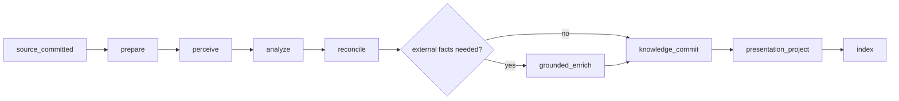

# 24. AI Runtime, Queue, Quota, and Operations

> 상태: production topology·model role·D1 queue 구현 · `0029` provider invocation fence local contract · grounded live quota와 후속 remote deploy 대기  
> 최초 기준일: 2026-08-12 · 최신 구현 기준: 2026-08-29

## 1. 결론

AI는 source commit 뒤 실행되는 versioned processing pipeline이다. Gemini model ID를 application code에 흩뿌리지 않고 역할 alias로 관리한다.

| role | 기본 configured model | 책임 |
| --- | --- | --- |
| `main_analyzer` | `gemini-3.6-flash` | 멀티모달 인식, 구조화, 유형·필드·관계 후보, 문서 분할 |
| `grounded_enricher` | `gemini-3.5-flash-lite` | Google Search·Maps가 필요한 저비용 외부 사실 보강 |
| `embedding_provider` | technical spike에서 선택 | 의미 검색 vector, 실패해도 FTS·typed retrieval 유지 |

2.5 Flash는 3.6 Flash의 일반 fallback이 아니다. 검색이 필요한 external claim에만 호출한다. 3.6이 실패하면 source를 `unclassified` document로 보존하고 재처리한다.

## 2. Runtime layers

```text
application use case
→ AI orchestrator
→ model-role router
→ Gemini gateway interface
→ official SDK adapter or REST adapter
```

application code는 provider response shape를 알지 못한다.

```ts
interface StructuredModelGateway {
  generate<T>(request: {
    role: ModelRole;
    schemaId: string;
    promptVersion: string;
    contents: ModelContentRef[];
    deadlineMs: number;
    grounding?: GroundingPolicy;
  }): Promise<ModelResult<T>>;
}
```

공식 Google GenAI JavaScript SDK를 1순위 adapter로 사용한다. Cloudflare Worker runtime·streaming·tool citation 호환 spike에 실패하면 같은 interface의 REST adapter를 사용한다. 기존 `lib/server/gemini.ts` 직접 호출을 V2 use case에서 import하지 않는다.

## 3. Configuration and capability probe

secret:

- `GEMINI_API_KEY`
- server/Worker secret store에만 존재
- `NEXT_PUBLIC_*` 금지

runtime configuration:

```text
GEMINI_MAIN_MODEL=gemini-3.6-flash
GEMINI_GROUNDED_MODEL=gemini-3.5-flash-lite
GEMINI_MAIN_CONCURRENCY=2
GEMINI_GROUNDED_CONCURRENCY=1
AI_DEBUG_PAYLOAD_RETENTION_DAYS=0
```

deploy promotion 전에 capability probe가 실제 configured ID로 다음을 확인한다.

- text + image input
- versioned JSON Schema output
- Korean text round-trip
- grounded search와 citation metadata
- Maps grounding이 필요한 경우 availability
- token usage·finish reason·provider request ID
- timeout/abort behavior

marketing name이 존재한다는 사실만으로 deploy하지 않는다. probe 실패 시 이전 검증 model configuration을 유지한다.

## 4. Pipeline stages



### `prepare` — deterministic

- attachment integrity와 metadata 읽기
- image orientation/preview task 생성
- source content hash와 revision snapshot
- template user input·locked field snapshot

### `perceive` — main analyzer

- OCR text와 image region
- audio transcript와 timecode, speaker 후보
- screenshot UI의 measurement·title·date 후보
- 원본을 수정하지 않는 normalized derivative

긴 audio/video는 bounded chunk로 나누고 overlap·time offset을 manifest에 기록한다. 한 request에 전체 file을 무조건 넣지 않는다.

### `analyze` — main analyzer

- document split proposal
- title·summary proposal
- entity·event·relation·type·property candidates
- each claim의 source locator와 source class
- enrichment request와 disambiguation requirement

### `reconcile` — deterministic

- JSON Schema validation
- registry key resolution과 duplicate candidate
- value type·unit normalization
- user precedence와 locked field
- high-risk social claim gate
- evidence locator bounds

### `grounded_enrich` — grounded enricher

- unresolved work/place/book/game candidate만 조사
- search 또는 maps가 실제로 필요한 field allowlist
- external ID, canonical URL, cited claim, verified time
- 동일 entity/version에 대한 cache

### `knowledge_commit` — transactional

validated proposal을 한 processing run namespace로 commit한다. 부분 stage의 row가 active presentation에 섞이지 않도록 run promotion pointer를 마지막에 바꾼다.

### `presentation_project` and `index` — deterministic

registry와 accepted values에서 `RecordPresentation`, FTS, typed property, timeline을 만든다. embedding 실패는 이 stages의 다른 성공을 rollback하지 않는다.

## 5. Job and run model

### `v2_processing_jobs`

핵심 필드:

- `id`, `user_id`, `capture_id`, `object_id?`
- `stage`, `status`
- `priority`: interactive, background, migration
- `idempotency_key`
- `attempt`, `max_attempts`, `next_attempt_at`
- `lease_owner`, `lease_expires_at`
- `dependency_job_id?`
- `input_revision_id`, `input_hash`
- `created_at`, `started_at`, `finished_at`
- `last_error_class`, redacted `last_error_code`

status:

```text
queued → leased → running → succeeded
                   ↘ retry_wait → queued
                   ↘ needs_review
                   ↘ dead_letter
                   ↘ superseded
```

### `v2_processing_runs`

job attempt마다 별도 run을 만든다.

- role과 실제 model ID
- prompt/schema/registry/model-config version
- input/output hash
- token counts, latency, provider request ID hash
- validation error summary
- grounding query count와 cited source count
- status와 superseded run
- optional ephemeral payload reference

`ai_conversations.input/output`처럼 raw personal text를 일반 운영 table에 저장하지 않는다.

## 6. Queue claim and lease

runner는 한 번에 작은 batch를 claim한다.

1. `next_attempt_at <= now`, dependency succeeded인 queued job 후보 선택
2. conditional update로 lease owner와 expiry 설정
3. lease 성공 row만 실행
4. stage heartbeat 또는 bounded deadline
5. 성공·retry·dead letter를 기록
6. expired lease는 reaper가 attempt 증가 없이 먼저 회수 원인을 기록

provisional values:

| stage | deadline | max attempts | initial backoff |
| --- | ---: | ---: | ---: |
| prepare | 30s | 3 | 10s |
| perceive image | 90s | 4 | 30s |
| perceive audio chunk | 180s | 4 | 60s |
| analyze | 90s | 4 | 30s |
| grounded enrich | 90s | 3 | 60s |
| commit/project/index | 30s | 5 | 10s |

실제 provider deadline과 Cloudflare invocation 한도는 spike 결과로 조정한다. 장시간 media는 continuation checkpoint를 사용하거나 queue topology upgrade 조건으로 취급한다.

### 6.1 Provider invocation visibility fence

job lease는 중복 worker를 막지만, provider request가 이미 외부로 나간 순간 migration quarantine이나 일반 trash가 입력 object를 숨기는 TOCTOU까지 막지는 못한다. `0029_v2_provider_invocation_lease.sql`은 이를 별도 object-level lease로 닫는다.

1. runner가 owner-scoped source·revision·template·mapping visibility를 모두 읽는다.
2. gateway 호출 직전에 현재 job/run/worker lease, object owner, active lifecycle, legacy `projected` 상태를 한 `INSERT ... SELECT`로 다시 확인하고 120초 invocation lease를 획득한다.
3. 획득 실패 시 provider를 호출하지 않고 stale/retry 경계로 보낸다.
4. 유효 lease 동안 D1 trigger는 projected mapping의 격리·이동·삭제, 같은 object에 nonprojected mapping 부착, object archive/delete를 거부한다. migration finalization과 quarantine은 이 conflict를 domain error로 변환한다.
5. success, retry, dead-letter 등 terminal job 전이는 run/job update와 같은 D1 batch에서 invocation lease를 삭제한다. 비정상 종료 시 expiry 뒤에만 mutation이 다시 열린다.

이 lease는 content lock이나 일반 편집 lock이 아니다. provider에게 전달할 입력의 visibility가 호출 도중 뒤집히지 않는다는 좁은 불변조건만 보장한다.

## 7. Idempotency and stale protection

job key:

```text
sha256(
  stage +
  capture_or_object_id +
  input_revision_id +
  input_hash +
  model_role_config_version +
  prompt_version +
  schema_version +
  registry_snapshot_version
)
```

- 같은 key의 succeeded run이 있으면 provider를 다시 호출하지 않음
- `재분석`은 prompt/model/registry version 또는 explicit nonce를 바꿔 새 run 생성
- result commit은 unique key와 upsert가 아니라 immutable rows + promotion pointer 사용
- 분석 중 user revision이 바뀌면 result는 `stale`; evidence로 볼 수 있지만 current accepted value에 자동 승격하지 않음
- delete tombstone이 생기면 pending jobs cancel/supersede

## 8. Structured output validation

JSON Schema file을 계약의 정본으로 두고 `schemas/ai/v{n}/`에서 versioning한다. Google의 supported JSON Schema subset만 provider에 전달하되 server에서는 더 강한 semantic validator를 추가한다.

검증 순서:

1. JSON parse
2. schema validation with Ajv
3. unknown key reject
4. ID·enum·type·unit registry validation
5. evidence locator bounds
6. user precedence and privacy policy
7. claim-risk rule
8. referential closure and duplicate limits

validation 실패 시:

- 첫 실패: error path만 넣은 constrained repair request 1회
- 두 번째 실패: valid subset이 독립적으로 안전하면 `partial`, 아니면 `needs_review`
- schema가 아닌 prose를 regex로 억지 parse하지 않음
- invalid output을 active object·property로 commit하지 않음

## 9. Model routing and fallback

| 상황 | 동작 |
| --- | --- |
| main analyzer unavailable | source 저장 유지, unclassified shell, retry |
| main schema invalid twice | needs review, deterministic minimal document |
| grounded model unavailable | external fields pending, local analysis 유지 |
| Maps unavailable | search citation 또는 unresolved, 주소 추측 금지 |
| quota near limit | background·migration pause, interactive source commit 계속 |
| embedding unavailable | FTS·typed search만 제공, later index job |
| one attachment unreadable | item error 표시, 다른 source 분석 가능 |
| high-risk social inference | proposed만, 직접 근거+사용자 확인 전 accepted 금지 |

3.6 결과를 2.5로 자동 재분석하는 fallback은 두 model의 golden corpus equivalence가 별도 검증되기 전에는 금지한다.

## 10. Grounding policy

grounded enrichment는 analyzer가 `enrichment_requests`를 생성하고 deterministic policy가 허용한 때만 실행한다.

허용 예:

- 작품 감독·출연진·발매일
- 책 ISBN·저자·출판 정보
- 장소 주소·공식 상호·지도 ID
- 게임 developer·publisher·platform

기본 금지:

- 사람의 사생활·관계·성격 조사
- 사용자의 인상이나 평가를 외부 rating으로 교체
- 명확한 entity 후보가 없는 broad search
- source와 관련 없는 자동 배경 조사

각 external property는 citation URL, provider, verified time, query intent hash를 가진다. citation이 없으면 `external_grounded`로 저장하지 않는다.

## 11. Quota governor

quota는 hard-coded free-tier 숫자가 아니라 model role별 configuration과 provider response로 관리한다.

### 우선순위

1. interactive capture의 perceive/analyze
2. user-triggered reprocess
3. pending external enrich
4. template pattern generation
5. migration/reindex

### state

- `healthy`
- `throttled`: concurrency 감소, background pause
- `quota_exhausted`: retry-after까지 provider call 중지
- `circuit_open`: 연속 provider/system failure 뒤 cooldown

429의 retry-after가 있으면 우선 사용한다. 없으면 exponential backoff + full jitter를 사용한다. 한 사용자 capture 폭주가 다른 사용자 interactive job을 완전히 막지 않도록 user round-robin claim을 사용한다.

UI는 `원본 저장 완료 · AI 정리는 할당량이 복구되면 계속됩니다`라고 표시한다.

## 12. Prompt and model rollout

모든 change는 versioned config다.

```text
model_config_version
prompt_version
schema_version
registry_snapshot_version
validator_version
```

promotion:

1. capability probe
2. sanitized contract fixture
3. private golden corpus shadow run
4. baseline과 severity comparison
5. new capture 10% canary 또는 personal account opt-in
6. full promotion

rollback은 이전 config version을 active로 돌리고 새 결과를 delete하지 않는다. 새 결과는 superseded history로 남아 비교 가능해야 한다.

## 13. Payload retention

기본값:

- model request body: 저장하지 않음
- raw response body: validated knowledge commit 후 저장하지 않음
- input/output SHA-256: 보존
- prompt template, schema, model config: 코드/registry version으로 보존
- provider request ID: keyed hash로 보존
- citations: external claim 근거로 보존

진단 모드:

- 사용자가 normal record에 명시 opt-in
- encrypted private R2 object
- 최대 7일 TTL
- sensitive/restricted에서는 비활성
- UI에서 현재 보관량과 즉시 삭제 제공

`02_CONCEPTUAL_DATA_MODEL`의 logical `raw_output`은 이 optional ephemeral reference로 구현하며 D1 plaintext column을 뜻하지 않는다.

## 14. Observability

### metrics

- source commit success/latency
- queue depth and oldest age by stage/priority
- stage success, retry, dead-letter rate
- model role latency and token count
- schema first-pass/repair success
- stale result rate
- external claim citation coverage
- user correction, dispute, provenance-open rate
- quota state duration

### no-content traces

trace는 request → capture → job → run → projection ID를 연결하되 user content를 포함하지 않는다. error는 provider body 대신 normalized class를 사용한다.

### alerts for personal-first deployment

- source commit error 1건: 즉시 visible status
- oldest interactive job > 10분
- 3회 연속 schema failure
- dead-letter 증가
- backup/export validator failure
- restricted projection policy test failure: deploy blocker

## 15. Operational runbook

### Provider outage

1. circuit open 확인
2. source commit health 확인
3. UI processing delay banner
4. retry storm 방지를 위해 background pause
5. capability probe 성공 후 gradual drain

### Schema failure spike

1. active prompt/model/schema version 비교
2. canary 중지
3. previous config rollback
4. raw payload가 없으면 reproducible sanitized fixture로 재현
5. affected runs를 stale/needs_review로 표시

### Queue stuck

1. expired lease reclaim
2. dependency cycle 검사
3. poison job isolated dead-letter
4. interactive queue 우선 drain
5. duplicate commit invariant 검사

### Grounding mismatch

1. disputed external values presentation에서 제외
2. entity resolution lock
3. citation·external ID 재검토
4. user-confirmed local identity는 유지

## 16. Test gates

- fake gateway로 timeout, 429, 5xx, invalid JSON, schema mismatch 재현
- 같은 input job 20회 실행 시 provider call 1회, active value 1세트
- revision 변경 중 늦게 온 result가 current 값을 덮지 않음
- analysis·grounded gateway callback 도중 projected mapping 격리·object trash/delete·quarantine이 거부되고 provider 종료 뒤 lease 0건
- grounded citation 없는 external field accepted 0건
- user explicit rating overwrite 0건
- social high-risk inference 자동 accepted 0건
- quota exhausted에서 source commit success 100%
- raw body가 D1, log, telemetry snapshot에 0건
- previous model config rollback 후 queue 정상 drain

## 17. Technical spike acceptance

실제 API 연결 spike는 대표 8개 fixture로 수행한다.

- Korean long text
- restaurant review text
- movie/game review
- workout screenshot
- book quote photo
- conversation screenshot
- image+note mixed bundle
- grounded place/work resolution

각 fixture에서 schema success, evidence locator, citation metadata, latency, token usage, privacy redaction을 기록한다. model ID·quota·tool 지원은 이 날짜의 추정이 아니라 probe report를 구현 증거로 삼는다.
