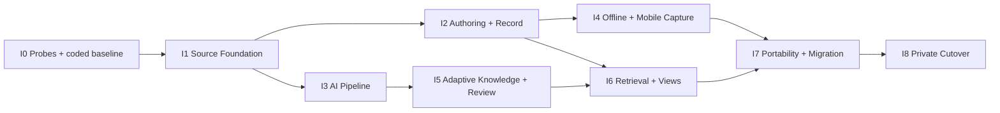

# 27. Implementation Delivery Plan

> 상태: I0–I8의 최초 구현 순서·gate 기준선. 현재 실행 순서와 상태는 [50번 완료표](./50_COMPLETION_GOAL_AND_EXECUTION_PLAN.md) 및 [현재 상태](./CURRENT_WORK_STATE.md)를 따른다.  
> 최초 기준일: 2026-08-12 · 과거 구현 스냅샷: 2026-08-29(`0029`) · 실행 라우팅 정정: 2026-09-08  
> 목표: 제품 기획을 손실 없이 작은 vertical slice로 구현

## 1. 구현 전략

전체 schema나 모든 화면을 먼저 만든 뒤 연결하지 않는다. 각 milestone은 source, UI, server, test, rollback이 함께 있는 사용 가능한 vertical slice로 끝낸다.



I2와 I3는 I1이 안정화된 뒤 일부 병행할 수 있다. 개인 프로젝트 유지보수를 위해 한 시점에 두 개 이상의 schema-changing milestone을 production에 올리지 않는다.

## 2. 코드 기준선

### 유지

- npm workspaces
- Next.js 16, React 19, TypeScript strict
- Tailwind 4와 Lucide renderer
- `@light-house/db` Drizzle schema·D1 binding factory
- D1, R2, Vectorize, current session cookie의 기본 형식
- legacy route와 table은 전환 중 read-only fallback

### 추가 예정

| 기능 | 선택 |
| --- | --- |
| visual Markdown editor | Milkdown |
| source editor | CodeMirror 6 |
| structured output validation | JSON Schema + Ajv |
| local capture store | IndexedDB + 얇은 `idb` wrapper |
| AI transport | Google GenAI SDK adapter 우선, REST adapter fallback |
| unit/integration | Vitest |
| browser E2E | Playwright |
| accessibility | axe-core Playwright integration |

package는 해당 spike가 통과한 milestone에서만 추가한다. 사용하지 않는 architecture dependency를 먼저 설치하지 않는다.

## 3. Feature flags

```text
FLAG_V2_ROUTES
FLAG_V2_WRITE
FLAG_V2_AI
FLAG_V2_OFFLINE
FLAG_V2_DEFAULT_LIBRARY
FLAG_V2_LEGACY_READONLY
```

client에 필요한 공개 flag와 server-only safety flag를 분리한다. client flag가 off여도 server mutation endpoint authorization이 열려 있으면 안 된다.

promotion 순서:

```text
routes fixture only
→ owner account write
→ owner account AI
→ selected friend accounts
→ default V2 Library
→ legacy mutation off
```

## 4. I0 — Technical probes and coded design baseline

### 구현

- production data를 사용하지 않는 local D1/R2 environment
- test scripts와 fake provider
- A+ design token을 CSS variables로 구현
- semantic icon catalog + fallback renderer
- fixture 기반 세 화면:
  - Library + `RecordPeekPane`
  - Record Detail + `EvidenceGutter`
  - mobile image Capture + commit receipt
- Milkdown/CodeMirror 동일 Markdown round-trip spike
- D1 binding `batch()` rollback·idempotency spike
- R2 reservation, direct upload, verify, streaming read spike
- Gemini configured model capability probe
- IndexedDB restart와 Android/iOS share test shell

### gate

- Korean IME, cursor/selection/scroll mode 전환 치명 실패 없음
- D1 partial commit 0
- R2 original checksum round-trip
- Gemini JSON Schema + citation sample 확보
- 320·768·1180px, light/dark, keyboard visual QA
- restricted fixture가 coded projection에서 payload를 보내지 않음
- private corpus 20 slot manifest와 최소 5건 expected 작성 시작

치명 blocker가 나오면 제품 원칙이 아니라 해당 기술 선택만 교체한다. Milkdown 실패 시 문서 D-017에 따라 Tiptap을 검토한다.

## 5. I1 — Source Foundation

### schema

- V2-001 source/job/idempotency
- V2-002 object/document/revision/tombstone의 최소 subset

### API

```text
POST /api/v2/attachments/reservations
POST /api/v2/attachments/{id}/verify
POST /api/v2/captures/commit
GET  /api/v2/captures/{id}/receipt
GET  /api/v2/records/{id}
POST /api/v2/records/{id}/trash
POST /api/v2/records/{id}/restore
```

### UI

- online blank Capture
- text + multi-image/file attachment tray
- AI on/off 확인 가능한 control
- local optimistic draft가 아닌 server commit receipt
- generic Record Detail의 source body/original attachment
- trash/restore minimal UX

### security

- request context와 repository user scope
- Origin/CSRF gate
- session rotation/revocation
- private R2 path와 MIME/size/checksum validation
- content-free audit event

### gate

- AI key가 없어도 capture 성공
- 20회 retry에서 source 1건
- transaction fault injection partial row 0
- user A가 user B source/attachment 접근 0
- source bytes/hash와 Markdown exact round-trip
- source commit p95 provisional target 1초 이내(text only, provider call 제외)

I1이 끝나기 전 legacy migration writer와 AI knowledge commit을 만들지 않는다.

## 6. I2 — Authoring, revisions, and generic Record

### 구현

- Milkdown visual editor
- CodeMirror source mode
- reading mode
- autosave revision and optimistic concurrency
- title, written date, privacy, document status
- generic Inspector contract renderer
- evidence source viewer skeleton
- restricted reauthentication and server projection
- normal/sensitive/restricted Library row

### component order

1. `Button`, `Field`, `OriginLabel`, `StatusReceipt`, focus primitives
2. `AppShell`, sidebar/rail/bottom navigation
3. `CaptureComposer`, `AttachmentTray`
4. `LibraryTable`, `RecordPeekPane`
5. `DocumentEditor`, `ModeSwitcher`, `SelectionToolbar`
6. `RecordInspector`, `EvidenceGutter`, `EvidencePeek`
7. privacy lock and redacted projection

### gate

- 5만 자 Markdown edit와 round-trip
- Korean IME composition 중 autosave corruption 0
- concurrent revision은 409+fork, silent overwrite 0
- AI body change path가 diff 승인 없이 없음
- restricted unlock 전 route/RSC/cache payload 0
- Peek→record→back focus/scroll recovery

## 7. I3 — AI pipeline and processing operations

### 구현

- outbox dispatcher, D1 lease queue, scheduler authentication
- `StructuredModelGateway`와 fake/real adapter
- versioned schemas, Ajv + semantic validator
- prepare/perceive/analyze/reconcile stages
- deterministic minimal document fallback
- grounded enrichment with citation
- processing receipt and retry action
- redacted runs, quota governor, circuit breaker

### 첫 지원 input

1. text-only review/essay/meditation
2. single screenshot/photo + note
3. multi-image bundle
4. short audio transcript

video와 긴 녹취 continuation은 이 순서의 안정화 뒤 추가한다.

### gate

- 20 corpus 중 준비된 case에서 source overwrite 0
- schema invalid output active commit 0
- repeated job duplicate object/property 0
- external accepted claim citation 100%
- quota/provider outage 중 source save 100%
- old revision result auto-promotion 0
- operational runbook drill 성공

## 8. I4 — Offline capture, PWA, and mobile share

### 구현

- manifest/service worker/app shell
- IndexedDB draft, Blob, outbox, receipt
- foreground sync와 optional Background Sync
- upload resume and session-expiry recovery
- Android Web Share Target
- paste/file/camera fallback
- `SyncQueueSheet`와 local/server/AI 상태 문법

### gate

- browser restart 뒤 offline text+3 images 복구
- reconnect exact-once source commit
- Background Sync disabled flow 성공
- Android share text/URL/image
- iOS installed PWA capture fallback
- restricted persistent local payload 0
- service worker update가 pending draft를 잃지 않음

## 9. I5 — Adaptive knowledge, presentation, and Review

### schema/logic

- entity, event, relation
- type/field/predicate/unit registry
- typed property and evidence
- `RecordPresentation` projector
- icon binding, view preset, context module registry
- accepted/proposed/disputed/superseded lifecycle
- high-risk claim confirmation

### UI

- semantic field renderers and editors
- origin labels and evidence navigation
- entity resolution/field conflict Review
- `ExplainableSuggestionCard`
- generic fallback and first context module only if evidence proves value

전용 module 우선순위는 실제 corpus에서 반복 가치가 큰 하나만 선택한다. 초기 후보는 workout summary 또는 place visit context이며 둘 다 동시에 만들지 않는다.

### gate

- 처음 보는 type이 generic view로 저장·열림
- AI가 임의 icon key·renderer key를 실행하지 못함
- social high-risk auto accepted 0
- missing module에서 source/body/fields 열람 100%
- field→evidence→field focus round-trip

## 10. I6 — Retrieval, views, templates, and rediscovery

### retrieval order

1. FTS title/body/OCR
2. typed field filters and sort
3. entity/relation/timeline
4. saved views
5. embedding rerank only after measured improvement

### UI

- OmniSearch and `/search`
- Library display/filter menu
- saved view create/pin
- Explore by entity/type/time
- adaptive template library and trial flow
- pattern observation after 3 separate dates
- opt-in RediscoveryDeck

### gate

- golden recall top-10 ≥ 90%
- sensitive snippet rule, restricted result exclusion
- saved view가 자동 sidebar pin되지 않음
- generated template가 explicit keep 전 active 0
- blank capture가 항상 first path
- embedding을 끄면 core retrieval이 계속 동작

## 11. I7 — Export, restore, and legacy migration

### 구현

- resumable streaming export jobs and bundle v1
- checksum, portable/migration profiles
- portable selective scope와 migration full-account/recent-reauth scope 분리
- canonical same-owner/referential closure와 `v2-020` restore compatibility
- change sequence, backup manifest, content-addressed blobs
- restore verify/dry-run/import/rollback
- live D1/R2 inventory scripts
- source envelope and adapters
- source-only legacy projection
- representative knowledge projection
- nonprojected read/write/AI/search/template visibility fence
- terminal reconciliation, CAS quarantine와 provider invocation lease

### gate

- export/empty environment restore round-trip
- source SHA-256 100%
- 2회 restore duplicate 0
- live inventory·adapter coverage
- source-only row count/hash reconciliation
- representative legacy recall and original return
- bad batch quarantine/restore drill

## 12. I8 — Private cutover

### 순서

- owner account에서 2주 V2 new capture
- 20-case corpus와 usability gate
- verified final legacy delta
- V1 mutation route off
- V2 Capture default
- Library/Search는 7일 observation 뒤 default
- legacy read-only archive 유지

### rollback boundary

- Capture 정본은 V2에 유지
- UI/Search만 legacy read view로 rollback 가능
- dual-write나 reverse migration 없음

## 13. First implementation backlog

다음은 최초 착수 당시의 의존 순서다. 현재 완료된 spike를 다시 실행하거나 기존 scaffold를 재생성하라는 지시가 아니다. 변경으로 무효화된 검증과 남은 기능만 최신 완료표에서 선택한다.

| ID | 작업 | 완료 증거 |
| --- | --- | --- |
| I0-001 | baseline build/typecheck와 dirty tree 기록 | command report |
| I0-002 | feature flag server/client 분리 | authorization test |
| I0-003 | Vitest·Playwright·fake gateway scaffold | sample green test |
| I0-004 | design token·semantic icon catalog | state fixture page |
| I0-005 | Library+Peek coded fixture | keyboard/video QA |
| I0-006 | Record+Evidence coded fixture | source focus test |
| I0-007 | mobile Capture receipt fixture | 320/390px QA |
| I0-008 | Milkdown/CodeMirror spike | IME+round-trip report |
| I0-009 | D1 binding transaction spike | rollback injection report |
| I0-010 | R2 upload/verify spike | checksum report |
| I0-011 | Gemini role capability spike | schema/citation report |
| I0-012 | IndexedDB/share target spike | device matrix report |
| I0-013 | 20-case private manifest | expected result coverage |

I0-001부터 I0-013을 한 거대한 PR로 만들지 않는다. design fixture, data runtime, external API spike를 독립 검토 단위로 나눈다.

## 14. Migration and API compatibility rules

- migration은 additive, down migration보다 forward repair 선호
- production migration 전에 local과 copied staging D1에서 실행
- V2 API는 `/api/v2` namespace
- API response contract는 runtime schema로 검증
- destructive schema rename/drop은 private cutover 후에도 별도 snapshot과 승인 필요
- legacy table write를 V2 application service에서 호출하지 않음
- Vectorize와 presentation cache는 재생성 가능 projection

## 15. Definition of Done for every slice

한 기능은 화면이 보인다고 끝나지 않는다.

- user-visible happy path
- loading, empty, retryable, permanent error
- normal/sensitive/restricted fixture
- keyboard, focus, mobile layout
- unit/contract/integration test appropriate to risk
- no-content log and metric
- schema migration and rollback/isolation path
- idempotency for mutation/background work
- source/evidence return path
- README/ADR update when a decision changed
- 변경 위험에 맞는 검증. 코드 통합 후보에서 typecheck·관련 test·필요한 build가 green이며, 문서만 바뀐 경우 링크/명령/정합성을 검사한다. 자세한 검증 선택은 [루트 지침](../../AGENTS.md)을 따른다.

## 16. Performance budgets to validate

초기 목표이며 I0/I1 측정 뒤 고정한다.

| interaction | provisional target |
| --- | ---: |
| Capture composer open | ≤ 150ms after route interactive |
| local text checkpoint | ≤ 100ms perceived, async write |
| text-only source commit | p95 ≤ 1s |
| Library first 50 rows | p95 ≤ 800ms server response |
| Peek next record | ≤ 150ms cached presentation |
| editor 5만 자 typing | no frame-long repeated stalls |
| mobile receipt | commit response 후 ≤ 100ms |
| RecordPresentation payload | normal record target ≤ 100KB excluding body/attachments |

AI latency는 source save budget에 포함하지 않는다.

## 17. Risk register

| 위험 | 조기 증거 | 대응 |
| --- | --- | --- |
| Next/Workers에서 D1 binding 접근 불안정 | I0 transaction spike | deployment adapter 수정, REST multi-call 금지 |
| Milkdown Korean IME/round-trip | I0 editor spike | Tiptap fallback decision |
| Gemini 3.6 configured ID/tool mismatch | capability probe | versioned config 유지/rollback |
| large media exceeds Worker limits | perceive audio spike | chunk/continuation 또는 queue upgrade |
| browser storage eviction | device quota test | receipt clarity, export/share fallback |
| R2 direct upload abuse/mismatch | verify fault tests | reservation limit, checksum, cleanup |
| dynamic EAV query slowdown | 10k/100k fixture | typed projection index/materialization |
| specialized modules proliferate | module review checklist | generic→preset→module ladder 강제 |
| migration re-contaminates V2 | source-only reconciliation | adapter version, no overwrite, review |

## 18. Planning closure

구현에 필요한 방향 결정은 끝났다. 남은 것은 선택지가 부족해서 생기는 기획 문제가 아니라 실제 코드·기기·API·개인 자료로 증명해야 하는 작업이다.

초기 진입과 해당 운영 단계에서 필요한 실제 증거:

- I0 기술 spike 결과
- private golden corpus 20건의 사람이 쓴 expected result
- live D1/R2 inventory
- coded A+ responsive/privacy prototype

실제 corpus·remote inventory의 미완료는 그 증거를 요구하는 평가/운영 전환 gate를 막는다. 독립적인 로컬 기능 구현까지 멈추거나 사용자에게 같은 승인을 반복 요청하는 조건으로 확대하지 않는다. 최초 작업의 시간 순서는 현재 모든 작업을 직렬로 수행하라는 지시가 아니다.

이 증거가 기획 가설을 반박하면 해당 기술·threshold를 수정한다. source preservation, user precedence, provenance, privacy, generic fallback 원칙은 유지한다.
